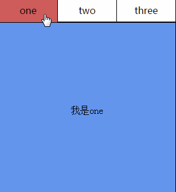

### 1 display:none 和 visbility:hidden的区别
* 1.display:none是彻底消失，不在文档流中占位，浏览器也不会解析该元素；visibility:hidden是视觉消失了，可以理解为透明度为0的效果，在文档流中占位，浏览器会解析该元素；  
* 2.使用visibility:hidden比display:none性能上要好，display:none切换显示时visibility，页面产生回流（当页面中的一部分元素需要改变规模尺寸、布局、显示隐藏等，页面重新构建，此时就是回流。所有页 面第一次加载时需要产生一次回流），而visibility切换是否显示时则不会引起回流。  
  
### 2 link和@import的区别 
* 区别1：link是XHTML标签，除了加载CSS外，还可以定义RSS等其他事务；@import属于CSS范畴，只能加载CSS。
* 区别2：link引用CSS时，在页面载入时同时加载；@import需要页面网页完全载入以后加载。
* 区别3：link是XHTML标签，无兼容问题；@import是在CSS2.1提出的，低版本的浏览器不支持。
* 区别4：link支持使用Javascript控制DOM去改变样式；而@import不支持。
  
* Link:XHTML标签；除了可以加载CSS外，还可以定义RSS，定义rel的链接属性；当页面被加载的时候，link使用的CSS会同时被加载，故浏览者浏览的时候，会有样式； 
* @import:是css提供的一种方式；只有当所有的界面都被下载完才会加载，所以用这个的时候，有的时候开始会没有样式； 老的浏览器不会支持只有在IE5以上才会支持。使用dom不可以控制@import
--------------------- 

### 3 进程和线程的区别
* 进程：是并发执行的程序在执行过程中分配和管理资源的基本单位，是一个动态概念，竞争计算机系统资源的基本单位。
* 线程：是进程的一个执行单元，是进程内科调度实体。比进程更小的独立运行的基本单位。线程也被称为轻量级进程。
* 一个程序至少一个进程，一个进程至少一个线程。
  
### 4 null 和undefined的区别
* 相同点：在if判断语句中，值都默认为false
* 不同点：
         1 null转化为数字类型值为0，undefined转化为数字类型为NaN  
         2 在使用var声明变量但未对其加以初始化时，这个变量的值就是undefined  
         3 null值则是表示空对象指针。  
     
* null是javascript的关键字，可以认为是对象类型，它是一个空对象指针，和其它语言一样都是代表“空值”，不过 undefined 却是javascript才有的。undefined是在ECMAScript第三版引入的，为了区分空指针对象和未初始化的变量，它是一个预定义的全局变量。没有返回值的函数返回为undefined，没有实参的形参也是undefined。

### 5 document.write和innerHTML
* document.write是直接将内容写入页面的内容流，会导致页面全部重绘，
* innerHTML将内容写入某个DOM节点，不会导致页面全部重绘

### 6 前后端分离怎么理解，怎么优化前端代码来提高项目执行速度
* 前端负责浏览器端（客户端）用户交互界面和逻辑等，显示数据；后端负责数据的处理和存储等，提供数据。
* 优势 提高工作效率  分工更加明确   局部性能提升  降低维护成本

### 7 babel/es6中箭头函数和function的区别
* 普通函数中的this指向函数被调用的对象，因此对于不同的调用者，this的值是不同的。而箭头函数中并没有自己的this（同时，箭头函数中也没有其他的局部变量，如this，argument，super等），所以箭头函数中的this是固定的，它指向定义该函数时所在的对象。

* 普通函数的this总是指向它的直接调用者。在严格模式下，没找到直接调用者，则函数中的this是undefined。在默认模式下（非严格模式），没找到直接调用者，则函数中的this指向window。

* 箭头函数相当于匿名函数，不能使用New作为构造函数来使用箭头函数中的this始终指向其父级作用域中的this。换句话说，箭头函数会捕获其所在的上下文的this值，作为自己的this值。任何方法都改变不了其指向

### 8 XML，html,xhtml,json的区别
 * html超文本标记语言，用来描述和定义网络内容的标记语言，超文本的意思是除了能标记文本，还能标记视频，图片，链接等其他内容
 * xml 可扩展标记语言，表现就是给文档加上标签，说明里面数据的意思，方便传输，存储和分享数据，和html的区别是，html是预定义的，xml是可扩展的xhtml
 * json 是轻量级的数据交换格式，又键值对组成，数据格式比较简单，易于读写
 * 数据体积方面。json的数据体积小，传递速度更快
 * 数据交互方面。json和Js交互更方便，更容易解析

### 9 主流浏览器内核私有属性css前缀
 * mozilla内核 (firefox,flock等)     -moz  
   webkit内核(safari,chrome等)   -webkit  
   opera内核(opera浏览器)         -o  
   trident内核(ie浏览器)               -ms

### 10 get和post的区别，何时使用Post
  *  GET：一般用于信息获取，使用URL传递参数，对所发送信息的数量也有限制，一般在2000个字符  
     POST：一般用于修改服务器上的资源，对所发送的信息没有限制。  
     GET方式需要使用Request.QueryString来取得变量的值，而POST方式通过Request.Form来获取变量的值，  
     也就是说Get是通过地址栏来传值，而Post是通过提交表单来传值。
  
  *  然而，在以下情况中，请使用 POST 请求：  
     无法使用缓存文件（更新服务器上的文件或数据库）  
     向服务器发送大量数据（POST 没有数据量限制）  
     发送包含未知字符的用户输入时，POST 比 GET 更稳定也更可靠 

### 11 性能优化的方法
1. 尽量减少HTTP请求次数
   合并js  
   合并css  
   图片sprite

2. 延迟加载内容
   图片懒加载  
   数据懒加载  
   功能懒加载（曝光或者点击后加载html模块、js功能模块）

3. 使用离线缓存
   把常用的变动又少的js、css、图片存储到localstorage，第二次访问的时候直接走本地缓存。在移动端使用广泛。

4. CSS、JS放置正确位置
   把css放在head中，保证页面看到的时候样式是对的。  
   把js放到body里最后位置，防止加载js阻塞页面。

5. 静态资源压缩
图片、CSS、JS在发布前要压缩。

6. 静态资源使用多个域名
对于图片、CSS、JS，可使用几个域名，可以并发加载。

7. 静态资源使用cdn存储
用户与你网站服务器的接近程度会影响响应时间的长短。 可以把静态资源放到内容分发网络（Content Delivery 

8. 预加载
在某个功能还没展现时，在空闲时间预先加载相关图片或者js代码

9. DOM操作优化
使用JavaScript访问DOM元素比较慢，因此为了获得更多的应该页面，应该做到：  
缓存已经访问过的有关元素  
线下更新完节点之后再将它们添加到文档树中  
避免使用JavaScript来修改页面布局

### 12 Ajax 和json是什么，优缺点
  * Ajax是异步JavaScript和XML，用于在Web页面中实现异步数据交互。 
    
    优点：  
    可以使得页面不重载全部内容的情况下加载局部内容，降低数据传输量  
    避免用户不断刷新或者跳转页面，提高用户体验  

    缺点：  
    对搜索引擎不友好  
    要实现Ajax下的前后退功能成本较大  
    可能造成请求数的增加  
    跨域问题限制  

  * JSON是一种轻量级的数据交换格式，ECMA的一个子集   
    JSON 是 JS 对象的字符串表示法，它使用文本表示一个 JS 对象的信息，本质是一个字符串。  
    优点：  
    轻量级、易于人的阅读和编写，便于机器（JavaScript）解析，支持复合数据类型（数组、对象、字符串、数字）

### 13 $(document).ready 和 window.onload的区别
    JavaScript的入口函数要等到DOM创建完毕，页面中所有资源（包括图片、文件）加载完成才开始执行。
    jQuery的入口函数只会等待文档树加载完成就开始执行，并不会等待图片、文件的加载。
    window.onload只能注册一次，jQuery入口函数可以注册多次
    jQuery的入口函数，封装了DOM中的DOMContentLoaded事件（此事件DOM加载完毕之后就执行）

### 14 微信小程序的优劣势
微信小程序的优势

　　1、对用户使用上来说，确实方便，要用的时候打开，不用的时候关掉，即用即走。这点比需要下载，还要占用手机内存空间的APP要好。  
　　2、主要的样式代码都封装在微信小程序里面，所以打开速度比普通的H5要快，接近原生APP。  
　　3、可以调用比H5更多的手机系统功能来进行开发，例如GPS定位、录音、拍视频、重力感应等，能开发更丰富的使用场景。  
　　4、在安卓手机上可以添加到手机桌面，看上去跟原生APP差不多，但仅限安卓手机，iphone就不行了。  
　　5、运行速度跟APP差不多，也能做出很多H5不做到的功能，开发成本跟H5差不多，相对来说开发成本比APP要低。

微信小程序的缺点

　　1、微信小程序只有1M的大小，这样导致无法开发大型一些的小程序。所以目前你会看到很多小程序真的很小很简单。  
　　2、小程序的技术框架还不稳定，开发方法时常有修改，导致短时间内经常要升级维护，或许这能解析为什么小程序只能1M大小，怕部署太大型的项目会出大问题。  
　　3、不能跳转外链网址，所以间接影响了小程序的开放性。也可能是想限制其他支付方式或功能接入(或许是我想多了)。  
　　4、不能直接分享到朋友圈，哎呀，少了一个重要的推广方式。  
　　5、需要像APP一样审核上架，这点比HTML5即做即发布要麻烦些。

### 15 async和await来处理异步
用async和await发送异步请求，从服务端的获取数据  
async->放在函数的前面，表示函数是一个异步函数，表示该函数执行不会阻塞后面代码执行。async返回一个promise对象，如果要获取到Promise的返回值，用then方法  
await 后面放置返回promise对象的表达式

```js
function takeLongTime() {
    return new Promise(resolve => {
        setTimeout(() => resolve("long_time_value"), 1000);
    });
}

async function test() {
    const v = await takeLongTime();
    console.log(v);
}

test();
```

### 16  回调函数 

```js
 function callback() {
   console.log(1)
 }
 SetTimeout(callback,2000)
 //callback返回一个函数对象，传递给settimeout的仍是一个函数对象
```
 * 一个函数作为参数传递给另一个函数，当某个事件发生后，触法回调函数执行
 * 回调函数使用场景：在函数外部获取到函数内部中异步操作结果
 * 用法：在异步操作中有结果时，把结果以函数实参方式进行传递
 * 由于回调函数是异步，在代码中每一层回调函数都会依赖上一层回调函数执行完形成了层层嵌套的关系--回调地狱

 ### 17 cookie是什么？cookie有哪些特性？cookie和session有什么区别
cookie 和session 的区别：

1、cookie数据存放在客户的浏览器上，session数据放在服务器上。

2、cookie不是很安全，别人可以分析存放在本地的COOKIE并进行COOKIE欺骗
   考虑到安全应当使用session。

3、session会在一定时间内保存在服务器上。当访问增多，会比较占用你服务器的性能
   考虑到减轻服务器性能方面，应当使用COOKIE。

4、单个cookie保存的数据不能超过4K，很多浏览器都限制一个站点最多保存20个cookie。

5、所以个人建议：
   将登陆信息等重要信息存放为SESSION
   其他信息如果需要保留，可以放在COOKIE中

### 18 写一个简单的渐变色效果
CSS3 定义了两种类型的渐变（gradients）：

    线性渐变（Linear Gradients）- 向下/向上/向左/向右/对角方向

    径向渐变（Radial Gradients）- 由它们的中心定义

语法：

    background: linear-gradient(direction, color-stop1, color-stop2, ...);

```css
background-image:linear-gradient(
    to right,
    pink 40%,
    pink 40%,
    orange 40%,
    orange 80%,
    yellow 20% 
  )

      
#grad {
  /* Safari 5.1 - 6.0 */
  background: -webkit-repeating-radial-gradient(red, yellow 10%, green 15%);
  /* Opera 11.6 - 12.0 */
  background: -o-repeating-radial-gradient(red, yellow 10%, green 15%);
  /* Firefox 3.6 - 15 */
  background: -moz-repeating-radial-gradient(red, yellow 10%, green 15%);
  /* 标准的语法 */
  background: repeating-radial-gradient(red, yellow 10%, green 15%);
}
```
### 19 如何对网站的文件和资源进行优化
1、图片优化  
首先，你需要优化你网站上的图片，来获得丝毫加速网站的机会。从原图上移除额外的注解、不必要的空间和无用的颜色，将图片保存为JPEG格式，因为它即使占用空间小，也能保证图片的高质量。  
对于WordPress网站，建议使用smush.it插件来自动优化网站的图片。如果图片是PNG格式，可以使用tinypng 优化图片，提高图片质量。

2、开启GZip压缩  
GZip压缩听起来很复杂，但实际上很简单，被用于减少HTTP请求的大小来缩短响应时间。因为这允许你发送GZip压缩文件而不是HTML文件给浏览器，它将缩短页面等待时间和加载时间。对于Apache服务器，可以将下面的代码添加到.htaccess文件中来开启GZip压缩。

3、服务器响应时间  
即使网站已经格外优化，但是除非服务器响应时间非常快，否则就不会有什么大的效果。当涉及到提高网站的速度，服务器响应时间起着重要的作用。下面是一些提高服务器响应时间的建议。  
有独立的服务器，而不是选择共享/托管服务器。  
提高Web服务器的质量。  
移除不必要的插件，只有那些必要的插件，才需要一直保持启用状态。

4、使用CDN  
内容分发网络(CDN)是位于不同地理位置的服务器组成的网络。每个服务器都拥有所有网站的文件副本。当用户请求文件和网页时，就可以直接从就近的网站服务器获取相应资源(也可以是从负载最小的服务器)。你可以使用Amazon cloud front 或者MaxCDN为网站开启CDN加速。

5、压缩CSS、JavaScript和HTML文件  
通过删除所有不必要的空格和注释，从而减小文件大小，提高页面的加载速度。下面是一些优化CSS、JavaScript和HTML文件的流行工具，非常有用。  
CSS Minifier  
Avivo  
HTML Compressor

6、避免重定向  
重定向是对网站访问者的一种极大的刺激。就类似你去一个朋友家，却发现你朋友早已经搬到三个街区远的地方了。重定向会消耗额外的时间，降低加载速度。

7、指定字符集  
指定字符集是加速浏览器渲染页面的另一个有用的技巧。下面的代码就能轻松实现：

8、避免错误请求  
当用户在网站上搜索时，收到404或410错误是比较失望的。错误请求会对网站的页面加载速度产生不利影响。因此，建议你无论如何都要避免错误请求。Check My Link 能帮你找出404链接，清除它们，改善用户体验

### 20 jquery实现简单的tab切换
```js
html:

<section>
   <nav id="nav">
     <a class="on">tab1</a>
     <a>tab2</a>
     <a>tab3</a>
     <a>tab4</a>
   </nav>
   <div id="contentBox">
     <div class="box active">内容一</div>
     <div class="box">内容二</div>
     <div class="box">内容三</div>
     <div class="box">内容四</div>
   </div>
</section>

js

$(function(){
  $("#nav a").off("click").on("click",function(){
     var index = $(this).index();
     $(this).addClass("on").siblings().removeClass("on");
     $("#contentBox .box").eq(index).addClass("active").siblings().removeClass("active");
   });
});

```
原生Js实现tab切换
```html
<div class="tab">
    <ul class="tab-list">
        <li>one</li>
        <li>two</li>
        <li>three</li>
    </ul>
    <ul class="tab-content">
        <li style="background-color:cornflowerblue;">我是one</li>
        <li style="display: none;background-color: burlywood;">我是two</li>
        <li style="display: none;background-color:mediumaquamarine;">我是three</li>
    </ul>
</div>
```
```js
var  eItemList = document.querySelectorAll(".tab-list li");
var eContentList = document.querySelectorAll(".tab-content li");
//给元素编号
for (var i=0;i<eItemList.length;i++) {
  eItemList[i].index=i;  //index是自定义属性，用来保存编号                 
  eItemList[i].onmouseover=function() {
  for (var i=0;i<eContentList.length;i++) {
  eContentList[i].style.display="none";        //先将内容全部隐藏                  
  }
  eContentList[this.index].style.display="block";  //当鼠标触发时再显示对应的内容    
  for (var i=0;i<eItemList.length;i++) {
  eItemList[i].style.background="none";        //将背景色设置为无                 
  }
  eItemList[this.index].style.background="indianred";
};    
}

```

### 21 http和https的区别，为什么https更安全
**一、HTTP和HTTPS的基本概念**

　　HTTP：是互联网上应用最为广泛的一种网络协议，是一个客户端和服务器端请求和应答的标准（TCP），用于从WWW服务器传输超文本到本地浏览器的传输协议，它可以使浏览器更加高效，使网络传输减少。

　　HTTPS：是以安全为目标的HTTP通道，简单讲是HTTP的安全版，即HTTP下加入SSL层，HTTPS的安全基础是SSL，因此加密的详细内容就需要SSL。

　　HTTPS协议的主要作用可以分为两种：一种是建立一个信息安全通道，来保证数据传输的安全；另一种就是确认网站的真实性。

**二、HTTP与HTTPS有什么区别？**

　　HTTP协议传输的数据都是未加密的，也就是明文的，因此使用HTTP协议传输隐私信息非常不安全，为了保证这些隐私数据能加密传输，于是网景公司设计了SSL（Secure Sockets Layer）协议用于对HTTP协议传输的数据进行加密，从而就诞生了HTTPS。简单来说，HTTPS协议是由SSL+HTTP协议构建的可进行加密传输、身份认证的网络协议，要比http协议安全。

　　HTTPS和HTTP的区别主要如下：

　　1、https协议需要到ca申请证书，一般免费证书较少，因而需要一定费用。

　　2、http是超文本传输协议，信息是明文传输，https则是具有安全性的ssl加密传输协议。

　　3、http和https使用的是完全不同的连接方式，用的端口也不一样，前者是80，后者是443。

　　4、http的连接很简单，是无状态的；HTTPS协议是由SSL+HTTP协议构建的可进行加密传输、身份认证的网络协议，比http协议安全。

**三、HTTPS的优点**

　　尽管HTTPS并非绝对安全，掌握根证书的机构、掌握加密算法的组织同样可以进行中间人形式的攻击，但HTTPS仍是现行架构下最安全的解决方案，主要有以下几个好处：

　　（1）使用HTTPS协议可认证用户和服务器，确保数据发送到正确的客户机和服务器；

　　（2）HTTPS协议是由SSL+HTTP协议构建的可进行加密传输、身份认证的网络协议，要比http协议安全，可防止数据在传输过程中不被窃取、改变，确保数据的完整性。

　　（3）HTTPS是现行架构下最安全的解决方案，虽然不是绝对安全，但它大幅增加了中间人攻击的成本。

　　（4）谷歌曾在2014年8月份调整搜索引擎算法，并称“比起同等HTTP网站，采用HTTPS加密的网站在搜索结果中的排名将会更高”。

**四、HTTPS的缺点**

　　虽然说HTTPS有很大的优势，但其相对来说，还是存在不足之处的：

　　（1）HTTPS协议握手阶段比较费时，会使页面的加载时间延长近50%，增加10%到20%的耗电；

　　（2）HTTPS连接缓存不如HTTP高效，会增加数据开销和功耗，甚至已有的安全措施也会因此而受到影响；

　　（3）SSL证书需要钱，功能越强大的证书费用越高，个人网站、小网站没有必要一般不会用。

　   （4）SSL证书通常需要绑定IP，不能在同一IP上绑定多个域名，IPv4资源不可能支撑这个消耗。

　　（5）HTTPS协议的加密范围也比较有限，在黑客攻击、拒绝服务攻击、服务器劫持等方面几乎起不到什么作用。最关键的，SSL证书的信用链体系并不安全，特别是在某些国家可以控制CA根证书的情况下，中间人攻击一样可行。

**五、http切换到HTTPS**

　如果需要将网站从http切换到https到底该如何实现呢？  
  这里需要将页面中所有的链接，例如js，css，图片等等链接都由http改为https。例如：http://www.baidu.com改为https://www.baidu.com

　　BTW，这里虽然将http切换为了https，还是建议保留http。所以我们在切换的时候可以做http和https的兼容，具体实现方式是，去掉页面链接中的http头部，这样可以自动匹配http头和https头。例如：将 http://www.baidu.com 改为  //www.baidu.com。  然后当用户从http的入口进入访问页面时，页面就是http，如果用户是从https的入口进入访问页面，页面即使https的。

### 13 如何实现浏览器内多个标签的通信
本题主要考察数据存储的知识，数据存储有本地和服务器存储两种方式。这里主要讲解用本地存储方式解决。即调用 localStorage、Cookie等本地存储方式。

> 第一种——调用localStorage

  在一个标签页里面使用 localStorage.setItem(key,value)添加（修改、删除）内容；  
  在另一个标签页里面监听 storage 事件。   
  即可得到 localstorge 存储的值，实现不同标签页之间的通信。  
```js
//标签页1：

<input id="name">  
<input type="button" id="btn" value="提交">  
<script type="text/javascript">  
    $(function(){    
        $("#btn").click(function(){    
            var name=$("#name").val();    
            localStorage.setItem("name", name);   
        });    
    });    
</script>  

//标签页2：

<script type="text/javascript">  
    $(function(){   
        window.addEventListener("storage", function(event){    
            console.log(event.key + "=" + event.newValue);    
        });     
    });  
</script>  

```
> 第二种——调用cookie+setInterval()

将要传递的信息存储在cookie中，每隔一定时间读取cookie信息，即可随时获取要传递的信息。

```js
页面1：

<input id="name">  
<input type="button" id="btn" value="提交">  
<script type="text/javascript">  
    $(function(){    
        $("#btn").click(function(){    
            var name=$("#name").val();    
            document.cookie="name="+name;    
        });    
    });    
</script>  


<script type="text/javascript">  
    $(function(){   
        function getCookie(key) {    
            return JSON.parse("{\"" + document.cookie.replace(/;\s+/gim,"\",\"").replace(/=/gim, "\":\"") + "\"}")[key];    
        }     
        setInterval(function(){    
            console.log("name=" + getCookie("name"));    
        }, 10000);    
    });  
</script>  
```
### 14 js有哪几种数据类型，基本数据类型有哪些
基本数据类型: undefined、null、number、boolean、string  
引用数据类型: 对象类型Object，比如：Object、array、function

### 15 清除浮动的方法
	1.给浮动元素的父元素增加高度
	2.给父元素增加overflow:hidden
	3.clear:both

### 16 怎么添加，移除，移动，复制和创建和查找节点
```js
　  appendChild() //添加
　　removeChild() //移除
　　replaceChild() //替换
　　insertBefore() //插入
    cloneNode()   //复制

创建新节点
　　createDocumentFragment() //创建一个DOM片段
　　createElement() //创建一个具体的元素
　　createTextNode() //创建一个文本节点
查找
　　getElementsByTagName() //通过标签名称
　　getElementsByName() //通过元素的Name属性的值
　　getElementById() //通过元素Id，唯一性
```
### 17 Js哪些操作可能赵成内存泄漏
内存泄漏：指一块被分配的内存既不能使用，又不能回收，直到浏览器进程结束。


1、JS的回收机制

JavaScript垃圾回收的机制很简单：找出不再使用的变量，然后释放掉其占用的内存，但是这个过程不是实时的，因为其开销比较大，所以垃圾回收系统（GC）会按照固定的时间间隔,周期性的执行。

垃圾收集器必须跟踪到底哪个变量没用，对于不再有用的变量打上标记，以备将来收回其内存。用于标记的无用变量的策略可能因实现而有所区别，通常情况下有两种实现方式：标记清除和引用计数。引用计数不太常用，标记清除较为常用。

2、标记清除

js中最常用的垃圾回收方式就是标记清除。当变量进入环境时，例如，在函数中声明一个变量，就将这个变量标记为“进入环境”。从逻辑上讲，永远不能释放进入环境的变量所占用的内存，因为只要执行流进入相应的环境，就可能会用到它们。而当变量离开环境时，则将其标记为“离开环境”。
```js
function test(){
  var a=10;//被标记，进入环境
  var b=20;//被标记，进入环境
}
test();//执行完毕之后a、b又被标记离开环境，被回收
```

3、引用计数

引用计数的含义是跟踪记录每个值被引用的次数。当声明了一个变量并将一个引用类型值（function object array）赋给该变量时，则这个值的引用次数就是1。如果同一个值又被赋给另一个变量，则该值的引用次数加1。相反，如果包含对这个值引用的变量又取得了另外一个值，则这个值的引用次数减1。当这个值的引用次数变成0时，则说明没有办法再访问这个值了，因而就可以将其占用的内存空间回收回来。这样，当垃圾回收器下次再运行时，它就会释放那些引用次数为0的值所占用的内存。

```js
function test(){
  var a={};//a的引用次数为0
  var b=a;//a的引用次数加1，为1
  var c=a;//a的引用次数加1，为2
  var b={};//a的引用次数减1，为1
}
```

4、哪些操作会造成内存泄露

1）意外的全局变量引起的内存泄露
```js
function leak(){
  leak="xxx";//leak成为一个全局变量，不会被回收
}
```

2）闭包引起的内存泄露 
```js
function bindEvent(){
  var obj=document.createElement("XXX");
  obj.onclick=function(){
    //Even if it's a empty function
  }
}
```
闭包可以维持函数内局部变量，使其得不到释放。 上例定义事件回调时，由于是函数内定义函数，并且内部函数--事件回调的引用外暴了，形成了闭包。

解决之道，将事件处理函数定义在外部，解除闭包,或者在定义事件处理函数的外部函数中，删除对dom的引用。
```js
//将事件处理函数定义在外部
function onclickHandler(){
  //do something
}
function bindEvent(){
  var obj=document.createElement("XXX");
  obj.onclick=onclickHandler;
}
```
```js
//在定义事件处理函数的外部函数中，删除对dom的引用
function bindEvent(){
  var obj=document.createElement("XXX");
  obj.onclick=function(){
    //Even if it's a empty function
  }
  obj=null;
}
```

3）没有清理的DOM元素引用 
```js
var elements={
    button: document.getElementById("button"),
    image: document.getElementById("image"),
    text: document.getElementById("text")
};
function doStuff(){
    image.src="http://some.url/image";
    button.click():
    console.log(text.innerHTML)
}
function removeButton(){
    document.body.removeChild(document.getElementById('button'))
}
```

4）被遗忘的定时器或者回调

```js
var someResouce=getData();
setInterval(function(){
    var node=document.getElementById('Node');
    if(node){
        node.innerHTML=JSON.stringify(someResouce)
    }
},1000)
```
这样的代码很常见, 如果 id 为 Node 的元素从 DOM 中移除, 该定时器仍会存在, 同时, 因为回调函数中包含对 someResource 的引用, 定时器外面的 someResource 也不会被释放。

* 怎样避免内存泄露

1）减少不必要的全局变量，或者生命周期较长的对象，及时对无用的数据进行垃圾回收；

2）注意程序逻辑，避免“死循环”之类的 ；

3）避免创建过多的对象  原则：不用了的东西要及时归还。

### 18 iframe有哪些优缺点
* iframe的优点：

1.iframe能够原封不动的把嵌入的网页展现出来。

2.如果有多个网页引用iframe，那么你只需要修改iframe的内容，就可以实现调用的每一个页面内容的更改，方便快捷。

3.网页如果为了统一风格，头部和版本都是一样的，就可以写成一个页面，用iframe来嵌套，可以增加代码的可重用。

4.如果遇到加载缓慢的第三方内容如图标和广告，这些问题可以由iframe来解决。

* iframe的缺点：

1.会产生很多页面，不容易管理。

2.iframe框架结构有时会让人感到迷惑，如果框架个数多的话，可能会出现上下、左右滚动条，会分散访问者的注意力，用户体验度差。

3.代码复杂，无法被一些搜索引擎索引到，这一点很关键，现在的搜索引擎爬虫还不能很好的处理iframe中的内容，所以使用iframe会不利于搜索引擎优化。

4.很多的移动设备（PDA 手机）无法完全显示框架，设备兼容性差。

5.iframe框架页面会增加服务器的http请求，对于大型网站是不可取的。 分析了这么多，现在基本上都是用Ajax来代替iframe，所以iframe已经渐渐的退出了前端开发。

### 19 构造函数的封装与继承
封装

就是将属性和方法封装成一个对象：构造函数模式。就是一个内部使用了this的普通函数，对构造函数使用new就能生成实例，this会绑定在对象实例上。
```js
function Cat(name,color){
    this.name=name;
    this.color=color;
}
//生成实例对象
var cat1=new Cat('aa','red');

//自动含有constructor属性，指向其构造函数
cat1.constructor==Cat

//instanceof 运算符，验证原型对象与实例对象之间的关系
cat1 instanceof Cat//true
```
构造函数主要是为了解决生成多实例时，减少代码冗余。但是对于不变的属性和方法，都指向不同的内存地址，浪费资源。

每个构造函数都有一个prototype属性，指向另一个对象，这个对象的所有属性和方法都会被构造函数的实例继承。
```js
function Cat(name,color){
    this.name=name;
    this.color=color;
}

Cat.prototype={
    type:"猫科",
    eat:function(){
        console.log("eating");
    }
}
//生成实例对象
var cat1=new Cat('aa','red');
cat1.eat()
var cat2=new Cat('bb','blue');
所有实例从prototype继承的方法指向同一个内存地址
cat2.eat==cat1.eat  //true

//验证构造函数的prototype对象和实例的关系
Cat.prototype.isPrototypeOf(cat1) 

//查看该属性为自身还是继承
cat1.hasOwnProperty('name')

```
### 20 template使用
```html
 <script type="text/template" id="tpl">
     {{each data value}}
     <tr>
        <td>{{value.member_name}}</td>
      </tr>
     {{/each}}
  </script>
  <script>
 $.ajax({
      url:'http://www.alishow.com/admin/api/comments/getCmt.php',
      type:'post',
      dataType:'json',
      //从后台获取的数据已经是json了
      success:function(data) {
        var tbodyStr = template('tpl',data);
        console.log(data);
        $('tbody').html(tbodyStr);
      }
    });
    </script>
```
* 1 使用script标签引入template库文件
* 2 定义标签用来显示最终结果数据
* 3 定义模板和模板中的数据
* 3.1 定义要显示在模板中的数据，必须是json对象
* 3.2 使用script标签定义模板，使用{{}},将所有数据位置标记起来
* 4 调用template函数，解析模板 template('tpl',data);参数1是模板的id值，参数2是JSON对象
* 5 将解析好的模板字符串填充到事先定义好的标签中