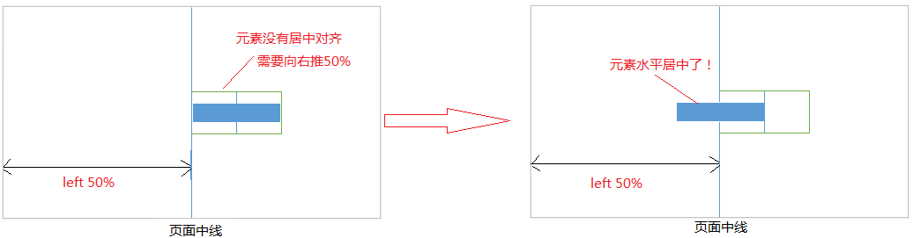
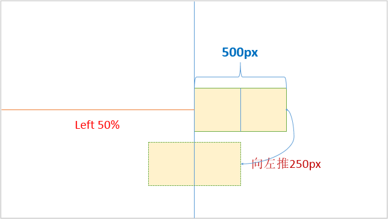

### 1 什么是css，列举例子来表示如何创建css规则以及如何应用于这个css至html元素(element)
    
    CSS 指层叠样式表 (Cascading Style Sheets)
    样式定义如何显示 HTML 元素
    样式通常存储在样式表中
    把样式添加到 HTML 4.0 中，是为了解决内容与表现分离的问题
    外部样式表可以极大提高工作效率
    外部样式表通常存储在 CSS 文件中
    多个样式定义可层叠为一

### 2 如何用css控制html元素的图层，举例
  定位
### 3 外部css和内部css之间有什么不同
  * 1 行内样式  
    p  style="font-size:14px;color:green;"直接在HTML标签中设置的样式</p>
  * 2 内部样式表  
    style标签写在head中
  * 3 外部样式表  
    链接式  
    link type="text/css" rel="styleSheet"  href="CSS文件路径" /  
    导入式  
    @import url("css文件路径");
  * 链接式和导入式的区别  
      link  
      1、属于XHTML  
      2、优先加载CSS文件到页面  

      @import  
      1、属于CSS2.1  
      2、先加载HTML结构在加载CSS文件。
    
### 4 如何使用原生的js(vanilla js)更改css规则，举例
  * 1通过在javascript代码中的node.style.cssText="css表达式1；css表达式2；css表达式3  "的方式直接更改CSS样式。  
    2先在CSS样式表中对特定的类如“active类”设置样式（这里的active类是假定的，暂时不存在），然后再在javascript代码中通过node.classname="active"使得CSS样式表中对active类的样式设置附加到该node节点上来。  

```js 
  <style type="text/css">
      div {
        float: left;
        padding: 20px;
        margin: 10px;
        border: 1px solid #000;
        background-color: #fff;
        color: #000;
      }
      .active
        {
          background-color:blue
        }
  </style>
  <body>
        <div class="root">
        </div>
  </body>

  <script type="text/javascript">  
     var root=document.getElementsByClassName("root")[0];
     root.style.cssText="background-color: blue;color: #fff;";
  </script>

  // 方式二
  <script type="text/javascript">  
      var root=document.getElementsByClassName("root")[0];
      root.className="active";
  </script>
```

### 5 什么是文件物模型(dom),画张简单的图来描述结构
DOM (Document Object Model) 译为文档对象模型，是 HTML 和 XML 文档的编程接口。  
HTML DOM 定义了访问和操作 HTML 文档的标准方法。  
DOM 以树结构表达 HTML 文档。


### 6 渐进增强和优雅降级
* 渐进增强原则   
   1 基本网页内容应该被所有浏览器访问  
   2 基本网页内容可以在所有浏览器中运行  
   3 增强的网页布局由外部提供的css引入
   4 尊重用户使用的浏览器首选项

* 优雅降级原则  
  争对最高级最完善的浏览器来设计网站，然后再争对浏览器测试和恢复

### 7 实现不使用border，画出1px的线，在不同的浏览器下的Quicksmode(怪异模式)和CSScompat(标准模式)模式下都能保持一致的效果

```html
  <div style="height:1px;overflow:hidden;background:red"></div>
```
### 8 css盒模型标准模式和怪异模式
  浏览器解析时使用标准模式还是怪异模式，与网页中的DTD声明直接相关，DTD声明定义了标准文档的类型（标准模式解析）文档类型，会使浏览器使用相关的方式加载网页并显示，忽略DTD声明，将使网页进入怪异模式（quirks mode）。

  只要完整定义DOCTYPE都会触发标准模式，如果DOCTYPE缺失则在ie6/ie7/ie8下将会触发怪异模式
    
    标准模式：盒子总宽度=width+padding+border+margin
    怪异模式：盒子总宽度=width(包含padding+border)+margin
  box-sizing 
    
    content-box---------------------------标准模式
    border-box-----------------------------怪异模式

### 9 如何居中div，如何居中一个浮动元素，如何让绝对定位的元素居中
  （一）元素水平居中的方式
   
   1）行级元素水平居中对齐（父元素设置 text-align:center）   
   2）块级元素水平居中对齐（margin: 0 auto）  
   3）浮动元素水平居中  
      宽度不固定的浮动元素

```js
  htlm
  <div class="outerbox">  
     <div class="innerbox">我是浮动的</div>  
  </div>  
  
  css
  .outerbox{  
    float:left;   
    position:relative;   
    left:50%;   
  }   
  .innerbox{    
    float:left;   
    position:relative;   
    right:50%;   
  }  
```
  

  宽度固定的浮动元素

```js
    html
  <div class="outerbox">  
   <div>我是浮动的</div>  
  </div> 

  css
  .outerbox{  
    background-color:pink; /*方便看效果 */    
    width:500px ;   
    height:300px; /*高度可以不设*/  
    margin: -150px 0 0 -250px; /*使用marin向左移动250px，保证元素居中*/  
    position:relative;   /*相对定位*/  
    left:50%;  
    top:50%;  
  }  

```


   4）让绝对定位的元素水平居中对齐
  
```js
.center{  
   position: absolute; /*绝对定位*/  
   width: 500px;  
   height:300px;  
   background: red;  
   margin: 0 auto; /*水平居中*/  
   left: 0; /*此处不能省略，且为0*/  
   right: 0; /*此处不能省略，且为0*/  
}  
```

  总结
    水平居中的主要属性有

    1. text-alin:center;
    2. margin:0 auto
    3. position:relative|absolute; left:50%;

### 10 垂直居中
  1）对行内元素垂直居中（height与line-height的值一样）  
  2）对块级元素垂直居中对齐  
  2.1 父元素高度固定的情况   

    1）父元素的height与line-height值相同
    2）需要垂直居中的元素
        vertical-align:middle;// 垂直居中对齐
        display:inline|inline-block 块级元素转行级元素
  2.2 父元素高度不固定的情况  
  父元素的padding-top和padding-bottom一样 

### 11 什么是盒子模型
把所有的网页元素都看成一个盒子，它具有：  
content，padding，border，margin   
四个属性，这就是盒子模型  

盒子模型有两种形式：标准盒子模型，怪异盒子模型

### 12 src和href的区别
href是Hypertext Reference的缩写，表示超文本引用。用来建立当前元素和文档之间的链接。常用的有：link、a。
```html
<link href="reset.css" rel=”stylesheet“/>
```
浏览器会识别该文档为css文档，并行下载该文档，并且不会停止对当前文档的处理。这也是建议使用link，而不采用@import加载css的原因。

src是source的缩写，src的内容是页面必不可少的一部分，是引入。src指向的内容会嵌入到文档中当前标签所在的位置。常用的有：img、script、iframe。    
当浏览器解析到该元素时，会暂停浏览器的渲染，知道该资源加载完毕。这也是将js脚本放在底部而不是头部得原因。

    src用于替换当前元素；href用于在当前文档和引用资源之间建立联系。

### 13 css3新特性
1.选择器

:nth-child()
:nth-of-type()
:checked
:disabled

2.盒模型

box-sizing

3.背景

background-image、background-size、background-origin

4.渐变

linear-gradient、radial-gradient

5.边框

border-radius、border-image

6.阴影

box-shadow、text-shadow

7.2D/3D转换

transform：translate rotate scale skew

8.过渡

transition

9.动画

keyframes、animation

10.弹性盒子

flex

11.媒体查询

@media

### 14 css hack
由于不同的浏览器，比如Internet Explorer 6,Internet Explorer 7,Mozilla Firefox等，对CSS的解析认识不一样，因此会导致生成的页面效果不一样，得不到我们所需要的页面效果。

这个时候我们就需要针对不同的浏览器去写不同的CSS，让它能够同时兼容不同的浏览器，能在不同的浏览器中也能得到我们想要的页面效果。

这个针对不同的浏览器写不同的CSS code的过程，就叫CSS hack,也叫写CSS hack。

* CSS hack的原理

由于不同的浏览器和浏览器各版本对CSS的支持及解析结果不一样，以及CSS优先级对浏览器展现效果的影响，我们可以据此针对不同的浏览器情景来应用不同的CSS

* CSS hack分类

CSS Hack大致有3种表现形式，CSS属性前缀法、选择器前缀法以及IE条件注释法（即HTML头部引用if IE）Hack，实际项目中CSS Hack大部分是针对IE浏览器不同版本之间的表现差异而引入的。

    属性前缀法(即类内部Hack)：例如 IE6能识别下划线"_"和星号" * "，
    IE7能识别星号" * "，但不能识别下划线"_"，
    IE6~IE10都认识"\9"，
    但firefox前述三个都不能认识。

    选择器前缀法(即选择器Hack)：例如 IE6能识别*html .class{}，
    IE7能识别*+html .class{}或者*:first-child+html .class{}。

    IE条件注释法(即HTML条件注释Hack)：
    针对所有IE(注：IE10+已经不再支持条件注释)： 
    <!--[if IE]>IE浏览器显示的内容 <![endif]-->，
    针对IE6及以下版本： <!--[if lt IE 6]>只在IE6-显示的内容 <![endif]-->。
    这类Hack不仅对CSS生效，对写在判断语句里面的所有代码都会生效。

　CSS hack书写顺序，一般是将适用范围广、被识别能力强的CSS定义在前面。

### 15 position
取值:
static ：默认值，无特殊定位，对象遵循正常文档流。top，right，bottom，left等属性不会被应用，默认值。

relative：相对定位，对象遵循正常文档流，相对于其正常位置进行定位

absolute：绝对定位，相对于 static 定位以外的第一个父元素进行定位。

fixed：固定定位，相对于浏览器窗口进行定位

### 16 怎么实现三列布局，左侧和右侧宽度固定，中间自适应
1.使用自身浮动法：

自身浮动法的原理就是对左右分别使用float:left和float:right，float使左右两个元素脱离文档流，中间元素正常在正常文档流中。对中间文档流使用margin指定左右外边距进行定位。

该布局法的不足是三个元素的顺序，middle一定要放在最后，middle占据文档流位置，所以一定要放在最后，左右两个元素位置没有关系。当浏览器窗口很小的时候，右边元素会被挤到下一行。

2.使用绝对定位法：

绝对定位法原理是将左右两边使用absolute定位，因为绝对定位使其脱离文档流，后面的middle会自然流动到他们上面，然后使用margin属性，留出左右元素的宽度，既可以使中间元素自适应屏幕宽度。

该法布局的好处，三个div顺序可以任意改变。但是因为是绝对定位，如果页面上还有其他内容，top的值需要小心处理。

3.使用flex布局：子元素的float,clear,vertical-align会失效

设置一个父div，添加样式display：flex。中间div设置flex-grow：1，（等同代码中设置flex：1。flex是grow、shrink、basis的简写）但是盒模型默认紧紧挨着，可以使用margin控制外边距。middle一定在中间，否则需要order属性来调整。      

通过项目属性flex-grow设置middle的放大比例，将空余的空间用middle来填充，使三个项目排满一整行；默认为0，也就是对剩余空间不做处理。通过项目属性flex-basis 设置left和right的固定宽度。
```html
<style>
.main{
      width:100%;
      height:300px;
      display: flex;
      /* 主轴方向，起点在左端 */
      flex-direction: row;
      /* 项目在主轴的对齐方式 */
      justify-content: flex-start;
    }
    .left{
      /* flex属性是flex-grow, flex-shrink 和 flex-basis的简写，
      默认值为0 1 auto。后两个属性可选。 */
      flex:0 1 200px;
      height: 100%;
      background-color:red;
    }
    .right{
      flex:0 1 200px;
      height:100%;
      background-color:pink;
    }
    .middle{
      flex:1;
      height: 100%;
      background-color:greenyellow;
    }
  </style>
</head>
<body>
  <div class="main">
    <div class="left"></div>
    <div class="middle"></div>
    <div class="right"></div>
  </div>
</body>

```
4.圣杯布局，实现上述要求：

 圣杯布局的原理是margin负值法。首先设置父div的位置，使其左右分别空出200px和120px区域。  
 然后利用三列全部左浮动和相对定位以及设置left和right 负的外边距可以实现。
 ```html
<style>
    body {
      min-width: 600px;
    }
    .main{
      padding:0 200px;
    }
    .a {
      float: left;
      height: 300px;
    }
    .left{
      width: 200px;
      position: relative;
      left:-200px; 
      margin-left:-100%;
      background-color:rosybrown;
    }
    .right{
      width: 200px;
      position: relative;
      right:-200px;
      margin-left:-200px;
      background-color:plum;
    }
    .middle{
      width: 100%;
      background-color:aqua;
    }
  </style>
</head>
<body>
  <div class="main">
    <div id="middle"><div class="middle a"></div></div>
    <div class="left a"></div>
    <div class="right a"></div>
  </div>
</body>


 ```