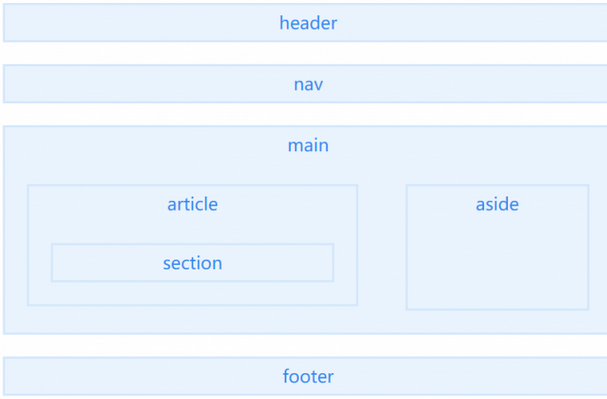

### 1 position中absolute和fixed的区别
 * 共同点  
  (1) 改变行内元素的呈现方式，display被置为block；

  (2) 让元素脱离普通流，不占据空间；

  (3) 默认会覆盖到非定位元素上

 * 不同点：

   absolute的”根元素“是可以设置的，而fixed的”根元素“固定为浏览器窗口。

   当你滚动网页，fixed元素与浏览器窗口之间的距离是不变的。

### 2 img设置属性alt和title的区别 
  * alt 用于图片没显示时在图片显示区域显示一个说明文字。
  * title 表示鼠标在图片上停留时，显示一个悬浮框，其中显示的文字。 
  
### 3 行内元素，块级元素和空元素
  * 块级元素：div、ul、li、dl、dt、dd、p、h1-h6、blockquote    
    块级元素的特点：  
    1.总在新行上开始，占据一整行  
    2.默认情况下，其宽度自动填满其父元素宽度  
    3.宽度始终是与浏览器宽度一样，与内容无关  
    4.它可以容纳内联元素和其他块元素  
    5.display属性为block  
    6.块级元素的垂直相邻外边距margin会合并。

  * 行内元素：a、b、span、img、input、strong、select、label、em、button、textarea   
    行内元素的特点：  
    1.和其他元素都在一行上  
    2.高，行高及外边距和内边距部分可改变  
    3.宽度只与内容有关  
    4.行内元素只能容纳文本或者其他行内元素  
    5.display属性为inline  

    水平方向的padding-left、padding-right、margin-left、margin-right都产生边距效果，
    但竖直方向的padding-top、padding-bottom、margin-top、margin-bottom却不会产生边距效果。
    不可以设置宽高，其宽度随着内容增加，高度随字体大小而改变，内联元素可以设置外边界，但是外边界不对上下起作用，只能对左右起作用。

  * 空元素:br、meta、hr、link、input、img
    空元素的特点：

    1.没有内容的 HTML 内容被称为空元素。空元素是在开始标签中关闭的。br 就是没有关闭标签的空元素  
    2.在 XHTML、XML 以及未来版本的 HTML 中，所有元素必须被关闭。  
    3.在开始标签中添加斜杠，比如 < br />，是关闭空元素的正确方法，HTML、XHTML 和 XML 都接受这种方式。  
    4.即使 <br> 在所有浏览器中都是有效的，但使用 <br /> 其实是更长远的保障。

### 3 通过html控制默认浏览器版本，举例
  在html的header标签中添加  meta name="renderer" content="webkit"

### 4 html中什么是标签tag,举例说明
  * 单标签  br hr
  * 双标签  em i斜体 b strong p u del

### 5 什么是HTML WEB 存储？列举两种不同类型的HTML WEB 存储 和 html5 web 存储的好处?
cookie 不适合大量数据的存储，因为它们由每个对服务器的请求来传递，这使得 cookie 速度很慢而且效率也不高。

在 HTML5 中，数据不是由每个服务器请求传递的，而是只有在请求时使用数据。它使在不影响网站性能的情况下存储大量数据成为可能。

对于不同的网站，数据存储于不同的区域，并且一个网站只能访问其自身的数据。
  
检查浏览器是否支持

```js
 <script>
// 检查是否支持
if (typeof(Storage) !== "undefined") {
    // Store
    localStorage.setItem("lastname", "Gates");
    // Retrieve
    document.getElementById("result").innerHTML = localStorage.getItem("lastname");
} else {
    document.getElementById("result").innerHTML = "抱歉！您的浏览器不支持 Web Storage ...";
}
</script>

```
localStorage 和 sessionStorage 
客户端存储数据的两个对象为：

    localStorage - 用于长久保存整个网站的数据，保存的数据没有过期时间，直到手动去除。
    sessionStorage - 用于临时保存同一窗口(或标签页)的数据，在关闭窗口或标签页之后将会删除这些数据。

localStorage 对象

    localStorage 对象存储的数据没有时间限制。第二天、第二周或下一年之后，数据依然可用。

sessionStorage 对象

    sessionStorage 方法针对一个 session 进行数据存储。当用户关闭浏览器窗口后，数据会被删除。

常用的API

    保存数据：localStorage.setItem(key,value);
    读取数据：localStorage.getItem(key);
    删除单个数据：localStorage.removeItem(key);
    删除所有数据：localStorage.clear();
    得到某个索引的key：localStorage.key(index);


离线存储工作原理

### 6 h5有哪些新特性?移除了哪些元素？如何处理H5新标签与浏览器的兼容问题？如何区分html和html5
 
   1 html5新特性之用于绘画的canvas元素  
   canvas 元素用于在网页上绘制图形，画布是一个矩形区域，您可以控制其每一像素。canvas 拥有多种绘制路径、矩形、圆形、字符以及添加图像的方法。  

   2 html5新特性之更加丰富强大的表单  
   html5 拥有多个新的表单 Input 输入类型。这些新特性提供了更好的输入控制和验证。  
   html5 也新增以下表单元素：  

    <datalist>：元素规定输入域的选项列表，使用 <input> 元素的 list 属性与 <datalist> 元素的 id 绑定。
    <keygen>：提供一种验证用户的可靠方法，标签规定用于表单的密钥对生成器字段。
    <output>：用于不同类型的输出，比如计算或脚本输出。

   HTML5 新增的表单属性：

    placehoder 属性：简短的提示在用户输入值前会显示在输入域上。即我们常见的输入框默认提示，在用户输入后消失。
    required 属性：是一个 boolean 属性。要求填写的输入域不能为空
    pattern 属性：描述了一个正则表达式用于验证<input> 元素的值。
    min 和 max 属性：设置元素最小值与最大值。
    step 属性：为输入域规定合法的数字间隔。
    height 和 width 属性：用于 image 类型的 <input> 标签的图像高度和宽度。
    autofocus 属性：是一个 boolean 属性。规定在页面加载时，域自动地获得焦点。
    multiple 属性：是一个 boolean 属性。规定<input> 元素中可选择多个值。

  3 用于媒介的video和audio元素

  4 地理定位

  5 拖放

    拖放（Drag 和 drop）是一种常见的特性，即抓取对象以后拖到另一个位置。
    在 HTML5 中，拖放是标准的一部分，任何元素都能够拖放；拖放的过程分为源对象和目标对象。源对象是指你即将拖动元素，而目标对象则是指拖动之后要放置的目标位置。

  6 WEB存储

  7 应用程序缓存

    使用 HTML5，通过创建 cache manifest 文件，可以轻松地创建 web 应用的离线版本。
    HTML5 引入了应用程序缓存，这意味着 web 应用可进行缓存，并可在没有因特网连接时进行访问。

    应用程序缓存为应用带来三个优势：

    （1）离线浏览 - 用户可在应用离线时使用它们
    （2）速度 - 已缓存资源加载得更快
    （3）减少服务器负载 - 浏览器将只从服务器下载更新过或更改过的资源。

  8  Web Workers
   
     当在 HTML 页面中执行脚本时，页面的状态是不可响应的，直到脚本已完成。

     web worker 是运行在后台的 JavaScript，独立于其他脚本，不会影响页面的性能。
     可以继续做任何愿意做的事情：点击、选取内容等等，而此时 web worker 在后台运行。

  9 服务器发送事件

    html5服务器发送事件（server-sent event）允许网页获得来自服务器的更新。
    Server-Sent 事件 - 单向消息传递
    Server-Sent 事件指的是网页自动获取来自服务器的更新。
    以前也可能做到这一点，前提是网页不得不询问是否有可用的更新。通过服务器发送事件，更新能够自动到达。

  10 WebSocket　

     WebSocket是HTML5开始提供的一种在单个 TCP 连接上进行全双工通讯的协议。
     在WebSocket API中，浏览器和服务器只需要做一个握手的动作，然后，浏览器和服务器之间就形成了一条快速通道。两者之间就直接可以数据互相传送。
     浏览器通过 JavaScript 向服务器发出建立 WebSocket 连接的请求，连接建立以后，客户端和服务器端就可以通过 TCP 连接直接交换数据。
     当你获取 Web Socket 连接后，你可以通过 send() 方法来向服务器发送数据，并通过 onmessage 事件来接收服务器返回的数据。

  让浏览器识别HTML5规范中的新标签  
    
    IE8浏览器中还没有添加对HTML5新标签的支持，所以在IE8中无法直接展现HTML5新标签中的内容。庆幸的是IE8/IE7/IE6支持通过document.createElement方法产生的标签，可以利用这一特性让这些浏览器支持HTML5新标签，代码如下：
     
```js
    var e = "abbr, article, aside, audio, canvas, datalist, details, dialog, eventsource, figure, footer, header, hgroup, mark, menu, meter, nav, output, progress, section, time, video".split(', ');
    var i= e.length;
    while (i--){
       document.createElement(e[i])
    }

```

```css
  article,aside,figcaption,figure,footer,header,hgroup,nav,section{display:block}
  mark{background:#FF0;color:#000}

```
  html5shim框架

```js
  <!--[if lt IE 9]>
     <script> src="http://html5shim.googlecode.com/svn/trunk/html5.js"</script>
  <![endif]-->
```

  !DOCTYPE声明位于位于HTML文档中的第一行，处于 <html> 标签之前。告知浏览器的解析器用什么文档标准解析这个文档,可以用来区分Html和html5

### 7 请描述一下 cookies，sessionStorage 和 localStorage 的区别？
  Cookie:（不能超过4k）始终在同源的Http请求中携带（即使不需要），他在浏览器和服务器之间来回传递；后两者均只在本地保存，不会自动发给服务器；只在设置的过期时间之前有用；所有同源窗口之间使用。  
  SessionStorge:缓存存储,存储范围大。所有的同源窗口之间共享。  
  LocalStrage:本地存储，仅在同浏览器，同浏览页面共享。

### 8 html5为什么只需要写< !doctype html >
  HTML 4.01 中的 doctype 需要对 DTD 进行引用，因为 HTML 4.01 基于 SGML。
  而 HTML 5 不基于 SGML，因此不需要对 DTD 进行引用，但是需要 doctype 来规范浏览器的行为。
  其中，SGML是标准通用标记语言,简单的说，就是比HTML,XML更老的标准，这两者都是由SGML发展而来的。
  BUT，HTML5不是的。

### 9 如何区分html和html5
1. DOCTYPE声明变化：  
    HTML4中需要指明是HTML的哪个版本，HTML5不需要，只使用<!DOCTYPE html>即可。  
2. 新增的元素和废除的元素

### 10 对h5语义化的了解
什么是语义化？就是用合理、正确的标签来展示内容，比如h1~h6定义标题。  
 语义化优点：

 易于用户阅读，样式丢失的时候能让页面呈现清晰的结构。  
 有利于SEO，搜索引擎根据标签来确定上下文和各个关键字的权重。  
 方便其他设备解析，如盲人阅读器根据语义渲染网页  
 有利于开发和维护，语义化更具可读性，代码更好维护，与CSS3关系更和谐。



    1、<header>

    <header>定义文档或者文档的部分区域的页眉，应作为介绍内容或者导航链接栏的容器。

    在一个文档中，您可以定义多个<header>元素，但需要注意的是<header>元素不能作为<address>、<footer> 或 <header> 元素的子元素。

    2、<nav>

    <nav>描述一个含有多个超链接的区域，该区域包含跳转到其他页面或页面内部其他部分的链接列表。

    在一个文档中，可定义多个<nav>元素。

    3、<main>

    <main> 定义文档的主要内容，该内容在文档中应当是独一无二的，不包含任何在文档中重复的内容，比如侧边栏，导航栏链接，版权信息，网站logo，搜索框（除非搜索框作为文档的主要功能）。

    需要注意的是在一个文档中不能出现多个<main>标签。

    4、<article>

    <article>元素表示文档、页面、应用或网站中的独立结构，是可独立分配的、可复用的结构，如在发布中，它可能是论坛帖子、杂志或新闻文章、博客、用户提交的评论、交互式组件，或者其他独立的内容项目。

    当<article>元素嵌套使用时，则该元素代表与外层元素有关的文章。例如，代表博客评论的<article>元素可嵌套在代表博客文章的<article>元素中。

    5、<aside>

    <aside> 元素表示一个和其余页面内容几乎无关的部分，被认为是独立于该内容的一部分且可以被单独的拆分出来而不会影响整体。通常表现为侧边栏或嵌入内容。

    6、<footer>

    <footer>定义最近一个章节内容或者根节点元素的页脚。一个页脚通常包含该章节作者、版权数据或者与文档相关的链接等信息。

    使用footer插入联系信息时，应在 footer 元素内使用 <address> 元素。

    注意不能包含<footer>或者<header>

    7、<section>

    <section>表示文档中的一个区域（或节），比如，内容中的一个专题组。

    如果元素内容可以分为几个部分的话，应该使用 <article> 而不是 <section>。
    不要把 <section> 元素作为一个普通的容器来使用，特别是当<section>仅仅是为了美化样式或方便脚本使用的时候，应使用<div>。

    这几个标签，比较容易混淆的是<section>、<article>，所以这里特别说明：

    “Authors are encouraged to use the article element instead of the section element when it would make sense to syndicate the contents of the elemen.”

    通俗来说就是<article>比<section>更具有独立性、完整性。可通过该段内容脱离了所在的语境，是否完整、独立来判断。

### 11 div和css布局跟table布局比有什么优点
a>       div+css布局的好处：

1.符合W3C标准，代码结构清晰明了，结构、样式和行为分离，带来足够好的可维护性。

2.布局精准，网站版面布局修改简单。

3.加快了页面的加载速度（最重要的）。

4.节约站点所占的空间和站点的流量。

5.用只包含结构化内容的HTML代替嵌套的标签，提高另外搜索引擎对网页的搜索效率。

b>    table布局的好处（table布局也不是一点用的没有，这点是毋庸置疑的）

1.容易上手。

2.可以形成复杂的变化，简单快速。

3.表现上更加“严谨”，在不同浏览器中都能得到很好的兼容。