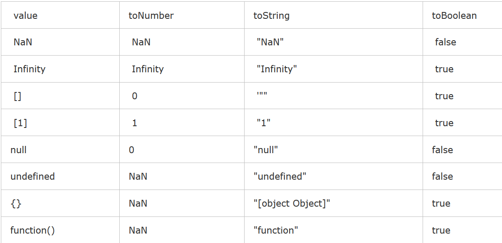

### 1 数组去重

```js
    // 思路1：定义一个新数组，并存放原数组的第一个元素，
    // 然后将元素组一一和新数组的元素对比，若不同则存放在新数组中。
    function unique(arr) {
      var res = [arr[0]];
      for (var i = 0;i < arr.length;i++) {
        var repeat = false;
        for (var j = 0;j<res.length;j++) {
          if (arr[i] === res[j]) {
            repeat = true;
            break;           
            alert(1);                        
          }
        }
        if (!repeat) {
          res.push(arr[i]);
        }
      }
      return res;
    }
    console.log(unique([1,2,1,2,3,4,3,1,3,4]));


  function unique(arr) {
  var temp = [];
  for (var i = 0;i < arr.length;i++) {
    if (temp.indexOf(arr[i]) == -1) {
      temp.push(arr[i]);
    }
  }
  return temp;
}
var arr = [1,2,3,1,2,4];
console.log(unique(arr));
```

### 2 使用正则表达式验证邮箱格式
### 3 计算数组arr所有元素的和
```js
  var arr = [1,2,3];
  var sum = 0;
  for (var i = 0;i <= arr.length;i++){
    sum += i
  }
  console.log(sum)

```
## 4 20190221面试代码题
```js
  (function(x) {
    delete x;
    alert(x); //6
  })(1+5);
 

  var a = 6;
  setTimeout(function() {
    alert(a);
    var a = 66;
  },1000);
  a = 666;
  alert(a);

  0 == '';// true
  NaN == NaN // false  因为NaN 是:Not a number (不是一个数字的缩写)

  [] == false //  []隐式转化为boolen时true
  [] == ![] // true

  //0 是逻辑的 false
  //1 是逻辑的 true
  //空字符串是逻辑的 false
  //null 是逻辑的 false
  //NaN 是逻辑的 false
  
  for (var i = 0;i<=3;i++) {
    setTimeout(function() {
      console.log(i);//4,4,4,4
    },0);
  };
 
  var a = new Object();
  a.value = 1;
  b = a;
  b.value = 2;
  alert(a.value);//2 直接把a对象的内存地址（或者说指针）复制给b，换句话说a和b实际上还是同一个对象
```



## 4 
```js
// 方式1：一个构造函数嘛，里面有个全部变量getName 指向一个匿名函数
function Foo() {
  getName = function() {
    console.log(1);
  }
  return this;
}
// 方式2：构造函数的一个属性getName 指向一个匿名函数
Foo.getName = function() {
  console.log(2);
}
// 方式3：构造函数的原型上有个getName方法
Foo.prototype.getName = function() {
  console.log(3);
}
// 方式4：定义一个变量指针指向一个匿名函数
var getName = function() {
  console.log(4);
}
// 方式5：声明一个叫getName的有名函数
function getName() {
  console.log(5);
}
Foo.getName();//2 函数Foo的静态方法

getName();//4 
//当定义的变量和声明的函数重名（5,4)，它们都会进行预解析，函数声明提前于变量声明，但是最终会被变量覆盖

Foo().getName();//1  先执行方式1的“Foo()”,结果是"this" 并指向window，并产生了一个全局getName(window.getName)指针指向一个匿名函数，然后再执行"this.getName()" , 其实就是执行刚刚造出来的那个全局getName指向的匿名函数，所以输出“1”.

getName();//1 此句执行的是方式1执行出来的那个全局变量getName 指针指向的匿名函数，有人问为啥不执行方式4？方式4已经被覆盖了！所以结果为 “1”.

new Foo.getName();//2 首先还是先看运算符优先级吧，【new Foo() >  Foo() > new Foo】，先运算方式2的Foo.getName() 结果为“2”，再new一个Foo实例对象。

new Foo().getName();//3 先执行 new Foo(), 结果产生一个新的实例对象，并且继承了Foo()这个构造函数中的getName方法，所以再执行方式3函数块

new new Foo().getName();//3 先执行new Foo(),变成了 new Foo的实例对象.getName(), 然后再执行 Foo的实例对象.getName(),又回到了方式3函数块，结果为“3”，最后执行new Foo的实例对象。
```
## 5 经典闭包题
```js
 function fun(n,o) {
  console.log(o)
  return {
    fun:function(m){
      return fun(m,n);
    }
  };
}
var a = fun(0);  a.fun(1);  a.fun(2);  a.fun(3);//undefined,?,?,?
var b = fun(0).fun(1).fun(2).fun(3);//undefined,?,?,?
var c = fun(0).fun(1);  c.fun(2);  c.fun(3);//undefined,?,?,?
 
```
1 第后面几个fun(1),fun(2),fun(3),函数都是在调用第二层fun函数。可以得知，第一个fun(0)是在调用第一层fun函数。第二个fun(1)是在调用前一个fun的返回值的fun函数，所以：
    在第一次调用fun(0)时，o为undefined；  
    第二次调用fun(1)时m为1，此时fun闭包了外层函数的n，也就是第一次调用的n=0，即m=1，n=0，并在内部调用第一层fun函数fun(1,0);所以o为0；  
    第三次调用fun(2)时m为2，但依然是调用a.fun，所以还是闭包了第一次调用时的n，所以内部调用第一层的fun(2,0);所以o为0  
    第四次同理；  
即：最终答案为undefined,0,0,0

2 遂：先从fun(0)开始看，肯定是调用的第一层fun函数；而他的返回值是一个对象，所以第二个fun(1)调用的是第二层fun函数，后面几个也是调用的第二层fun函数。  
    在第一次调用第一层fun(0)时，o为undefined；  
    第二次调用 .fun(1)时m为1，此时fun闭包了外层函数的n，也就是第一次调用的n=0，即m=1，n=0，并在内部调用第一层fun函数fun(1,0);所以o为0；  
    第三次调用 .fun(2)时m为2，此时当前的fun函数不是第一次执行的返回对象，而是第二次执行的返回对象。而在第二次执行第一层fun函数时时(1,0)所以n=1,o=0,返回时闭包了第二次的n，遂在第三次调用第三层fun函数时m=2,n=1，即调用第一层fun函数fun(2,1)，所以o为1；  
    第四次调用 .fun(3)时m为3，闭包了第三次调用的n，同理，最终调用第一层fun函数为fun(3,2)；所以o为2；

即最终答案：undefined,0,1,2

3 fun(0)为执行第一层fun函数，.fun(1)执行的是fun(0)返回的第二层fun函数，这里语句结束，遂c存放的是fun(1)的返回值，而不是fun(0)的返回值，所以c中闭包的也是fun(1)第二次执行的n的值。

c.fun(2)执行的是fun(1)返回的第二层fun函数，c.fun(3)执行的也是fun(1)返回的第二层fun函数。根据前面两个例子，可以得知：  
    第一次调用第一层fun(0)时，o为undefined；  
    第二次调用 .fun(1)时m为1，此时fun闭包了外层函数的n，也就是第一次调用的n=0，即m=1，n=0，并在内部调用第一层fun函数fun(1,0);所以o为0；  
    第三次调用 .fun(2)时m为2，此时fun闭包的是第二次调用的n=1，即m=2，n=1，并在内部调用第一层fun函数fun(2,1);所以o为1；  
    第四次.fun(3)时同理，但依然是调用的第二次的返回值，遂最终调用第一层fun函数fun(3,1)，所以o还为1

即最终答案：undefined,0,1,1

## 6 
```js
  var funcs = [];
  for (var i=0;i<10;i++){
    funcs.push(function(){
      console.log(i);
    })
  }
  funcs.forEach(function (func) {
    func();
  })
10个10
```

## 7 不使用循环，创建一个长度为100的数组，并且每个元素的值等于他的下标
```js
// 使用for循环实现
var s = [];
for(var i=0; i<100;i++){
    s[i]=i
}
console.log(s);

var s = [];
for(var i=0;i<100;i++){
    s.push(i);
}
console.log(s);

```

```js
//第一种 Object.key()
var creatArray = Object.keys(Array.apply(null,{length: 100}));
console.log(creatArray);//结果为字符串

var creatArray = Object.keys(Array.apply(null,{length: 100})).map(function(item){
    return +item
});
console.log(creatArray);//结果为数字
```
```js
// 第二种Array.from()
var arrNew = Array.from({length: 100},(v,k)=>k);
console.log(arrNew );
```

```js
// 方法三：Array.keys()获取数组的key值
var arr = new Array(100).keys();
console.log(Array.from(arr));
```

```js
// 方法四：setInterval
var s = []; var i = 0; var pushArray = setInterval(function(){ s[i] = i++ if (i >= 100){
        clearInterval(pushArray);
        console.log(s);
    } },1);
```
## 8 编写一个函数foo(n),参数n是整数，该函数返回一个数组，该数组内是n个随机不重复的整数，整数的范围是11-41
```js
function fun(n) {
  var a  = [];
  for (var i = 0;i < n;i++) {
    var b = Math.floor(Math.random()*(41-11+1)+11);
    a.push(b)
  }
  return a;
}
console.log(fun(10));


```