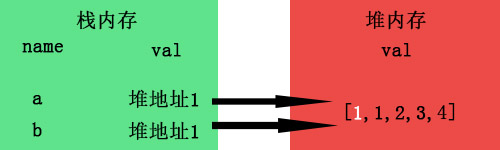
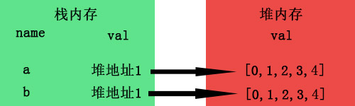

## 1 Json对象和字符串的相互转化
  JSON.stringify(obj)      将JSON对象转为字符串。  
  JSON.parse(string)       将字符串转为JSON对象格式。 parse(解析，理解)
## 2 ajax  axios 和 fetch 的区别
  > 1.jQuery ajax 

  ```js
    $.ajax({
      type: 'POST',
      url: url,
      data: data,
      dataType: dataType,
      success: function () {},
      error: function () {}
    });
  ```
  > 优缺点：

    本身是针对MVC的编程,不符合现在前端MVVM的浪潮
    基于原生的XHR开发，XHR本身的架构不清晰，已经有了fetch的替代方案
    JQuery整个项目太大，单纯使用ajax却要引入整个JQuery非常的不合理（采取个性化打包的方案又不能享受CDN服务）

  > 2.axios

  ```js 
  axios({
    method: 'post',
    url: '/user/12345',
    data: {
        firstName: 'Fred',
        lastName: 'Flintstone'
    }
  })
    .then(function (response) {
        console.log(response);
    })
    .catch(function (error) {
        console.log(error);
    });


    文档
    // 为给定 ID 的 user 创建请求
    axios.get('/user?ID=12345')
      .then(function (response) {
        console.log(response);
      })
      .catch(function (error) {
        console.log(error);
      });

    // 可选地，上面的请求可以这样做
    axios.get('/user', {
        params: {
          ID: 12345
        }
      })
      .then(function (response) {
        console.log(response);
      })
      .catch(function (error) {
        console.log(error);
      });

  ```

  > 优缺点：  

    从 node.js 创建 http 请求  
    支持 Promise API  
    客户端支持防止CSRF  
    提供了一些并发请求的接口（重要，方便了很多的操作）  

  > 3.fetch

  ```js
    try {
      let response = await fetch(url);
      let data = response.json();
      console.log(data);
    } catch(e) {
      console.log("Oops, error", e);
    }
  ```
  
  >优缺点：
    
    优点
    符合关注分离，没有将输入、输出和用事件来跟踪的状态混杂在一个对象里
    更好更方便的写法
    更加底层，提供的API丰富（request, response）
    脱离了XHR，是ES规范里新的实现方式
    
    缺点
    1）fetchtch只对网络请求报错，对400，500都当做成功的请求，需要封装去处理
    2）fetch默认不会带cookie，需要添加配置项
    3）fetch不支持abort，不支持超时控制，  
    使用setTimeout及Promise.reject的实现的超时控制并不能阻止请求过程继续在后台运行，造成了量的浪费
    4）fetch没有办法原生监测请求的进度，而XHR可以

   > fetch 

     fetch是基于Promise设计，支持async和await

  > 为什么要用axios

    axios 是一个基于Promise 用于浏览器和 nodejs 的 HTTP 客户端，它本身具有以下特征：

    从浏览器中创建 XMLHttpRequest,本质也是对原生xhr的封装
    从 node.js 发出 http 请求
    支持 Promise API
    拦截请求和响应
    转换请求和响应数据
    取消请求
    自动转换JSON数据
    客户端支持防止CSRF/XSRF
    防止CSRF:就是让你的每个请求都带一个从cookie中拿到的key, 根据浏览器同源策略，  
    假冒的网站是拿不到你cookie中得key的，这样，后台就可以轻松辨别出这个请求是否是用户在假冒网站上的误导输入，  
    从而采取正确的策略。

## 3 h5plus
  > h5 plus 是什么

    HTML5+是中国HTML5产业联盟的扩展规范，基于HTML5扩展了大量调用设备的能力，使得web语言可以想原生语言一样强大。

  >HTML5+运行环境

   *Runtime版 – for App（运行环境与项目代码打包为原生APP）*  
   使用HTML5开发，然后使用HBuilder提供的云打包或本地打包将可以把5+ Runtime和开发者编写的HTML5页面打包为原生App的安装包，包括Android的apk和iOS的ipa。发行到原生应用市场。

   *SDK版 – for Hybrid（原生APP中构建H5+运行环境）*  
   在你的原生应用中内嵌5+ SDK，替代手机默认的webview，无论使用Hybrid开发模式，还是在原生App中构建web应用生态，都将能体验到更强大的内核动力。

  > 配套工具
   
   HBuilder  
   HTML5+项目的开发工具，既是代码编辑器，也是基于H5+的APP打包工具。

   MUI框架  
   一个与HTML5+配套的样式框架

## 3 jquery和zepto的区别
   * zepto是针对高级浏览器的js库，有触摸事件，不兼容IE

## 4 富文本编辑器的原理
## 5 上传图片时图片较大怎么处理
* 进行压缩处理，再转成file文件上传

```js
<!DOCTYPE html>
<html lang="en">
<head>
    <meta charset="UTF-8">
    <title>Title</title>
</head>
<body>

<input type="file" style="" accept="image/*">
<script src="jquery-1.js"></script>
<script>
    $("input").on("change",select_img);
    function select_img() {//当input file值改变时触发的事件
        console.log($("input")[0].files);
        var img_size = $("input")[0].files[0].size; //用来判断大小
        const reader = new FileReader();//图片预览
        reader.readAsDataURL($("input")[0].files[0]);
        reader.onload = function(e) {
            if (img_size >= 1024 * 1024 *0.1) { //意思是大于0.5m 就进行处理
                console.log("图片太大");
                compressImage(e.target.result);//调用自定义方法来处理图片
            }
            else {
                const src = e.target.result;
                $("img").attr("src",src) ;
            }
        }
    }
    function  compressImage(bdata) {//压缩图片
        console.log(bdata);
        var quality = 1; //压缩图片的质量
        var oldimglength = bdata.length;//压缩前的大小
        var compresRadio = 0;// 压缩率
        var canvas = document.createElement("canvas"); //创建画布
        var ctx = canvas.getContext("2d");
        var img = new Image();
        img.src = bdata;
        img.onload = function(){
            var width = img.width;
            var height = img.height;
            canvas.width = 500;   //这里可以自定义你的图片大小
            canvas.height = 500 * (img.height / img.width);
            ctx.drawImage(img, 0, 0, canvas.width, canvas.height);
            var cdata = canvas.toDataURL("image/png",quality);  //将图片转为Base64 之后预览要用
            $("img").attr("src",cdata);
            var newimglength = cdata.length;
            console.log("img-blob:"+oldimglength);//压缩前大小
            console.log("ctx-blob:"+newimglength) ;//压缩后大小
            compresRadio = (((oldimglength-newimglength)/oldimglength*100).toFixed(2))+'%';
            console.log("压缩率:"+compresRadio)
            var arr = cdata.split(',');
            var mime = arr[0].match(/:(.*?);/)[1];
            var bstr = atob(arr[1]);
            var n = bstr.length;
            var u8arr = new Uint8Array(n);
            while(n--){
                u8arr[n] = bstr.charCodeAt(n);
            }
            console.log(new File([u8arr],"压缩", {type:mime}))
        }
    }
 
 
</script>
</body>
</html>
```
## 6 HTML中& nbsp; & ensp; & emsp; & thinsp;等6种空白空格的区别 

HTML提供了5种空格实体（space entity），它们拥有不同的宽度，非断行空格（& nbsp;）是常规空格的宽度，可运行于所有主流浏览器。其他几种空格（ & ensp; & emsp; & thinsp; & zwnj;& zwj;）在不同浏览器中宽度各异。
 
& nbsp;        
 
它叫不换行空格，全称No-Break Space，它是最常见和我们使用最多的空格，大多数的人可能只接触了&nbsp;，它是按下space键产生的空格。在HTML中，如果你用空格键产生此空格，空格是不会累加的（只算1个）。要使用html实体表示才可累加，该空格占据宽度受字体影响明显而强烈。
 
& ensp;        
 
它叫“半角空格”，全称是En Space，en是字体排印学的计量单位，为em宽度的一半。根据定义，它等同于字体度的一半（如16px字体中就是8px）。名义上是小写字母n的宽度。此空格传承空格家族一贯的特性：透明的，此空格有个相当稳健的特性，就是其占据的宽度正好是1/2个中文宽度，而且基本上不受字体影响。
 
& emsp;        
 
它叫“全角空格”，全称是Em Space，em是字体排印学的计量单位，相当于当前指定的点数。例如，1 em在16px的字体中就是16px。此空格也传承空格家族一贯的特性：透明的，此空格也有个相当稳健的特性，就是其占据的宽度正好是1个中文宽度，而且基本上不受字体影响。
 
& thinsp;        
 
它叫窄空格，全称是Thin Space。我们不妨称之为“瘦弱空格”，就是该空格长得比较瘦弱，身体单薄，占据的宽度比较小。它是em之六分之一宽。
 
& zwnj; 
 
它叫零宽不连字，全称是Zero Width Non Joiner，简称“ZWNJ”，是一个不打印字符，放在电子文本的两个字符之间，抑制本来会发生的连字，而是以这两个字符原本的字形来绘制。Unicode中的零宽不连字字符映射为“”（zero width non-joiner，U+200C），HTML字符值引用为： & #8204;
 
& zwj;
 
它叫零宽连字，全称是Zero Width Joiner，简称“ZWJ”，是一个不打印字符，放在某些需要复杂排版语言（如阿拉伯语、印地语）的两个字符之间，使得这两个本不会发生连字的字符产生了连字效果。零宽连字符的Unicode码位是U+200D (HTML: & #8205; & zwj;）。
 
此外，浏览器还会把以下字符当作空白进行解析：空格（& #x0020;）、制表位（& #x0009;）、换行（& #x000A;）和回车（& #x000D;）还有（& #12288;）等等。

## 7 vue项目中遇到的坑
 1 当我们在路由中配置了不同的router-link对应于不同的组件的时候，会发现npm run dev之后什么都没有，比如我的路由如下：
 ```js
export default new Router({
  routes: [
    {
      path: '/Mall',
      component: Mall
    },
    {
      path: '/personal-center',
      component: personalCenter
    }, 
    {
      path: '/order',
      component: AlipayHint
    },
    {
      path: '/commodity',
      component: Commodity
    }
  ]
});
 ```
 运行之后，是空白页，这是因为路由中并没有配置一进来是“/”的路由，所以什么都没有显示，这时就需要重定向了。如下所示：
 ```js
routes: [
    {
      path: '/Mall',
      component: Mall
    },
    {
      path: '/personal-center',
      component: personalCenter
    }, 
    {
      path: '/order',
      component: AlipayHint
    },
    {
      path: '/commodity',
      component: Commodity
    },
    {
      path: "/",
      redirect: "/commodity"
    }
  ]
 ```
 2 在vue中，我们可以使用v-on:click.once对click处理函数只绑定一次，


## 8 node的优缺点
## 9 html的兼容性问题
1、浏览器默认的margin和padding不同。  
解决办法：使用*{margin：0；padding：0；}

2、IE6双边bug问题。  
如果给块级元素同时设置了margin-left和float：left；lIE6浏览器会解析margin-left值为2倍。或者设置了margin-right和float: right;浏览器会解析margin-right值为2倍。  
解决办法：加上_display:inline; （_display是IE6特有的写法） 

3、超链接访问之后hover样式不出现了，被点击后也不具有active和hover样式。  
方法：按照顺序写 ：a:link{   }  a:visited{  } a:hover{  } a:active{   }

4、上下margin会重合的问题。
margin-left和margin-right不会重合，但是margin-top和margin-bottom会重合。  
解决办法：养成良好的书写习惯，同时书写margin-top或者同时书写margin-bottm。

## 10 异步上传图片
```html
<form class="form-horizontal"enctype="multipart" id="form_edit">
  <div class="form-group">
    <label class="col-sm-3 control-label">头像</label>
    <div class="col-sm-6">
      <label class="form-image">
        <input id="avatar" type="file" name="file_img">
        " id="avatar_img">
        <i class="mask fa fa-upload"></i>
      </label>
      <!-- 用来保存图片的信息 -->
      <input type="hidden" name="temp" id="temp">
    </div>
  </div>
</form>

```

```js
    //上传管理员头像
    $('#avatar').change(function () {
      //转化为jquery对象
      var file = document.getElementById('avatar').files[0];
      var fd = new FormData();
      fd.append('f',file);
      // console.dir(file);
      $.ajax({
        url:'uploadImg.php',
        data:fd,
        type:'post',
        dataType:'text',
        contentType:false,
        processData:false,
        success:function (data) {
          // console.log(data);
          if (data == 2) {                                                                                                                                                                                          
            layer.msg('头像上传失败');
          } else {
            $('#avatar_img').attr('src',data);
            layer.msg('头像上传成功');
          }
        }
      })
    })


```

下面的代码将创建一个空的FormData对象:
```js
var formData = new FormData(); // 当前为空
```
你可以使用FormData.append来添加键/值对到表单里面；
```js
formData.append('username', 'Chris');
```
* FormData对象的优势就是能够一次性将表单中的所有数据全部取出，包括文件域，文件对象
* 使用formdata对象后，必须使用post方式来发送ajax请求
* 将formdata对象作为参数传入send中

## 11常见的加密方式
1.Base64

2.MD5

## 12 vue中插槽

## 13 vue中服务端渲染
* 浏览器渲染缺点
* 1 js放在dom结尾，如果js文件过大，那么必然造成页面阻塞。用户体验明显不好
* 2 不利于SEO

服务端比起客户端渲染页面的优点：

    首屏渲染速度更快

客户端渲染的一个缺点是，用户第一次访问页面，此时浏览器没有缓存，需要先从服务端下载js，然后再通过js操作动态添加dom并渲染页面，时间较长。而服务端渲染的规则是，用户第一次访问浏览器可以直接解析html文档并渲染页面，并屏渲染速度比客户端渲染更快。

    SEO

服务端渲染可以让搜索引擎更容易读取页面的meta信息，以及其它SEO相关信息，大大增加了网站在搜索引擎中的速度。

    减少HTTP请求

服务端渲染可以把一些动态数据在首次渲染时同步输出到页面，而客户端渲染需要通过AJAX等手段异步获取这些数据，这样就相当于多了一次HTTP请求。
  
服务端渲染实现原理机制：在服务端拿数据进行解析渲染，直接生成html片段返回给前端。然后前端可以通过解析后端返回的html片段到前端页面，大致有以下两种形式：

1、服务器通过模版引擎直接渲染整个页面，例如java后端的vm模版引擎，php后端的smarty模版引擎。  
2、服务渲染生成html代码块, 前端通过AJAX获取然后使用js动态添加。

## 14 vue2.0 路由模式mode="history"的作用
404错误

在History mode下，如果直接通过地址栏访问路径，那么会出现404错误，这是因为这是单页应用（废话）…其实是因为调用了history.pushState API 所以所有的跳转之类的操作都是通过router来实现的，解决这个问题很简单，只需要在后台配置如果URL匹配不到任何静态资源，就跳转到默认的index.html。

## 15 jQuery对象和DOM对象的相互转换
1.jQuery对象转DOM对象
```js
var $li = $(“li”);
//第一种方法（推荐使用）
$li[0]
//第二种方法
$li.get(0)
//其实jQuery对象转DOM对象的实质就是取出jQuery对象中封装的DOM对象。
```

2.DOM对象转jQuery对象
```js
var $obj = $(domObj);
// $(document).ready(function(){});就是典型的DOM对象转jQuery对象
```

## 16 深拷贝和浅拷贝
简单点来说，就是假设B复制了A，当修改A时，看B是否会发生变化，如果B也跟着变了，说明这是浅拷贝，拿人手短，如果B没变，那就是深拷贝

基本数据类型有哪些，number，string，boolean，null，undefined，symbol以及未来ES10新增的BigInt(任意精度整数)七类。

引用数据类型(Object类)有常规名值对的无序对象{a:1}，数组[1,2,3]，以及函数等。

1 基本类型--名值存储在栈内存中，例如let a=1;


当你b=a复制时，栈内存会新开辟一个内存，例如这样：


所以当你此时修改a=2，对b并不会造成影响，因为此时的b不受a的影响了。当然，let a=1,b=a;虽然b不受a影响，但这也算不上深拷贝，因为深拷贝本身只针对较为复杂的object类型数据。

2 引用数据类型--名存在栈内存中，值存在于堆内存中，但是栈内存会提供一个引用的地址指向堆内存中的值


当b=a进行拷贝时，其实复制的是a的引用地址，而并非堆里面的值。


而当我们a[0]=1时进行数组修改时，由于a与b指向的是同一个地址，所以自然b也受了影响，这就是所谓的浅拷贝了。



要是在堆内存中也开辟一个新的内存专门为b存放值，就像基本类型那样，岂不就达到深拷贝的效果了



深拷贝

数组 slice concat
```js
arrayObj.slice(start, [end]) 该方法返回一个 Array 对象，其中包含了 arrayObj 的指定部分。  
不会改变原数组

var arr = ['a', 'b', 'c'];
var arrCopy = arr.slice(0);
arrCopy[0] = 'test'
console.log(arr); // ["a", "b", "c"]
console.log(arrCopy); // ["test", "b", "c"]

arrayObj.concat() 方法用于连接两个或多个数组。该方法不会改变现有的数组，而仅仅会返回被连接数组的一个副本。

var arr = ['a', 'b', 'c'];
var arrCopy = arr.concat();
arrCopy[0] = 'test'
console.log(arr); // ["a", "b", "c"]
console.log(arrCopy); // ["test", "b", "c"]

function deepCopy(arr1, arr2) {
   for (var i = 0; i < arr1.length; ++i) {
       arr2[i] = arr1[i];
   }
}

```
对象

对象的深拷贝实现原理： 定义一个新的对象，遍历源对象的属性 并 赋给新对象的属性
```js
var obj = {
   name:'Hanna Ding',
   age: 22
}

var obj2 = new Object();
obj2.name = obj.name;
obj2.age = obj.age

obj.name = 'xiaoDing';
console.log(obj); //Object {name: "xiaoDing", age: 22}
console.log(obj2); //Object {name: "Hanna Ding", age: 22}

```

```js
封装深拷贝方法

var obj = {
    name: 'Hanna',
    age: 22
}
var deepCopy = function (source) {
    var result = {};            
    for(var key in source) {                
        if(typeof source[key] === 'object') {
            result[key] = deepCopy(source[key])
        } else {
            result[key] = source[key]
        }
    }            
    return result;
}

var objCopy = deepCopy(obj)
obj.name = 'ding';
console.log(obj);//Object {name: "ding", age: 22}
console.log(objCopy);//Object {name: "Hanna", age: 22}

```
## 17 原生js实现购物车
购物车总金额计算：通过queryselector获取价格，数量等。循环遍历所有被选中商品计算总金额，将总金额通过innertext传递给总数部分

移除商品：点击按钮后触法方法，在方法中获取需要的节点，在父节点中移除商品的tr

增加商品数量：点击加号后，获取input里面的值，将增加后的值重新赋值给Input。parseInt 将字符串转整数，最后再重新调用购物车金额计算的方法

减少商品数量：判断input的值是否大于1.

## 18 call apply 
```js
/*apply()方法*/
function.apply(thisObj[, argArray])

/*call()方法*/
function.call(thisObj[, arg1[, arg2[, [,...argN]]]]);

```
定义  
apply：调用一个对象的一个方法，用另一个对象替换当前对象。例如：B.apply(A, arguments);即A对象应用B对象的方法。

call：调用一个对象的一个方法，用另一个对象替换当前对象。例如：B.call(A, args1,args2);即A对象调用B对象的方法。
