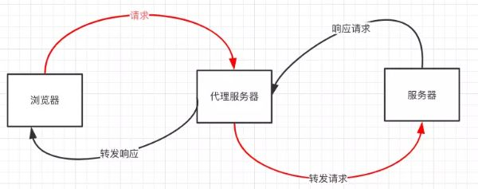

## 1 网页生成过程 
* 1 HTML被HTML解析器解析成DOM 树
* 2 css则被css解析器解析成CSSOM 树
* 3 结合DOM树和CSSOM树，生成一棵渲染树(Render Tree)
* 4 生成布局（flow），即将所有渲染树的所有节点进行平面合成
* 5 将布局绘制（paint）在屏幕上
  
  #### 渲染
  网页生成的时候，至少会渲染一次。  
  在用户访问的过程中，还会不断重新渲染  
  重新渲染需要重复之前的第四步(重新生成布局)+第五步(重新绘制)或者只有第五个步(重新绘制)。

  #### 重排 reflow
  重新生成布局，重新排列元素
  ##### 常见引起重排属性和方法
  任何会改变元素几何信息(元素的位置和尺寸大小)的操作，都会触发重排，下面列一些栗子  
  1 添加或者删除可见的DOM元素；  
  2 元素尺寸改变——边距、填充、边框、宽度和高度  
  3 内容变化，比如用户在input框中输入文字  
  4 浏览器窗口尺寸改变——resize事件发生时  
  5 计算 offsetWidth 和 offsetHeight 属性  
  6 设置 style 属性的值
  ##### 重排影响的范围
  由于浏览器渲染界面是基于流式布局模型的，所以触发重排时会对周围DOM重新排列，影响的范围有两种：  
  *全局范围*：从根节点html开始对整个渲染树进行重新布局。  
  *局部范围*：对渲染树的某部分或某一个渲染对象进行重新布局 把一个dom的宽高之类的几何信息定死，然后在dom内部触发重排，就只会重新渲染该dom内部的元素，而不会影响到外界。

  #### 重绘 repaint
  当一个元素的外观发生改变，但没有改变布局,重新把元素外观绘制出来的过程，叫做重绘。
  ##### 常见引起重绘属性和方法
  color  backgroundcolor  text-decoration  box-shadow

  #### 浏览器渲染队列
  当我们修改了元素的几何属性，导致浏览器触发重排或重绘时。它会把该操作放进渲染队列，等到队列中的操作到了一定的数量或者到了一定的时间间隔时，浏览器就会批量执行这些操作。

> 重绘"不一定会出现"重排"，"重排"必然会出现"重绘

  #### 重排优化建议
  + 1. 分离读写操作
  + 2. 样式集中改变  建议通过改变class或者csstext属性集中改变样式
  + 3. 缓存布局信息
>
> // bad 强制刷新 触发两次重排  
> div.style.left = div.offsetLeft + 1 + 'px';  
> div.style.top = div.offsetTop + 1 + 'px';  
>
> // good 缓存布局信息 相当于读写分离  
> var curLeft = div.offsetLeft;  
> var curTop = div.offsetTop;  
> div.style.left = curLeft + 1 + 'px';  
> div.style.top = curTop + 1 + 'px';
  
  + 4. 离线改变dom  
  *隐藏要操作的dom*   
  在要操作dom之前，通过display隐藏dom，当操作完成之后，才将元素的display属性为可见，因为不可见的元素不会触发重排和重绘。  
  dom.display = 'none'  
  // 修改dom样式  
  dom.display = 'block'  
  通过使用DocumentFragment创建一个dom碎片,在它上面批量操作dom，操作完成之后，再添加到文档中，这样只会触发一次重排。复制节点，在副本上工作，然后替换它！

  + 5.  position属性为absolute或fixed   
  position属性为absolute或fixed的元素，重排开销比较小，不用考虑它对其他元素的影响

  + 6. 优化动画  
  可以把动画效果应用到position属性为absolute或fixed的元素上，这样对其他元素影响较小  
  动画效果还应牺牲一些平滑，来换取速度，这中间的度自己衡量：  
  比如实现一个动画，以1个像素为单位移动这样最平滑，但是reflow就会过于频繁，大量消耗CPU资源，如果以3个像素为单位移动则会好很多。

  ## 2 跨域实现方式
  #### (1) 什么是同源策略及其限制内容？
      同源策略是一种约定，它是浏览器最核心也最基本的安全功能，如果缺少了同源策略，浏览器很容易受到XSS、CSFR等攻击。所谓同源是指"协议+域名+端口"三者相同，即便两个不同的域名指向同一个ip地址，也非同源  
      

      * 同源限制的内容有：
      * Cookie、LocalStorage、IndexedDB 等存储性内容  
        DOM 节点  
        AJAX 请求发送后，结果被浏览器拦截了

      * 有三个标签是允许跨域加载资源：  
      * img link script
#### (2) 常见跨域场景
   当协议、子域名、主域名、端口号中任意一个不相同时，都算作不同域。不同域之间相互请求资源，就算作“跨域”。
   
   > 注意  
   >第一：如果是协议和端口造成的跨域问题“前台”是无能为力的。   
   >
   >第二：在跨域问题上，仅仅是通过“URL的首部”来识别而不会根据域名对应的IP地址是否相同来判断。“URL的首部”可以理解为“协议, 域名和端口必须匹配”。  
   >
   >跨域并不是请求发不出去，请求能发出去，服务端能收到请求并正常返回结果，只是结果被浏览器拦截了。你可能会疑问明明通过表单的方式可以发起跨域请求，为什么 Ajax 就不会?因为归根结底，跨域是为了阻止用户读取到另一个域名下的内容，Ajax 可以获取响应，浏览器认为这不安全，所以拦截了响应。但是表单并不会获取新的内容，所以可以发起跨域请求。同时也说明了跨域并不能完全阻止 CSRF，因为请求毕竟是发出去了。
## 2.1 跨域解决方案
### 1 jsonp 
        1. jsonp原理   
        利用 script 标签没有跨域限制的漏洞，网页可以得到从其他来源动态产生的 JSON 数据。JSONP请求一定需要对方的服务器做支持才可以。
        1. JSONP和AJAX对比  
        JSONP和AJAX相同，都是客户端向服务器端发送请求，从服务器端获取数据的方式。但AJAX属于同源策略，JSONP属于非同源策略（跨域请求）
        1. JSONP优缺点  
        JSONP优点是简单兼容性好，可用于解决主流浏览器的跨域数据访问的问题。  缺点是仅支持get方法具有局限性,不安全可能会遭受XSS攻击。
        1. JSONP的实现流程  
        
        ```js
        index.html
        function jsonp({ url, params, callback }) {
          return new Promise((resolve, reject) => {
           let script = document.createElement('script')
           window[callback] = function(data) {
              resolve(data)
              document.body.removeChild(script)
           }
        params = { ...params, callback } // wd=b&callback=show
        let arrs = []
        for (let key in params) {
          arrs.push(`${key}=${params[key]}`)
        }
        script.src = `${url}?${arrs.join('&')}`
        document.body.appendChild(script)
        })
        }
        jsonp({
         url: 'http://localhost:3000/say',
         params: { wd: 'Iloveyou' },
         callback: 'show'
        }).then(data => {
          console.log(data)
        })
        ```
        * 上面这段代码相当于向   http://localhost:3000/say?wd=Iloveyou&callback=show  这个地址请求数据，然后后台返回show('我不爱你')，最后会运行show()这个函数，打印出'我不爱你'

        ```js
        // server.js
        let express = require('express')
        let app = express()
        app.get('/say', function(req, res) {
           let { wd, callback } = req.query
           console.log(wd) // Iloveyou
           console.log(callback) // show
           res.end(`${callback}('我不爱你')`)
        })
         app.listen(3000)
        ```
        >声明一个回调函数，其函数名(如show)当做参数值，要传递给跨域请求数据的服务器，函数形参为要获取目标数据(服务器返回的data)。 
        > 
        >创建一个script标签，把那个跨域的API数据接口地址，赋值给script的src,还要在这个地址中向服务器传递该函数名（可以通过问号传参:?callback=show）。 
        >
        >服务器接收到请求后，需要进行特殊的处理：把传递进来的函数名和它需要给你的数据拼接成一个字符串,例如：传递进去的函数名是show，它准备好的数据是show('我不爱你')。  
        >
        >最后服务器把准备的数据通过HTTP协议返回给客户端，客户端再调用执行之前声明的回调函数（show），对返回的数据进行操作。 

   5. jQuery的jsonp形式   
      JSONP都是GET和异步请求的，不存在其他的请求方式和同步请求，且jQuery默认就会给JSONP的请求清除缓存。

      ```js 
      $.ajax({
        url:"http://crossdomain.com/jsonServerResponse",
        dataType:"jsonp",
        type:"get",//可以省略
        jsonpCallback:"show",//->自定义传递给服务器的函数名，而不是使用jQuery自动生成的，可省略
        jsonp:"callback",//->把传递函数名的那个形参callback，可省略
        success:function (data){
        console.log(data);}
      });
      ```
   为了便于客户端使用数据，逐渐形成了一种非正式传输协议，人们把它称作JSONP，该协议的一个要点就是允许用户传递一个callback参数给服务端，然后服务端返回数据时会将这个callback参数作为函数名来包裹住JSON数据，这样客户端就可以随意定制自己的函数来自动处理返回数据了

### 2 cors
  > CORS 需要浏览器和后端同时支持。IE 8 和 9 需要通过 XDomainRequest 来实现。
  >
  >浏览器会自动进行 CORS 通信，实现 CORS 通信的关键是后端。只要后端实现了 CORS，就实现了跨域。
  >
  >服务端设置 Access-Control-Allow-Origin 就可以开启 CORS。 该属性表示哪些域名可以访问资源，如果设置通配符则表示所有网站都可以访问资源。
  >
  >虽然设置 CORS 和前端没什么关系，但是通过这种方式解决跨域问题的话，会在发送请求时出现两种情况，分别为简单请求和复杂请求。

  1. 简单请求
  > 只要同时满足以下两大条件，就属于简单请求
  >
  >条件1：使用下列方法之一：
   GET
   HEAD
   POST

  >条件2：Content-Type 的值仅限于下列三者之一：  
   text/plain  
   multipart/form-data  
   application/x-www-form-urlencoded  

   >请求中的任意 XMLHttpRequestUpload 对象均没有注册任何事件监听器  
   >XMLHttpRequestUpload 对象可以使用 XMLHttpRequest.upload 属性访问。

  2. 复杂请求
   > 符合以上条件的请求就肯定是复杂请求了。  
   复杂请求的CORS请求，会在正式通信之前，增加一次HTTP查询请求，称为"预检"请求,该请求是 option 方法的，通过该请求来知道服务端是否允许跨域请求
   > 用PUT向后台请求时，属于复杂请求，后台需做如下配置：

   ```js 
   // 允许哪个方法访问我
   res.setHeader('Access-Control-Allow-Methods', 'PUT')
   // 预检的存活时间
   res.setHeader('Access-Control-Max-Age', 6)
    // OPTIONS请求不做任何处理
   if (req.method === 'OPTIONS') {
      res.end()
   }
    // 定义后台返回的内容
   app.put('/getData', function(req, res) {
      console.log(req.headers)
    res.end('我不爱你')
  })
   ```

  > 完整复杂请求的例子
  ```js
     // index.html
     let xhr = new XMLHttpRequest()
     document.cookie = 'name=xiamen' // cookie不能跨域
     xhr.withCredentials = true // 前端设置是否带cookie
     xhr.open('PUT', 'http://localhost:4000/getData', true)
     xhr.setRequestHeader('name', 'xiamen')
     xhr.onreadystatechange = function() {
       if (xhr.readyState === 4) {
         if ((xhr.status >= 200 && xhr.status < 300) || xhr.status === 304) {
           console.log(xhr.response)
           //得到响应头，后台需设置Access-Control-Expose-Headers
           console.log(xhr.getResponseHeader('name'))
         }
       }
     }
     xhr.send()
     //server1.js
     let express = require('express');
     let app = express();
     app.use(express.static(__dirname));
     app.listen(3000);
     //server2.js
     let express = require('express')
     let app = express()
     let whitList = ['http://localhost:3000'] //设置白名单
     app.use(function(req, res, next) {
       let origin = req.headers.origin
       if (whitList.includes(origin)) {
         // 设置哪个源可以访问我
         res.setHeader('Access-Control-Allow-Origin', origin)
         // 允许携带哪个头访问我
         res.setHeader('Access-Control-Allow-Headers', 'name')
         // 允许哪个方法访问我
         res.setHeader('Access-Control-Allow-Methods', 'PUT')
         // 允许携带cookie
         res.setHeader('Access-Control-Allow-Credentials', true)
         // 预检的存活时间
         res.setHeader('Access-Control-Max-Age', 6)
         // 允许返回的头
         res.setHeader('Access-Control-Expose-Headers', 'name')
         if (req.method === 'OPTIONS') {
           res.end() // OPTIONS请求不做任何处理
         }
       }
       next()
     })
     app.put('/getData', function(req, res) {
       console.log(req.headers)
       res.setHeader('name', 'jw') //返回一个响应头，后台需设置
       res.end('我不爱你')
     })
     app.get('/getData', function(req, res) {
       console.log(req.headers)
       res.end('我不爱你')
     })
     app.use(express.static(__dirname))
     app.listen(4000)
  ```

### 3.postMessage
   * postMessage是HTML5 XMLHttpRequest Level 2中的API，且是为数不多可以跨域操作的window属性之一，它可用于解决以下方面的问题：  
   页面和其打开的新窗口的数据传递  
   多窗口之间消息传递  
   页面与嵌套的iframe消息传递  
   上面三个场景的跨域数据传递  
   postMessage()方法允许来自不同源的脚本采用异步方式进行有限的通信，可以实现跨文本档、多窗口、跨域消息传递。

   > otherWindow.postMessage(message, targetOrigin, [transfer])  
   message: 将要发送到其他 window的数据。  
   targetOrigin:通过窗口的origin属性来指定哪些窗口能接收到消息事件，其值可以是字符串"*"（表示无限制）或者一个URI。在发送消息的时候，如果目标窗口的协议、主机地址或端口这三者的任意一项不匹配targetOrigin提供的值，那么消息就不会被发送；只有三者完全匹配，消息才会被发送。  
   transfer(可选)：是一串和message 同时传递的 Transferable 对象. 这些对象的所有权将被转移给消息的接收方，而发送一方将不再保有所有权。

   > http://localhost:3000/a.html  页面向http://localhost:4000/b.html   传递“我爱你”,然后后者传回"我不爱你"。

   ```js 
     // a.html
       <iframe src="http://localhost:4000/b.html" frameborder="0" id="frame" onload="load()"></iframe> //等它加载完触发一个事件
       //内嵌在http://localhost:3000/a.html
         <script>
           function load() {
             let frame = document.getElementById('frame')
             frame.contentWindow.postMessage('我爱你', 'http://localhost:4000') //发送数据
             window.onmessage = function(e) { //接受返回数据
               console.log(e.data) //我不爱你
             }
           }
         </script>
     // b.html
       window.onmessage = function(e) {
         console.log(e.data) //我爱你
         e.source.postMessage('我不爱你', e.origin)
      }
   ```


### 4.websocket
 * Websocket是HTML5的一个持久化的协议，它实现了浏览器与服务器的全双工通信，同时也是跨域的一种解决方案。WebSocket和HTTP都是应用层协议，都基于 TCP 协议。*但是 WebSocket 是一种双向通信协议，在建立连接之后，WebSocket 的 server 与 client 都能主动向对方发送或接收数据。* 同时，WebSocket 在建立连接时需要借助 HTTP 协议，连接建立好了之后 client 与 server 之间的双向通信就与 HTTP 无关了。

 * 原生WebSocket API使用起来不太方便，我们使用Socket.io，它很好地封装了webSocket接口，提供了更简单、灵活的接口，也对不支持webSocket的浏览器提供了向下兼容。

 * 本地文件socket.html向localhost:3000发生数据和接受数据

 ```js
 // socket.html
    let socket = new WebSocket('ws://localhost:3000');
    socket.onopen = function () {
      socket.send('我爱你');//向服务器发送数据
    }
    socket.onmessage = function (e) {
      console.log(e.data);//接收服务器返回的数据
    }
// server.js
    let express = require('express');
    let app = express();
    let WebSocket = require('ws');//记得安装ws
    let wss = new WebSocket.Server({port:3000});
    wss.on('connection',function(ws) {
    ws.on('message', function (data) {
      console.log(data);
      ws.send('我不爱你')
    });
    })
 ```

 ### 5. Node中间件代理(两次跨域)
   * 实现原理：同源策略是浏览器需要遵循的标准，而如果是服务器向服务器请求就无需遵循同源策略。
  
   * 代理服务器，需要做以下几个步骤：  
   接受客户端请求 。  
   将请求 转发给服务器。  
   拿到服务器 响应 数据。  
   将 响应 转发给客户端。
   

   * 本地文件index.html文件，通过代理服务器 http://localhost:3000  向目标服务器 http://localhost:4000  请求数据。

   ```js
   // index.html(http://127.0.0.1:5500)
      $.ajax({
        url: 'http://localhost:3000',
        type: 'post',
        data: { name: 'xiamen', password: '123456' },
        contentType: 'application/json;charset=utf-8',
        success: function(result) {
          console.log(result) // {"title":"fontend","password":"123456"}
        },
        error: function(msg) {
          console.log(msg)
        }
      })
      
        // server1.js 代理服务器(http://localhost:3000)
        const http = require('http')
        // 第一步：接受客户端请求
        const server = http.createServer((request, response) => {
          // 代理服务器，直接和浏览器直接交互，需要设置CORS 的首部字段
          response.writeHead(200, {
            'Access-Control-Allow-Origin': '*',
            'Access-Control-Allow-Methods': '*',
            'Access-Control-Allow-Headers': 'Content-Type'
          })
          // 第二步：将请求转发给服务器
          const proxyRequest = http
            .request(
              {
                host: '127.0.0.1',
                port: 4000,
                url: '/',
                method: request.method,
                headers: request.headers
              },
              serverResponse => {
                // 第三步：收到服务器的响应
                var body = ''
                serverResponse.on('data', chunk => {
                  body += chunk
                })
                serverResponse.on('end', () => {
                  console.log('The data is ' + body)
                  // 第四步：将响应结果转发给浏览器
                  response.end(body)
                })
              }
            )
            .end()
        })
        server.listen(3000, () => {
          console.log('The proxyServer is running at http://localhost:3000')
        })

        // server2.js(http://localhost:4000)
        const http = require('http')
        const data = { title: 'fontend', password: '123456' }
        const server = http.createServer((request, response) => {
          if (request.url === '/') {
            response.end(JSON.stringify(data))
          }
        })
        server.listen(4000, () => {
          console.log('The server is running at http://localhost:4000')
        })
   ```

   * 上述代码经过两次跨域，值得注意的是浏览器向代理服务器发送请求，也遵循同源策略，最后在index.html文件打印出{"title":"fontend","password":"123456"}

 ### 6.nginx反向代理
    * 实现原理类似于Node中间件代理，需要你搭建一个中转nginx服务器，用于转发请求。

    使用nginx反向代理实现跨域，是最简单的跨域方式。只需要修改nginx的配置即可解决跨域问题，支持所有浏览器，支持session，不需要修改任何代码，并且不会影响服务器性能。

    实现思路：
    通过nginx配置一个代理服务器（域名与domain1相同，端口不同）做跳板机，反向代理访问domain2接口，并且可以顺便修改cookie中domain信息，方便当前域cookie写入，实现跨域登录。

   > 先下载nginx，然后将nginx目录下的nginx.conf修改如下:  

    ```js
    // proxy服务器
    server {
        listen 80;
        server_name www.domain1.com;
        location / {
            proxy_pass http://www.domain2.com:8080; #反向代理
            proxy_cookie_domain www.domain2.com www.domain1.com; #修改cookie里域名
            index index.html index.htm;

            # 当用webpack-dev-server等中间件代理接口访问nignx时，此时无浏览器参与，故没有同源限制，下面的跨域配置可不启用
            add_header Access-Control-Allow-Origin http://www.domain1.com; #当前端只跨域不带cookie时，可为*
            add_header Access-Control-Allow-Credentials true;
        }
    }
    ```

    > 最后通过命令行nginx -s reload启动nginx

    ```js
    // index.html
      var xhr = new XMLHttpRequest();
      // 前端开关：浏览器是否读写cookie
      xhr.withCredentials = true;
      // 访问nginx中的代理服务器
      xhr.open('get', 'http://www.domain1.com:81/?user=admin', true);
      xhr.send();
      // server.js
      var http = require('http');
      var server = http.createServer();
      var qs = require('querystring');
      server.on('request', function(req, res) {
          var params = qs.parse(req.url.substring(2));
          // 向前台写cookie
          res.writeHead(200, {
              'Set-Cookie': 'l=a123456;Path=/;Domain=www.domain2.com;HttpOnly' // HttpOnly:脚本无法读取
          });
          res.write(JSON.stringify(params));
          res.end();
      });
      server.listen('8080');
      console.log('Server is running at port 8080...');
    ```
 > 总结  
 CORS支持所有类型的HTTP请求，是跨域HTTP请求的根本解决方案  
 JSONP只支持GET请求，JSONP的优势在于支持老式浏览器，以及可以向不支持CORS的网站请求数据。  
 不管是Node中间件代理还是nginx反向代理，主要是通过同源策略对服务器不加限制。  
 日常工作中，用得比较多的跨域方案是cors和nginx反向代理

## 3 原生ajax发送请求
   * Ajax:Asynchronous javascript and xml (异步js和xml)是一种用于创建快速动态网页的技术
   * 优势：在不刷新页面的情况下，更新页面数据，提升用户体验
   > 发送ajax请求  
         1.IE7之前 var xhr = new Activeobject('Msxmi2.XMLHTTP');  
         主流 var xhr = new XMLHTTPRequest(); 
         2.准备ajax请求  
         open (get/post,后端地址,异步/同步);  
         3.发送ajax请求  
         send(var)  
         如果是get，写null  
         如果是post,写要发送到后端的数据  
         4. 接受后端的响应结果，核心属性：readystate,对应0-4  
               0 未初始化 还没有调用send方法，正在发送请求  
               1 载入 已调用send方法，正在发送请求  
               2 载入完成 send()方法载入完成，已经接收到全部响应内容  
               3 交互 正在解析响应内容  
               4 完成 响应内容解析完成，已经在客户端调用  

        > 使用Onreadystatechange 来检测readystate的值
          responseText属性：以字符串形式接收后端程序的返回值

        > ajax get的缓冲问题，在IE中有
          解决方案： 前端：在open准备ajax请求时，为请求的地址增加随机后缀  
          后端：后端程序中设置不允许有缓冲头信息
  get请求

```js
//步骤一:创建异步对象
var ajax = new XMLHttpRequest();
//步骤四:注册事件 onreadystatechange 状态改变就会调用
ajax.onreadystatechange = function () {
   if (ajax.readyState==4 &&ajax.status==200) {
   //步骤五 如果能够进到这个判断 说明 数据 完美的回来了,并且请求的页面是存在的
　　 console.log(ajax.responseText);//输入相应的内容
   }
}
//步骤二:设置请求的url参数,参数一是请求的类型,参数二是请求的url,可以带参数,动态的传递参数starName到服务端
ajax.open('get','getStar.php?starName='+name);
//步骤三:发送请求
ajax.send();

```

post请求

```js
//创建异步对象  
var xhr = new XMLHttpRequest();
//设置请求的类型及url
//post请求一定要添加请求头才行不然会报错
xhr.setRequestHeader("Content-type","application/x-www-form-urlencoded");
xhr.onreadystatechange = function () {
    // 这步为判断服务器是否正确响应
  if (xhr.readyState == 4 && xhr.status == 200) {
    console.log(xhr.responseText);
  } 
};

 xhr.open('post', '02.post.php' );
//发送请求
xhr.send('name=fox&age=18');
```
jQuery提供的Ajax方法 

 jQuery提供了4个ajax方法:  `$.get()  $.post()  $.ajax()  $.getJSON()`


 1 $.get ##  
 $.get(var1, var2, var3, var4);  
  参数1: 请求的后端程序的地址  
  参数2: 要发送到后端程序的数据，json对象/js对象（推荐）或者 字符串  
  参数3: 当readyState==4时的回调函数，该函数中有一个参数，就是后端程序返回的数据  
  参数4: 设置返回数据的类型:  text(默认)  、json  、 xml等

 2 $.post

`$.post`函数的用法和`$.get`一模一样，只是发送请求方式变为post

 $.post(var1, var2, var3 , var4);    //最标准的写法  
  参数1: 请求的后端程序的地址  
  参数2: 要发送到后端程序的数据，json对象/js对象（推荐） 或者 字符串  
  参数3: 当readyState=4时的回调函数，该函数中有一个参数，就是后端程序返回的数据  
  参数4: 设置返回数据的类型:  text(默认)  json     xml

 3 $.ajax
 `$.ajax`使用JS对象来配置ajax请求  ---  $.ajax(obj);

 必须配置项：
  url:         要请求的后端程序地址  
  data:      要发送到后端程序的数据 (可以使用字符串、js、json、fd)  
  type:      请求类型  post和get 两种  （还有put和delete）  
  dataType:  返回值类型  text(默认) 、 json 、xml 、 jsonp(跨域使用)   
  success:   成功完成ajax触发的回调函数，其参数是后端程序的返回数据

  其他配置项：

  cache: 是否进行缓存(true缓存/fasle不缓存)，如果设置type为get，一般设置该项为false(不缓存)。  
  async: 同步/异步设置，true(异步、默认)  false(同步)。  
  timeout: 超时设置，多少ms之后扔未接收到后端返回数据，则结束本次请求。--- 进入error方法中  
  error: 请求失败时的回调函数，该函数有三个参数。参数1是xhr对象，参数2是错误信息（错误信息通常是 "null", "timeout", "error", "notmodified" 和 "parsererror"），参数3是异常对象。  
  complete: Ajax完成时的回调函数。  
  beforeSend: 发送Ajax之前执行的回调函数。  

​	 beforeSend --->  success/error ---> complete

  contentType:  头信息设置，使用FormData对象时设置该值为false，其他情况会自动设置，不需要手动设置。  
  processData:  处理数据方式，使用FormData对象时设置该值为false，其他情况会自动设置，不需要手动设置。  

  注意: ==contentType和processData只有在使用FormData对象时设置为false，其余情况均不用设置==


## 3 bootstrap
  * 介绍  
     利用栅格系统，对于不同的屏幕采用不同的类属性，随着屏幕或视口(viewport)的增加，系统会自动分为12列。栅格系统通过一系列行与列组合来创建页面布局  
  * 版本  
    3.37
  * 特点  
     1.跨设备，跨浏览器，兼容现代所有浏览器  
     2.响应式布局，支持pc端和移动端，手机屏幕等  
     3.提供全面的组件，导航，标签，按钮  
     4.内置jquery插件  
     5.支持h5，c3。h5语义化和c3都有很好的支持  
     5.支持Less,可编写更灵活的Less
  * 原理
     Bootstrap响应式布局是利用其栅格系统，对于不同的屏幕采用不同的类属性。在开发中可以只写一套代码在手机平板，PC端都能使用，而不用考虑使用媒体查询（针对不同的设备分别写不同的代码）。    Bootstrap的官方解释：Bootstrap提供了一套响应式、移动设备优先的流式栅格系统，随着屏幕或视口（viewport）尺寸的增加，系统会自动分为做多12列。  
     栅格系统用于通过一系列的行（row）与列（column）的组合来创建页面布局。

1 整体架构


2 栅格系统

　　栅格系统就是把网页的总宽度平分为12份，我们可以自由按份组合。栅格系统使用的总宽度可以不固定，Bootstrap是按百分比进行平分。（保留15位小数点精度）

　　栅格系统是整个Bootstrap的核心功能，也是响应式设计核心理念的一个实现形式。

3 响应式设计

  　响应式设计是一个理念，而非功能。Bootstrap的所有内容，都是以响应式设计为设计理念来实现的。

　　响应式设计的目的：让页面应该有能力自动响应用户的设备环境。响应式网页设计就是一个网站能够兼容多个终端，而不是为每个终端做一个特定的版本。

　　实践方式：由多方面决定，包括弹性网格和布局、图片、CSS媒体查询（media query）的使用等。

4 栅格系统

4.1实现原理

通过定义容器大小，平分12份，再调整内外边距，最后再结合媒体查询，就制作出了强大的响应式的栅格系统。Bootstrap默认的栅格系统平分为12份，在使用的时候大家也可以根据情况通过重新编译LESS源码来修改12这个数值

4.2 工作原理
　　•一行数据（row）必须包含在.container中，以便为其赋予合适的对齐方式和内边距。

　　•使用行（row）在水平方向创建一组列（column）。

　　•具体内容应当放置于列（column）内，而且只有列（column）可以作为行（row）的直接子元素。

　　•使用像.row和.col-xs-4这样的样式来快速创建栅格布局。

　　•通过设置列padding从而创建列（column）之间的间隔。然后通过为第一列和最后一列设置负值的margin从而抵消掉padding的影响。

　　•栅格系统中的列是通过指定1到12的值来表示其跨越的范围的。

Container的作用：

    提供宽度限制。container随着页面宽度变化而变化，由于column的宽度是基于百分比，所以它们的宽度不用去管。
    提供左右padding，以至于文本内容不会触及浏览器边缘。container左右有15px的padding
 
## 4 继承
  * js中的继承就是获取存在对象已有属性和方法的一种方式.

  ### 继承一 属性拷贝

    就是将对象的成员复制一份给需要继承的对象.

    ```js 
    // 创建父对象
    var superObj = {
        name:'liyajie',
        age:25,
        friends:['小名','小丽','二蛋'],
        showName:function(){
            console.log(this.name);
        }
    }

    // 创建需要继承的子对象
    var subObj = {};
    // 开始拷贝属性(使用for...in...循环)
    for(var i in superObj){
        subObj[i] = superObj[i];
    }
    // 这里我们打印下subObj看下
    console.log(subObj);
    // 打印superObj(父对象)
    console.log(superObj);
    ```
    
    > 存在的问题
    
    如果继承过来的成员是引用类型的话,
    那么这个引用类型的成员在父对象和子对象之间是共享的,
    也就是说修改了之后, 父子对象都会受到影响.
  
  ### 继承二 原型式继承

   * 原型式继承就是借用构造函数的原型对象实现继承. 即 子构造函数.prototype = 父构造函数.prototype

   ```js
      // 创建父构造函数
      function SuperClass(name){
          this.name = name;
          this.showName = function(){
              console.log(this.name);
          }
      }
      // 设置父构造器的原型对象
      SuperClass.prototype.age = 25;
      SuperClass.prototype.friends = ['小名','小丽'];
      SuperClass.prototype.showAge = function(){
          console.log(this.age);
      }

      // 创建子构造函数, 刚开始没有任何成员
      function SubClass(){
      }
      // 设置子构造器的原型对象实现继承
      SubClass.prototype = SuperClass.prototype;
      // 因为子构造函数的原型被覆盖了, 所以现在子构造函数的原型的构造器属性已经不在指向SubClass,
      // 而是SuperClass,我们需要修正
      console.log(SubClass.prototype.constructor == SuperClass);// true
      console.log(SuperClass.prototype.constructor == SuperClass);// true
      SuperClass.prototype.constructor = SubClass;
      // 上面这行代码之后, 就实现了继承
      var child = new SubClass();
      console.log(child.age);// 25
      console.log(child.friends);// ['小名','小丽']
      child.showAge();// 25

   ```

   > 存在的问题

   只能继承父构造函数的原型对象上的成员, 不能继承父构造函数的实例对象的成员, 同时父构造函数的原型对象和子构造函数的原型对象上的成员有共享问题

   ### 继承三 原型链继承

     * 原型链继承 即 子构造函数.prototype = new 父构造函数();

     ```js
      // 创建父构造函数
      function SuperClass(){
          this.name = 'liyajie';
          this.age = 25;
          this.showName = function(){
              console.log(this.name);
          }
      }
      // 设置父构造函数的原型
      SuperClass.prototype.friends = ['小名', '小强'];
      SuperClass.prototype.showAge = function(){
          console.log(this.age);
      }
      // 创建子构造函数
      function SubClass(){

      }
      // 实现继承
      SubClass.prototype = new SuperClass();
      // 修改子构造函数的原型的构造器属性
      SubClass.prototype.constructor = SubClass;

      var child = new SubClass();
      console.log(child.name); // liyajie
      console.log(child.age);// 25
      child.showName();// liyajie
      child.showAge();// 25
      console.log(child.friends); // ['小名','小强']

      // 当我们改变friends的时候, 父构造函数的原型对象的也会变化
      child.friends.push('小王八');
      console.log(child.friends);["小名", "小强", "小王八"]
      var father = new SuperClass();
      console.log(father.friends);["小名", "小强", "小王八"]
     ```

     > 存在的问题

     问题是不能给父构造函数传递参数, 父子构造函数的原型对象之间有共享问题.

     ### 继承四 借用构造函数

     * 使用call和apply借用其他构造函数的成员, 可以解决给父构造函数传递参数的问题, 但是获取不到父构造函数原型上的成员.也不存在共享问题.
     
     ```js
      // 创建父构造函数
      function Person(name){
          this.name = name;
          this.friends = ['小王','小强'];
          this.showName = function(){
              console.log(this.name);
          }
      }
      // 创建子构造函数
      function Student(name){
          // 使用call借用Person的构造函数
          Person.call(this,name);
      }
      // 测试是否有了Person的成员
      var stu = new Student('liyajie');
      stu.showName(); // liyajie
      console.log(stu.friends); // ['小王','小强']

     ```

     ### 组合继承

     * 借用构造函数 + 原型式继承   问题：还存在共享问题

     ```js
      // 创建父构造函数
      function Person(name,age){
          this.name = name;
          this.age = age;
          this.showName = function(){
              console.log(this.name);
          }
      }
      // 设置父构造函数的原型对象
      Person.prototype.showAge = function(){
          console.log(this.age);
      }
      // 创建子构造函数
      function Student(name){
          Person.call(this,name);
      }
      // 设置继承
      Student.prototype = Person.prototype;
      Student.prototype.constructor = Student;
      // 上面代码解决了 父构造函数的属性继承到了子构造函数的实例对象上了, 
      // 并且继承了父构造函数原型对象上的成员, 
      // 解决了给父构造函数传递参数问题
      // 但是还有共享的问题

     ```

     ### 继承六 借用构造函数 + 深拷贝

     ```js 
        function Person(name,age){
          this.name = name;
          this.age = age;
          this.showName = function(){
              console.log(this.name);
          }
        }
        Person.prototype.friends = ['小王','小强','小王八'];

        function Student(name,25){
            // 借用构造函数(Person)
            Person.call(this,name,25);
        }
        // 使用深拷贝实现继承
        deepCopy(Student.prototype,Person.prototype);
        Student.prototype.constructor = Student;
        // 这样就将Person的原型对象上的成员拷贝到了Student的原型上了, 这种方式没有属性共享的问题.

     ```

     ### 深拷贝

     * 使用递归实现, 主要是为了解决对象中引用类型的成员的共享问题.

     ```js
     // 将obj2的成员拷贝到obj1中, 只拷贝实例成员
        function deepCopy(obj1, obj2) {
            for (var key in obj2) {
                // 判断是否是obj2上的实例成员
                if (obj2.hasOwnProperty(key)) {
                    // 判断是否是引用类型的成员变量
                    if (typeof obj2[key] == 'object') {
                        obj1[key] = Array.isArray(obj2[key]) ? [] : {};
                        deepCopy(obj1[key], obj2[key]);
                    } else {
                        obj1[key] = obj2[key];
                    }
                }
            }
        }

        var person = {
            name: 'liyajie',
            age: 25,
            showName: function() {
                console.log(this.name);
            },
            friends: [1, 2, 3, 4],
            family: {
                father: 'ligang',
                mather: 'sizhongzhen',
                wife: 'dan',
                baby: 'weijun'
            }
        }
        var student = {};
        // 将person的成员拷贝到student对象上.
        deepCopy(student, person);
     ```

    > Array.isArray() 

    * 此方法主要是来判断某个对象是否是数组, 因为是ES5的新特性, 所有有兼容性问题.

    ```js
    // 检查是否是数组对象
      function checkIsArray(obj){
          if(Array.isArray){// 如果有这个属性
              return Array.isArray(obj);
          } else {
              return Object.prototype.toString.call(obj) == '[object Array]';
          }
      }
    ```

  > instanceof

  * 简单来说用来判断某个对象是否是由某个构造函数创建的.  
    严谨一点: 用来检查某个对象的构造函数的原型对象是否在当前对象的原型链上, 因为原型链可以任意由我们修改

  ```js 
      function Person(){}
      var person = new Person();
      console.log(person instanceof Person); // true
      Person.prototype = {};
      console.log(person instanceof Person); // false

  ```

## 5 Flex布局

Flex 是 Flexible Box 的缩写，意为"弹性布局"，用来为盒状模型提供最大的灵活性。

任何一个容器都可以指定为 Flex 布局。

注意，设为 Flex 布局以后，子元素的float、clear和vertical-align属性将失效。

#### 基本概念
采用 Flex 布局的元素，称为 Flex 容器（flex container），简称"容器"。它的所有子元素自动成为容器成员，称为 Flex 项目（flex item），简称"项目"。


容器默认存在两根轴：水平的主轴（main axis）和垂直的交叉轴（cross axis）。主轴的开始位置（与边框的交叉点）叫做main start，结束位置叫做main end；交叉轴的开始位置叫做cross start，结束位置叫做cross end。

项目默认沿主轴排列。单个项目占据的主轴空间叫做main size，占据的交叉轴空间叫做cross size。,
 
#### 容器的属性
  * flex-direction    
      flex-direction属性决定主轴的方向（即项目的排列方向）

```css

    .box {
      flex-direction: row | row-reverse | column | column-reverse;
    }
  

        row（默认值）：主轴为水平方向，起点在左端。
        row-reverse：主轴为水平方向，起点在右端。
        column：主轴为垂直方向，起点在上沿。
        column-reverse：主轴为垂直方向，起点在下沿。
```
  * flex-wrap  
      默认情况下，项目都排在一条线（又称"轴线"）上。flex-wrap属性定义，如果一条轴线排不下，如何换行。

```css

    .box{
      flex-wrap: nowrap | wrap | wrap-reverse;
    }
    （1）nowrap（默认）：不换行。  
    （2）wrap：换行，第一行在上方。  
    （3）wrap-reverse：换行，第一行在下方。

```
  * flex-flow  
    flex-flow属性是flex-direction属性和flex-wrap属性的简写形式，默认值为row nowrap。

```css

    .box {
      flex-flow: <flex-direction> || <flex-wrap>;
    }

```
  * justify-content  
    justify-content属性定义了项目在主轴上的对齐方式。

```css

    .box {
      justify-content: flex-start | flex-end | center | space-between | space-around;
    }

```
  * align-items  
    align-items属性定义项目在交叉轴上如何对齐。

```css

    .box {
      align-items: flex-start | flex-end | center | baseline | stretch;
    }
    
    

        flex-start：交叉轴的起点对齐。
        flex-end：交叉轴的终点对齐。
        center：交叉轴的中点对齐。
        baseline: 项目的第一行文字的基线对齐。
        stretch（默认值）：如果项目未设置高度或设为auto，将占满整个容器的高度。


```
  * align-content  
    align-content属性定义了多根轴线的对齐方式。如果项目只有一根轴线，该属性不起作用。

```css

    .box {
      align-content: flex-start | flex-end | center | space-between | space-around | stretch;
    }
    

        flex-start：与交叉轴的起点对齐。
        flex-end：与交叉轴的终点对齐。
        center：与交叉轴的中点对齐。
        space-between：与交叉轴两端对齐，轴线之间的间隔平均分布。
        space-around：每根轴线两侧的间隔都相等。所以，轴线之间的间隔比轴线与边框的间隔大一倍。
        stretch（默认值）：轴线占满整个交叉轴。

```

#### 项目的属性
  * order  
    order属性定义项目的排列顺序。数值越小，排列越靠前，默认为0。

  * flex-grow  
    flex-grow属性定义项目的放大比例，默认为0，即如果存在剩余空间，也不放大。  
    如果所有项目的flex-grow属性都为1，则它们将等分剩余空间（如果有的话）。如果一个项目的flex-grow属性为2，其他项目都为1，则前者占据的剩余空间将比其他项多一倍。

  * flex-shrink  
    flex-shrink属性定义了项目的缩小比例，默认为1，即如果空间不足，该项目将缩小。  
    果所有项目的flex-shrink属性都为1，当空间不足时，都将等比例缩小。如果一个项目的flex-shrink属性为0，其他项目都为1，则空间不足时，前者不缩小。  
    负值对该属性无效。

  * flex-basis  
    flex-basis属性定义了在分配多余空间之前，项目占据的主轴空间（main size）。浏览器根据这个属性，计算主轴是否有多余空间。它的默认值为auto，即项目的本来大小。

    它可以设为跟width或height属性一样的值（比如350px），则项目将占据固定空间。

  * flex   
    flex属性是flex-grow, flex-shrink 和 flex-basis的简写，默认值为0 1 auto。后两个属性可选。  
    该属性有两个快捷值：auto (1 1 auto) 和 none (0 0 auto)。  
    建议优先使用这个属性，而不是单独写三个分离的属性，因为浏览器会推算相关值。

  * align-self  
    align-self属性允许单个项目有与其他项目不一样的对齐方式，可覆盖align-items属性。默认值为auto，表示继承父元素的align-items属性，如果没有父元素，则等同于stretch

```css 
item {
  align-self: auto | flex-start | flex-end | center | baseline | stretch;
}
```

## 6 XML
 * XML简介  
    XML 指可扩展标记语言（EXtensible Markup Language）  
    XML 是一种标记语言，很类似 HTML  
    XML 的设计宗旨是传输数据，而非显示数据  
    XML 标签没有被预定义。您需要自行定义标签。  
    XML 被设计为具有自我描述性。  
    XML 是 W3C 的推荐标准  

 * XML 与 HTML 的主要差异  
    XML 不是 HTML 的替代。  
    XML 和 HTML 为不同的目的而设计：  
    XML 被设计为传输和存储数据，其焦点是数据的内容。   
    HTML 被设计用来显示数据，其焦点是数据的外观。  
    HTML 旨在显示信息，而 XML 旨在传输信息。  

 * 通过XML可以自己定义标签  
    在 HTML 中使用的标签（以及 HTML 的结构）是预定义的。HTML 文档只使用在 HTML 标准中定义过的标签（比如 p,h1 等等）。

    XML 允许创作者定义自己的标签和自己的文档结构。

 * XML举例
```xml
<bookstore>
  <book category="CHILDREN">
    <title>Harry Potter</title> 
    <author>J K. Rowling</author> 
    <year>2005</year> 
    <price>29.99</price> 
  </book>
  <book category="WEB">
    <title>Learning XML</title> 
    <author>Erik T. Ray</author> 
    <year>2003</year> 
    <price>39.95</price> 
  </book>
</bookstore> 
```
## 7 json
 * 1)JSON是JavaScript Object Notation的缩写，它是一种数据交换格式。

 * 2)JSON在前端中的使用
    ajax+json使用场景：ajax处理登录验证信息  解析json格式的String类型对象和ajax获得服务端的响应数据的方式request.responseText
  
  

 * 3)JSON的值
  
  

 * 4).json对象写法：{ "firstName":"John" , "lastName":"Doe" }
 * 6).json数组写法（可包含多个json对象）：

```js
var employees = [
{ "firstName":"Bill" , "lastName":"Gates" },
{ "firstName":"George" , "lastName":"Bush" },
{ "firstName":"Thomas" , "lastName": "Carter" }
];

读取json数组的方式：
employees[0].lastName;//获取第一项json对象的lastName属性的值
for（var i=0;i<employees.length;i++）{//js中遍历json数组中的所有的值
  alert( employees[i].firstName);
  alert( employees[i].lastName);
}

var a={
"employees": [
{ "firstName":"John" , "lastName":"Doe" },
{ "firstName":"Anna" , "lastName":"Smith" },
{ "firstName":"Peter" , "lastName":"Jones" }
]
}
a.employees[0].lastName;//获取employees第一项json对象的lastName属性的值


```
## 8 浏览器工作原理
1、输入地址

  * 当我们开始在浏览器中输入网址的时候，浏览器其实就已经在智能的匹配可能得 url 了，他会从历史记录，书签等地方，找到已经输入的字符串可能对应的 url，然后给出智能提示，让你可以补全url地址。对于 google的chrome 的浏览器，他甚至会直接从缓存中把网页展示出来，就是说，你还没有按下 enter，页面就出来了。

2、浏览器查找域名的 IP 地址　　

* 1、请求一旦发起，浏览器首先要做的事情就是解析这个域名，一般来说，浏览器会首先查看本地硬盘的      hosts 文件，看看其中有没有和这个域名对应的规则，如果有的话就直接使用 hosts 文件里面的 ip 地址。

* 2、如果在本地的 hosts 文件没有能够找到对应的 ip 地址，浏览器会发出一个 DNS请求到本地DNS服务器 。本地DNS服务器一般都是你的网络接入服务器商提供，比如中国电信，中国移动。

* 3、查询你输入的网址的DNS请求到达本地DNS服务器之后，本地DNS服务器会首先查询它的缓存记录，如果  缓存中有此条记录，就可以直接返回结果，此过程是递归的方式进行查询。如果没有，本地DNS服务器还要向DNS根服务器进行查询。

* 4、根DNS服务器没有记录具体的域名和IP地址的对应关系，而是告诉本地DNS服务器，你可以到域服务器上去继续查询，并给出域服务器的地址。这种过程是迭代的过程。

* 5、本地DNS服务器继续向域服务器发出请求，在这个例子中，请求的对象是.com域服务器。.com域服务器收到请求之后，也不会直接返回域名和IP地址的对应关系，而是告诉本地DNS服务器，你的域名的解析服务器的地址。

* 6、最后，本地DNS服务器向域名的解析服务器发出请求，这时就能收到一个域名和IP地址对应关系，本地DNS服务器不仅要把IP地址返回给用户电脑，还要把这个对应关系保存在缓存中，以备下次别的用户查询时，可以直接返回结果，加快网络访问。

3、浏览器向 web 服务器发送一个 HTTP 请求

* 拿到域名对应的IP地址之后，浏览器会以一个随机端口（1024<端口<65535）向服务器的WEB程序（常用的有httpd,nginx等）80端口发起TCP的连接请求。这个连接请求到达服务器端后（这中间通过各种路由设备，局域网内除外），进入到网卡，然后是进入到内核的TCP/IP协议栈（用于识别该连接请求，解封包，一层一层的剥开），还有可能要经过Netfilter防火墙（属于内核的模块）的过滤，最终到达WEB程序，最终建立了TCP/IP的连接。

* 建立了TCP连接之后，发起一个http请求。一个典型的 http request header 一般需要包括请求的方法，例如 GET 或者 POST 等，不常用的还有 PUT 和 DELETE 、HEAD、OPTION以及 TRACE 方法，一般的浏览器只能发起 GET 或者 POST 请求。

　　客户端向服务器发起http请求的时候，会有一些请求信息，请求信息包含三个部分：  
　　 | 请求方法URI协议/版本  
  | 请求头(Request Header)  
　　 | 请求正文：

4、服务器的永久重定向响应

 * 服务器给浏览器响应一个301永久重定向响应，这样浏览器就会访问“http://www.google.com/” 而非“http://google.com/”。

* 为什么服务器一定要重定向而不是直接发送用户想看的网页内容呢？其中一个原因跟搜索引擎排名有关。如果一个页面有两个地址，就像  http://www.yy.com/和http://yy.com/， 搜索引擎会认为它们是两个网站，结果造成每个搜索链接都减少从而降低排名。而搜索引擎知道301永久重定向是什么意思，这样就会把访问带www的和不带www的地址归到同一个网站排名下。还有就是用不同的地址会造成缓存友好性变差，当一个页面有好几个名字时，它可能会在缓存里出现好几次。

5、浏览器跟踪重定向地址

* 现在浏览器知道了 "http://www.google.com/" 才是要访问的正确地址，所以它会发送另一个http请求。这里没有啥好说的

6、服务器处理请求

* 经过前面的重重步骤，我们终于将我们的http请求发送到了服务器这里，其实前面的重定向已经是到达服务器了，那么，服务器是如何处理我们的请求的呢？

* 后端从在固定的端口接收到TCP报文开始，它会对TCP连接进行处理，对HTTP协议进行解析，并按照报文格式进一步封装成HTTP Request对象，供上层使用。

* 一些大一点的网站会将你的请求到反向代理服务器中，因为当网站访问量非常大，网站越来越慢，一台服务器已经不够用了。于是将同一个应用部署在多台服务器上，将大量用户的请求分配给多台机器处理。此时，客户端不是直接通过HTTP协议访问某网站应用服务器，而是先请求到Nginx，Nginx再请求应用服务器，然后将结果返回给客户端，这里Nginx的作用是反向代理服务器。同时也带来了一个好处，其中一台服务器万一挂了，只要还有其他服务器正常运行，就不会影响用户使用。

7、服务器返回一个 HTTP 响应　

* 经过前面的6个步骤，服务器收到了我们的请求，也处理我们的请求，到这一步，它会把它的处理结果返回，也就是返回一个HTPP响应。

  HTTP响应与HTTP请求相似，HTTP响应也由3个部分构成，分别是：

  l 　状态行

  l 　响应头(Response Header)

  l 　响应正文

8、浏览器显示 HTML

* 在浏览器没有完整接受全部HTML文档时，它就已经开始显示这个页面了，浏览器是如何把页面呈现在屏幕上的呢？不同浏览器可能解析的过程不太一样，这里我们只介绍webkit的渲染过程，下图对应的就是WebKit渲染的过程，这个过程包括：

  解析html以构建dom树 -> 构建render树 -> 布局render树 -> 绘制render树

9、浏览器发送请求获取嵌入在 HTML 中的资源（如图片、音频、视频、CSS、JS等等）

* 其实这个步骤可以并列在步骤8中，在浏览器显示HTML时，它会注意到需要获取其他地址内容的标签。这时，浏览器会发送一个获取请求来重新获得这些文件。比如我要获取外图片，CSS，JS文件等，类似于下面的链接：

  图片：http://static.ak.fbcdn.net/rsrc.php/z12E0/hash/8q2anwu7.gif  
  CSS式样表：http://static.ak.fbcdn.net/rsrc.php/z448Z/hash/2plh8s4n.css  
  JavaScript 文件：http://static.ak.fbcdn.net/rsrc.php/zEMOA/hash/c8yzb6ub.js  

* 这些地址都要经历一个和HTML读取类似的过程。所以浏览器会在DNS中查找这些域名，发送请求，重定向等等...  
* 不像动态页面，静态文件会允许浏览器对其进行缓存。有的文件可能会不需要与服务器通讯，而从缓存中直接读取，或者可以放到CDN中

## 9 new操作符执行了什么

1. 创建一个新对象
2. 将构造函数的作用域赋值给新对象(因此this就指向了这个新对象)
3. 执行构造函数中的代码(为这个新对象添加属性)
4. 返回新对象

## 10 Promise
Promise对象用于异步操作，表示一个尚未完成且预计在未来完成的异步操作

## 11 防抖和节流
像scroll、scroll、onchange这类事件会频繁触发，如果我们在回调中计算元素位置、做一些跟DOM相关的操作，引起浏览器回流和重绘，频繁触发回调，很可能会造成浏览器掉帧，甚至会使浏览器崩溃，影响用户体验。针对这种现象，目前有两种常用的解决方案：防抖和节流。

防抖（debounce）

所谓防抖，就是指触发事件后，就是把触发非常频繁的事件合并成一次去执行。即在指定时间内只执行一次回调函数，如果在指定的时间内又触发了该事件，则回调函数的执行时间会基于此刻重新开始计算。


```js
var debounce = function(fn,delayTime) {
  var timeId;
  return function () {
    var context = this,
        args = arguments;
    timeId && clearTimeout(timeout);
    timeId = setTimeout(function {
      fn.apply(context,args);
    },delayTime)
  }
}

```
思路解析：

执行debounce函数之后会返回一个新的函数，通过闭包的形式，维护一个变量timeId，每次执行该函数的时候会结束之前的延迟操作，重新执行setTimeout方法，也就实现了上面所说的指定的时间内多次触发同一个事件，会合并执行一次。

温馨提示：

1、上述代码中arguments只会保存事件回调函数中的参数，譬如：事件对象等，并不会保存fn、delayTime

2、使用apply改变传入的fn方法中的this指向，指向绑定事件的DOM元素。

节流（throttle）

所谓节流，是指频繁触发事件时，只会在指定的时间段内执行事件回调，即触发事件间隔大于等于指定的时间才会执行回调函数。


时间戳
```js
var throttle = (fn, delayTime) => {
var _start = Date.now();
  return function() {
    var _now = Date.now(), 
       context = this, 
       args = arguments;
    if(_now - _start >= delayTime) {
      fn.apply(context, args);
      _start = Date.now();
    }
  }
}
通过比较两次时间戳的间隔是否大于等于我们事先指定的时间来决定是否执行事件回调。
```
定时器
```js
var throttle = function(fn, delayTime) {
  var flag;
  return function() {
    var context = this, 
        args = arguments;
    if(!flag) {
      flag = setTimeout(function() {
        fn.apply(context, args);
        flag = false;
      }, delayTime);
    }
  }
}

```
在上述实现过程中，我们设置了一个标志变量flag，当delayTime之后执行事件回调，便会把这个变量重置，表示一次回调已经执行结束。 对比上述两种实现，我们会发现一个有趣的现象：

1、使用时间戳方式，页面加载的时候就会开始计时，如果页面加载时间大于我们设定的delayTime，第一次触发事件回调的时候便会立即fn，并不会延迟。如果最后一次触发回调与前一次触发回调的时间差小于delayTime，则最后一次触发事件并不会执行fn；

2、使用定时器方式，我们第一次触发回调的时候才会开始计时，如果最后一次触发回调事件与前一次时间间隔小于delayTime，delayTime之后仍会执行fn。

函数防抖和函数节流的区别：

频繁触发事件时，函数防抖只会在最后一次触发事件只会才会执行回调内容，其他情况下会重新计算延迟事件，而函数节流便会很有规律的每隔一定时间执行一次回调函数。

requestAnimationFrame

如果我们不考虑兼容性，追求精度比较高的页面效果，可以考虑试试html5提供的API--requestAnimationFrame。

与setTimeout相比，requestAnimationFrame的时间间隔是有系统来决定，保证屏幕刷新一次，回调函数只会执行一次，比如屏幕的刷新频率是60HZ，即间隔1000ms/60会执行一次回调。
```js
var throttle = function(fn, delayTime) {
  var flag;
  return function() {
    if(!flag) {
      requestAnimationFrame(function() {
        fn();
        flag = false;
      });
      flag = true;
    }
  }

```
上述代码的基本功能就是保证在屏幕刷新的时候（对于大多数的屏幕来说，大约16.67ms），可以执行一次回调函数fn。使用这种方式也存在一种比较明显的缺点，时间间隔只能跟随系统变化，我们无法修改，但是准确性会比setTimeout高一些。

注意：

防抖和节流只是减少了事件回调函数的执行次数，并不会减少事件的触发频率。

防抖和节流并没有从本质上解决性能问题，我们还应该注意优化我们事件回调函数的逻辑功能，避免在回调中执行比较复杂的DOM操作，减少浏览器reflow和repaint。

工具库：underscore