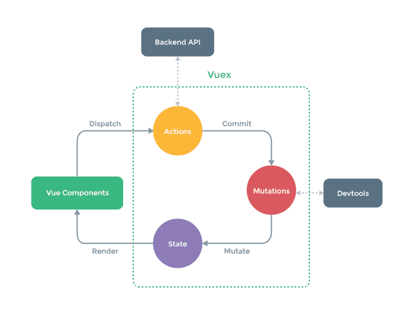
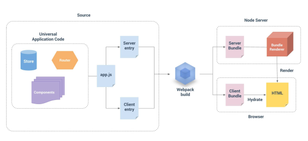

### 1 import 和 repuire 的区别

- require 的基本语法
  在导出的文件中定义 module.export,导出的对象的类型不予限定（可以是任何类型，字符串，变量，对象，方法），在引入的文件中调用 require()方法引入对象即可。

- import 的基本语法
  核心概念：导出的对象必须与模块中的值一一对应，换一种说法就是导出的对象与整个模块进行结构赋值。

区别
1 require 是赋值过程并且是运行时才执行， import 是解构过程并且是编译时执行。require 可以理解为一个全局方法，而 import 必须写在文件的顶部。

2 require 的性能相对于 import 稍低，因为 require 是在运行时才引入模块并且还赋值给某个变量，而 import 只需要依据 import 中的接口在编译时引入指定模块所以性能稍高

3 在 commom.js 中 module.export 之后 导出的值就不能再变化，但是在 es6 的 export 中是可以的。

### 2 vue 解决跨域的方法？详细说明

- 1 后台更改 header  
  header('Access-Control-Allow-Origin:\*'); 允许所有来源访问  
  header('Access-Control-Allow-Method:POST,GET'); 允许访问的方式

- 2 使用 JQuery 提供的 jsonp

  ```js
  methods: {
    getData () {
      var self = this
      $.ajax({
        url: 'http://f.apiplus.cn/bj11x5.json',
        type: 'GET',
        dataType: 'JSONP',
        success: function (res) {
          self.data = res.data.slice(0, 3)
          self.opencode = res.data[0].opencode.split(',')
        }
      })
    }
  }

  ```

- 3 使用 http-proxy-middleware 代理解决（项目使用 vue-cli 脚手架搭建）  
   例如请求的 url: “http://f.apiplus.cn/bj11x5.json”

  ```js
  //打开config/index.js,在proxyTable中添写如下代码
  proxyTable: {
   '/api': {  //使用"/api"来代替"http://f.apiplus.c"
  target: 'http://f.apiplus.cn', //源地址
  changeOrigin: true, //改变源
  pathRewrite: {
    '^/api': 'http://f.apiplus.cn' //路径重写
    }
  }
  }
  //使用axios请求数据时直接使用“/api”
  getData () {
   axios.get('/api/bj11x5.json', function (res) {
     console.log(res)
   })

  //通过这中方法去解决跨域，打包部署时还按这种方法会出问题。解决方法如下：
  let serverUrl = '/api/'  //本地调试时
  // let serverUrl = 'http://f.apiplus.cn/'  //打包部署上线时
  export default {
     dataUrl: serverUrl + 'bj11x5.json'
  }
  ```

### 3 vue 插槽

1.匿名插槽,一个组件只能插入一个默认插槽，就是匿名插槽 2.具名插槽，可以有多个，名字不同即可 3.作用于插槽 是父组件引用子组件中的数据；使用 slot-scope 进行数据的传递

```js
// 匿名插槽
<slot></slot>
// 具名插槽
<slot name="up"></slot>

// 作用于插槽
// 子组件中 将数据传递给父组件
<template>
  <div>
    <h2>这里是子组件</h2>
    <slot :data="data"></slot>
  </div>
</template>

// 在父组件中
// 这里自定义一个变量 我们传的数据会到这个对象下面 使用的时候是  user.data
// data就是我们传过来的数据
<child>
  <template slot-scope="user">
    <div class="tmp">
      <span v-for="item in user.data" :key="item">{{item}}</span>
    </div>
  </template>
</child>
// 如果我们不用 slot-scope进行接受的话 子组件的作用域插槽 就会变成了 普通的 匿名插槽了
```

### 4 对于 MVVM 的理解

- MVVM 是 Model-View-ViewModel 的缩写。

  Model 代表数据模型，也可以在 Model 中定义数据修改和操作的业务逻辑。  
  View 代表 UI 组件，它负责将数据模型转化成 UI 展现出来。  
  ViewModel 监听模型数据的改变和控制视图行为、处理用户交互，简单理解就是一个同步 View 和 Model 的对象，连接 Model 和 View。

  在 MVVM 架构下，View 和 Model 之间并没有直接的联系，而是通过 ViewModel 进行交互，Model 和 ViewModel 之间的交互是双向的， 因此 View 数据的变化会同步到 Model 中，而 Model 数据的变化也会立即反应到 View 上。

  ViewModel 通过双向数据绑定把 View 层和 Model 层连接了起来，而 View 和 Model 之间的同步工作完全是自动的，无需人为干涉，因此开发者只需关注业务逻辑，不需要手动操作 DOM，不需要关注数据状态的同步问题，复杂的数据状态维护完全由 MVVM 来统一管理。

### 4.1 对于 MVC 的理解

- MVC 的全名是 Model View Controller，是模型(model)－视图(view)－控制器(controller)的缩写，是一种软件设计典范。它是用一种业务逻辑、数据与界面显示分离的方法来组织代码，将众多的业务逻辑聚集到一个部件里面，在需要改进和个性化定制界面及用户交互的同时，不需要重新编写业务逻辑，达到减少编码的时间。

  MVC 开始是存在于桌面程序中的，M 是指业务模型，V 是指用户界面，C 则是控制器。

  在网页当中，

  V 即 View 视图是指用户看到并与之交互的界面。比如由 html 元素组成的网页界面，或者软件的客户端界面。MVC 的好处之一在于它能为应用程序处理很多不同的视图。在视图中其实没有真正的处理发生，它只是作为一种输出数据并允许用户操纵的方式。

  M 即 model 模型是指模型表示业务规则。在 MVC 的三个部件中，模型拥有最多的处理任务。被模型返回的数据是中立的，模型与数据格式无关，这样一个模型能为多个视图提供数据，由于应用于模型的代码只需写一次就可以被多个视图重用，所以减少了代码的重复性。

  C 即 controller 控制器是指控制器接受用户的输入并调用模型和视图去完成用户的需求，控制器本身不输出任何东西和做任何处理。它只是接收请求并决定调用哪个模型构件去处理请求，然后再确定用哪个视图来显示返回的数据。

### 5 Vue 的生命周期

- beforeCreate（创建前），在数据观测和初始化事件还未开始

  created（创建后），完成数据观测，属性和方法的运算，初始化事件， $el 属性还没有显示出来

  beforeMount（载入前），在挂载开始之前被调用，相关的 render 函数首次被调用。实例已完成以下的配置：编译模板，把 data 里面的数据和模板生成 html。注意此时还没有挂载 html 到页面上。

  mounted（载入后），在 el 被新创建的 vm.$el 替换，并挂载到实例上去之后调用。实例已完成以下的配置：用上面编译好的 html 内容替换 el 属性指向的 DOM 对象。完成模板中的 html 渲染到 html 页面中。此过程中进行 ajax 交互。

  beforeUpdate（更新前），在数据更新之前调用，发生在虚拟 DOM 重新渲染和打补丁之前。可以在该钩子中进一步地更改状态，不会触发附加的重渲染过程。

  updated（更新后），在由于数据更改导致的虚拟 DOM 重新渲染和打补丁之后调用。调用时，组件 DOM 已经更新，所以可以执行依赖于 DOM 的操作。然而在大多数情况下，应该避免在此期间更改状态，因为这可能会导致更新无限循环。该钩子在服务器端渲染期间不被调用。

  beforeDestroy（销毁前），在实例销毁之前调用。实例仍然完全可用。

  destroyed（销毁后），在实例销毁之后调用。调用后，所有的事件监听器会被移除，所有的子实例也会被销毁。该钩子在服务器端渲染期间不被调用。

- 1、什么是 vue 生命周期？  
  Vue 实例从创建到销毁的过程，就是生命周期。从开始创建、初始化数据、编译模板、挂载 Dom→ 渲染、更新 → 渲染、销毁等一系列过程，称之为 Vue 的生命周期。

- 2、vue 生命周期的作用是什么？  
  它的生命周期中有多个事件钩子，让我们在控制整个 Vue 实例的过程时更容易形成好的逻辑。

- 3、vue 生命周期总共有几个阶段？  
  它可以总共分为 8 个阶段：创建前/后、载入前/后、更新前/后、销毁前/销毁后。

- 4、第一次页面加载会触发哪几个钩子？  
  会触发下面这几个 beforeCreate、created、beforeMount、mounted 。

- 5、DOM 渲染在哪个周期中就已经完成？  
  DOM 渲染在 mounted 中就已经完成了。

### 6 Vue 实现数据双向绑定的原理：Object.defineProperty()

vue.js 则是采用数据劫持结合发布者-订阅者模式的方式，通过 Object.defineProperty()来劫持各个属性的 setter，getter，在数据变动时发布消息给订阅者，触发相应的监听回调。

```js
var obj = {};
Object.defineProperty(obj, "name", {
  get: function () {
    console.log("我被获取了");
    return val;
  },
  set: function (newVal) {
    console.log("我被设置了");
  },
});
obj.name = "fei"; //在给obj设置name属性的时候，触发了set这个方法
var val = obj.name; //在得到obj的name属性，会触发get方法
```

示意图


a、Observer 实现对 MVVM 自身 model 数据劫持，监听数据的属性变更，并在变动时进行 notify  
b、Compile 实现指令解析，初始化视图，并订阅数据变化，绑定好更新函数  
c、Watcher 一方面接收 Observer 通过 dep 传递过来的数据变化，一方面通知 Compile 进行 view update。

observer 用来实现对每个 vue 中的 data 中定义的属性循环用 Object.defineProperty()实现数据劫持，以便利用其中的 setter 和 getter，然后通知订阅者，订阅者会触发它的 update 方法，对视图进行更新。

在 vue 中 v-model，v-name，{{}}等都可以对数据进行显示，也就是说假如一个属性都通过这三个指令了，那么每当这个属性改变的时候，相应的这个三个指令的 html 视图也必须改变，于是 vue 中就是每当有这样的可能用到双向绑定的指令，就在一个 Dep 中增加一个订阅者，其订阅者只是更新自己的指令对应的数据，也就是 v-model='name'和{{name}}有两个对应的订阅者，各自管理自己的地方。每当属性的 set 方法触发，就循环更新 Dep 中的订阅者。

### 7 Vue 组件间的参数传递

1、父组件与子组件传值

父组件传给子组件：父传子的实现方式就是通过 props 属性，子组件通过 props 属性接收从父组件传过来的值，而父组件传值的时候使用 v-bind 将子组件中预留的变量名绑定为 data 里面的数据即可

- 1 子组件在 props 中创建一个属性，用来接收父组件传过来的值
- 2 在父组件中注册子组件
- 3 在子组件标签中添加子组件 props 中创建的属性
- 4 把需要传给子组件的值赋值给该属性

子组件的代码

```js
<template>
    <div id="container">
        {{msg}}
    </div>
</template>

<script>
export default {
  data() {
    return {};
  },
  props:{
    msg: String
  }
};
</script>
<style scoped>
#container{
    color: red;
    margin-top: 50px;
}
</style>
```

父组件的代码

```js
<template>
    <div id="container">
        <input type="text" v-model="text" @change="dataChange">
        <Child :msg="text"></Child>
    </div>
</template>
<script>
import Child from "@/components/Child";
export default {
  data() {
    return {
      text: "父组件的值"
    };
  },
  methods: {
    dataChange(data){
        this.msg = data
    }
  },
  components: {
    Child
  }
};
</script>
<style scoped>
</style>
```

2 子组件传给父组件： 子传父的实现方式就是用了 this.$emit 来遍历 getData 事件，首先用按钮来触发 setData 事件，在 setData 中 用 this.$emit 来遍历 getData 事件，最后返回 this.msg

总结：

    子组件中需要以某种方式例如点击事件的方法来触发一个自定义事件
    将需要传的值作为$emit的第二个参数，该值将作为实参传给响应自定义事件的方法
    在父组件中注册子组件并在子组件标签上绑定对自定义事件的监听

    this.$on('abc',()=>{}) 绑定事件
    this.$emit('abc') 触法事件

子组件代码

```js
<template>
    <div id="container">
        <input type="text" v-model="msg">
        <button @click="setData">传递到父组件</button>
    </div>
</template>
<script>
export default {
  data() {
    return {
      msg: "传递给父组件的值"
    };
  },
  methods: {
    setData() {
      this.$emit("getData", this.msg);
    }
  }
};
</script>
<style scoped>
#container {
  color: red;
  margin-top: 50px;
}
</style>

```

父组件代码

```js
<template>
    <div id="container">
        <Child @getData="getData"></Child>
        <p>{{msg}}</p>
    </div>
</template>
<script>
import Child from "@/components/Child";
export default {
  data() {
    return {
      msg: "父组件默认值"
    };
  },
  methods: {
    getData(data) {
      this.msg = data;
    }
  },
  components: {
    Child
  }
};
</script>
<style scoped>
</style>

```

2、非父子组件间的数据传递，兄弟组件传值

eventBus，就是创建一个事件中心，相当于中转站，可以用它来传递事件和接收事件。项目比较小时，用这个比较合适（虽然也有不少人推荐直接用 VUEX，具体来说看需求咯。技术只是手段，目的达到才是王道）。

> child-a>child-b
> 前置条件->js 绑定+触发事件

1. 绑定事件 this.$on(事件名,函数(接收的形参){})
2. 触发事件 this.$emit(事件名,数据)

> A

1. 点击按钮触发方法->触发事件 vm.$emit(事件名,数据)

> B

1. 绑定事件 vm.$on(事件名,接收的参数)

> A 和 B 中导入共同的 vm 实例
> 注意:提供共有的 vm 实例->利用模块->导出一个 vm 实例

### 8 Vue 的路由实现：hash 模式 和 history 模式

hash 模式：在浏览器中符号“#”，#以及#后面的字符称之为 hash，用 window.location.hash 读取。特点：hash 虽然在 URL 中，但不被包括在 HTTP 请求中；用来指导浏览器动作，对服务端安全无用，hash 不会重加载页面。vue-router 默认是 hash 模式

history 模式：history 采用 HTML5 的新特性；且提供了两个新方法： pushState()， replaceState()可以对浏览器历史记录栈进行修改，以及 popState 事件的监听到状态变更。

### 9 vue 路由的钩子函数

首页可以控制导航跳转，beforeEach，afterEach 等，一般用于页面 title 的修改。一些需要登录才能调整页面的重定向功能。

beforeEach 主要有 3 个参数 to，from，next。

to：route 即将进入的目标路由对象。

from：route 当前导航正要离开的路由。

next：function 一定要调用该方法 resolve 这个钩子。执行效果依赖 next 方法的调用参数。可以控制网页的跳转。

### 10 vuex 是什么？怎么使用？哪种功能场景使用它？

- 只用来读取的状态集中放在 store 中； 改变状态的方式是提交 mutations，这是个同步的事物； 异步逻辑应该封装在 action 中。

  在 main.js 引入 store，注入。新建了一个目录 store，… export 。

  场景有：单页应用中，组件之间的状态、音乐播放、登录状态、加入购物车



- state：Vuex 使用单一状态树,即每个应用将仅仅包含一个 store 实例，但单一状态树和模块化并不冲突。存放的数据状态，不可以直接修改里面的数据。

- mutations：mutations 定义的方法动态修改 Vuex 的 store 中的状态或数据。

- getters：类似 vue 的计算属性，主要用来过滤一些数据。

- action：actions 可以理解为通过将 mutations 里面处里数据的方法变成可异步的处理数据的方法，简单的说就是异步操作数据。view 层通过 store.dispath 来分发 action。

```js
const store = new Vuex.Store({
  state: {
    count: 0,
  },
  mutations: {
    increment(state) {
      state.count++;
    },
  },
  actions: {
    increment(context) {
      context.commit("incremnet");
    },
  },
});
```

- modules：项目特别复杂的时候，可以让每一个模块拥有自己的 state、mutation、action、getters，使得结构非常清晰，方便管理。

```js
  const moduleA = {
    state:{},
    actions:{},
    getters:{},
  }
  const moduleB = {
  state:{},
  actions:{},
  getters:{},
  }
  const store = new Vuex.store({
    modules：{
      a:moduleA,
      b:moduleB
    }
  })
```

### 11 CSS 只在当前的组件起作用

在 style 标签中写入 scoped 即可

### 12 $route和$router 的区别

$route 是“路由信息对象”，包括 path，params，hash，query，fullPath，matched，name 等路由信息参数。

$router为VueRouter的实例，相当于一个全局的路由器对象，里面含有很多属性和子对象，例如history对象。。。经常用的跳转链接就可以用this.$router.push，和 router-link 跳转一样
编程式导航

### 13vue 中缓冲

- keep-alive 是 Vue 的内置组件，能在组件切换过程中将状态保留在内存中，防止重复渲染 DOM。
  keep-alive 包裹动态组件时，会缓存不活动的组件实例，而不是销毁它们。和 <transition> 相似，keep-alive 是一个抽象组件：它自身不会渲染一个 DOM 元素，也不会出现在父组件链中。

Props：  
 include - 字符串或正则表达式。只有名称匹配的组件会被缓存。  
 exclude - 字符串或正则表达式。任何名称匹配的组件都不会被缓存。  
 max - 数字。最多可以缓存多少组件实例。

在 app.vue 组件里面

```js
<keep-alive exclude="moviesDetail">
  <router-view></router-view>
</keep-alive>
```

keep-alive 生命周期钩子函数：activated、deactivated

使用 keep-alive 会将数据保留在内存中，如果要在每次进入页面的时候获取最新的数据，需要在 activated 阶段获取数据，承担原来 created 钩子中获取数据的任务。

### 14 如何让选择 vue 和 react

1 数据方面

- react 整体是函数式的思想，把组件设计成纯组件，状态和逻辑通过参数传入，所以在 react 中，是单向数据流，推崇结合 immutable 来实现数据不可变。
- vue 的思想是响应式的，也就是基于是数据可变的，通过对每一个属性建立 Watcher 来监听，当属性变化的时候，响应式的更新对应的虚拟 dom。

2 通过 js 来操作一切，还是用各自的处理方式

- react 的思路是 all in js，通过 js 来生成 html，所以设计了 jsx，还有通过 js 来操作 css，社区的 styled-component、jss 等，
- vue 是把 html，css，js 组合到一起，用各自的处理方式，vue 有单文件组件，可以把 html、css、js 写到一个文件中，html 提供了模板引擎来处理。

### 15 vue-router 的钩子函数

vue 路由钩子大致可以分为三类:

1.全局钩子

主要包括 beforeEach 和 aftrEach,
beforeEach 函数有三个参数：

    to:router即将进入的路由对象
    from:当前导航即将离开的路由
    next:Function,进行管道中的一个钩子，如果执行完了，则导航的状态就是 confirmed （确认的）
    否则为false，终止导航。

    afterEach函数不用传next()函数

这类钩子主要作用于全局,一般用来判断权限,以及以及页面丢失时候需要执行的操作,例如:

```js
//使用钩子函数对路由进行权限跳转
router.beforeEach((to, from, next) => {
    const role = localStorage.getItem('ms_username');
    if(!role && to.path !== '/login'){
        next('/login');
    }else if(to.meta.permission){
        // 如果是管理员权限则可进入，这里只是简单的模拟管理员权限而已
        role === 'admin' ? next() : next('/403');
    }else{
        // 简单的判断IE10及以下不进入富文本编辑器，该组件不兼容
        if(navigator.userAgent.indexOf('MSIE') > -1 && to.path === '/editor'){
            Vue.prototype.$alert('vue-quill-editor组件不兼容IE10及以下浏览器，请使用更高版本的浏
            览器查看', '浏览器不兼容通知', {
                confirmButtonText: '确定'
            });
        }else{
            next();
        }
    }
})

```

2.单个路由里面的钩子 beforeEnter,beforeLeave

主要用于写某个指定路由跳转时需要执行的逻辑

```js
   {
    path: '/dashboard',
    component: resolve => require(['../components/page/Dashboard.vue'], resolve),
    meta: { title: '系统首页' },
    beforeEnter: (to, from, next) => {

      },
    beforeLeave: (to, from, next) => {

    }
 },
```

3.组件路由

    主要包括 beforeRouteEnter和beforeRouteUpdate ,beforeRouteLeave
    这几个钩子都是写在组件里面也可以传三个参数(to,from,next),作用与前面类似.

```js
beforeRouteEnter(to, from, next) {
    next(vm => {
      if (
        vm.$route.meta.hasOwnProperty('auth_key') &&
        vm.$route.meta.auth_key != ''
      ) {
        if (!vm.hasPermission(vm.$route.meta.auth_key)) {
          vm.$router.replace('/admin/noPermission')
        }
      }
    })
  },
```

### 16 插槽

插槽，也就是 slot，是组件的一块 HTML 模板，这块模板显示不现实、以及怎样显示由父组件来决定。

插槽模板是 slot，它是一个空壳子，因为它显示与隐藏以及最后用什么样的 html 模板显示由父组件控制。但是插槽显示的位置由子组件自身决定，slot 写在组件 template 的哪块，父组件传过来的模板将来就显示在哪块。这样就使组件可复用性更高，更加灵活。我们可以随时通过父组件给子组件加一些需要的东西。

### 17 如何用 vuex 使 axios 获取到的数据替换 store 中的数据

### 18 vue 计算属性和 watch 在什么情况下使用

共同点是：都是希望在依赖数据发生改变的时候，被依赖的数据根据预先定义好的函数，发生“自动”的变化。  
但 watch 和 computed 也有明显不同的地方：  
watch 和 computed 各自处理的数据关系场景不同  
(1).watch 擅长处理的场景：一个数据影响多个数据  
(2).computed 擅长处理的场景：一个数据受多个数据影响。总价受到单价和数量的影响

### 19 spa 页面

SPA 的优点

页面之间的切换非常快  
一定程度上减少了后端服务器的压力（不用管页面逻辑和渲染）  
后端程序只需要提供 API，完全不用管客户端到底是 Web 界面还是手机等

SPA 的缺点

首屏打开速度很慢，因为用户首次加载需要先下载 SPA 框架及应用程序的代码，然后再渲染页面。  
不利于 SEO

SEO：搜索引擎优化。SEO 是一种通过了解搜索引擎的运作规则（如何抓取网站页面，如何索引以及如何根据特定的关键字展现搜索结果排序等）来调整网站，以提高该网站在搜索引擎中某些关键词的搜索结果排名。

标题： 即 HTML 的 < title >标签，例如： < title>浅谈 SPA、SEO、SSR | XXX 的博客< /title>

描述： 即 HTML<meta>标签的 description，例如百度百科的一个词条的 description

关键字： 即 HTML<meta>标签的 keywords

SSR  
概述：SSR 是 Server-Side Rendering(服务器端渲染)的缩写，在普通的 SPA 中，一般是将框架及网站页面代码发送到浏览器，然后在浏览器中生成和操作 DOM（这里也是第一次访问 SPA 网站在同等带宽及网络延迟下比传统的在后端生成 HTML 发送到浏览器要更慢的主要原因），但其实也可以将 SPA 应用打包到服务器上，在服务器上渲染出 HTML，发送到浏览器，这样的 HTML 页面还不具备交互能力，所以还需要与 SPA 框架配合，在浏览器上“混合”成可交互的应用程序。所以，只要能合理地运用 SSR 技术，不仅能一定程度上解决首屏慢的问题，还能获得更好的 SEO。

SSR 的优点

更快的响应时间，不用等待所有的 JS 都下载完成，浏览器便能显示比较完整的页面了。

更好的 SSR，我们可以将 SEO 的关键信息直接在后台就渲染成 HTML，而保证搜索引擎的爬虫都能爬取到关键数据。

SSR 的缺点

相对于仅仅需要提供静态文件的服务器，SSR 中使用的渲染程序自然会占用更多的 CPU 和内存资源

一些常用的浏览器 API 可能无法正常使用，比如 window、docment 和 alert 等，如果使用的话需要对运行的环境加以判断

开发调试会有一些麻烦，因为涉及了浏览器及服务器，对于 SPA 的一些组件的生命周期的管理会变得复杂
可能会由于某些因素导致服务器端渲染的结果与浏览器端的结果不一致。



ssr 有两个入口文件，client.js 和 server.js， 都包含了应用代码，webpack 通过两个入口文件分别打包成给服务端用的 server bundle 和给客户端用的 client bundle. 当服务器接收到了来自客户端的请求之后，会创建一个渲染器 bundleRenderer，这个 bundleRenderer 会读取上面生成的 server bundle 文件，并且执行它的代码， 然后发送一个生成好的 html 到浏览器，等到客户端加载了 client bundle 之后，会和服务端生成的 DOM 进行 Hydration(判断这个 DOM 和自己即将生成的 DOM 是否相同，如果相同就将客户端的 vue 实例挂载到这个 DOM 上， 否则会提示警告)。

## 20 vue 预渲染 prerender-spa-plugin

这个配置只需要在 build 的时候可以生成预渲染好的 html，所以应该配置在 build/webpack.prod.conf.js 这个文件里。

```js
// 在vue-cli生成的文件的基础上，只有下面这个才是我们要配置的
new PrerenderSPAPlugin({
    // 生成文件的路径，也可以与webpakc打包的一致。
    // 下面这句话非常重要！！！
    // 这个目录只能有一级，如果目录层次大于一级，在生成的时候不会有任何错误提示，在预渲染的时候只会卡着不动。
    staticDir: path.join(__dirname, '../dist'),

    // 对应自己的路由文件，比如index有参数，就需要写成 /index/param1。
    routes: ['/', '/index', '/skin', '/slimming', '/exercise', '/alPay', '/wxPay'],

    // 这个很重要，如果没有配置这段，也不会进行预编译
    renderer: new Renderer({
        inject: {
          foo: 'bar'
        },
        headless: false,
        // 在 main.js 中 document.dispatchEvent(new Event('render-event'))，两者的事件名称要对应上。
        renderAfterDocumentEvent: 'render-event'
    })
```

在 webpack.prod.conf.js 配置完成之后，然后再 main.js 里改成如下所示：

```js
new Vue({
  el: "#app",
  router,
  store,
  render: (h) => h(App),

  /* 这句非常重要，否则预渲染将不会启动 */
  mounted() {
    document.dispatchEvent(new Event("render-event"));
  },
});
```

## 21 active-class 是哪个组件的属性？嵌套路由怎么定义？

active-class 是 vue-router 模块的 router-link 组件中的属性，用来做选中样式的切换；
使用方法： 1.直接在标签内使用

```js
<router-link to="/" active-class="active">
  首页
</router-link>
```

2.在路由 js 文件，配置 active-class

```js
<script>
    const router = new VueRouter({
        routes,
        linkActiveClass: 'active'
    });
</script>
```

使用过程中 bug，在首页的 active 会一直被应用。原因是 to:'/'
解决方法：1.在 router-link 中写入 exact

```js
<router-link to="/" active-class="active" exact>
  首页
</router-link>
```

2.在路由 Js 文件中配置 active-class

```js
<script>
    const router = new VueRouter({
        routes,
        linkExactActiveClass: 'active'
    });
</script>
```

嵌套路由

```js
[
  {
    path: '/profile'
    component: profile, // 此处不能少
    children: [
      {
        path: '/profile/list',
        component: profileList
      },
      {
        path: '/profile/item',
        component: profileItem
      }
    ]
  },
]
```

## 22 vue-router 有哪几种导航钩子？有哪些组件？

第一种：是全局导航钩子：router.beforeEach(to,from,next)，作用：跳转前进行判断拦截。  
第二种：组件内的钩子  
第三种：单独路由独享组件

## 23 v-model 是什么？怎么使用？vue 中标签怎么绑定事件？

v-model 用于表单数据的双向绑定，其实它就是一个语法糖，这个背后就做了两个操作：  
  1. v-bind 绑定一个 value 属性  
  2. v-on 指令给当前元素绑定 input 事件

1.通过指令 v-on：事件名=“函数名”绑定事件 eg:<button     v-on:click="doThis ">  
2.通过语法 @事件名=“函数名”绑定事件 eg:<button @click.stop="doThis"></button>

## 24 vue 打包后有哪些文件

## 25 v-for 中 key 的作用

如果不使用 key，Vue 会使用一种最大限度减少动态元素并且尽可能的尝试就地修改/复用相同类型元素的算法。而使用 key 时，它会基于 key 的变化重新排列元素顺序，并且会移除 key 不存在的元素。

有相同父元素的子元素必须有独特的 key。重复的 key 会造成渲染错误。

## 26 如何动态绑定路由信息

## 27 拦截器怎么使用

axios 中有请求拦截器和响应拦截器

## 28 给定一个数组，使用 ajax 请求依次使用数组中的元素作为参数进行请求，返回结果按照顺序填充到页面

```js
let dimCode = [
  "type",
  "types",
  "disabled",
  "size",
  "trigger",
  "isRequired",
  "clearable",
];
let getDIm = _.map(dimCode, (v) => {
  //发送ajax请求
});
Promise.all(getDIm)
  .then((res) => {
    this.listOptions = res;
  })
  .then((res) => {
    _.map(dimCode, (v, i) => {
      this[v + "Options"] = this.listOptions[i];
    });
  });

// （1）创建异步对象
var ajaxObj = new XMLHttpRequest();

// （2）设置请求的参数。包括：请求的方法、请求的url。
ajaxObj.open("get", "02-ajax.php");

// （3）发送请求
ajaxObj.send();

//（4）注册事件。 onreadystatechange事件，状态改变时就会调用。
//如果要在数据完整请求回来的时候才调用，我们需要手动写一些判断的逻辑。
ajaxObj.onreadystatechange = function () {
  // 为了保证 数据 完整返回，我们一般会判断 两个值
  if (ajaxObj.readyState == 4 && ajaxObj.status == 200) {
    // 如果能够进到这个判断 说明 数据 完美的回来了,并且请求的页面是存在的
    // 5.在注册的事件中 获取 返回的 内容 并修改页面的显示
    console.log("数据返回成功");

    // 数据是保存在 异步对象的 属性中
    console.log(ajaxObj.responseText);

    // 修改页面的显示
    document.querySelector("h1").innerHTML = ajaxObj.responseText;
  }
};
```

## 29 nexttick 原理

## 30 手写使用emit传值给父组件的关键代码实现
## 31 stringify序列化对象时，对象的属性为function null undefined时的结果会是什么
## 32 写一个方法能从树形数据中找到指定id的值的节点，输出此节点的name

