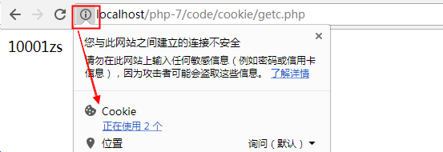
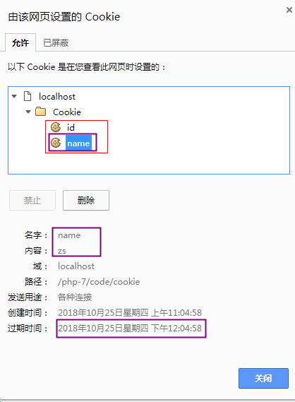

# 1. **会话控制概述**

1) http协议的缺陷

  无状态，就是无记忆，不能让同一浏览器和服务器进行多次数据交换时，产生业务的连续性。

2) 什么是会话控制

​       会话控制就是解决http无记忆的缺陷的。能够==将数据持久化的保存在客户端(浏览器)或者服务器端==，从而让浏览器和服务器进行多次数据交换时，产生连续性。

3) 会话控制的分类

​	分为两种: cookie（客户端）  和  session（服务器端）

cookie应用实例 --- 千人千面（猜你喜欢）

不同的用户访问优酷服务器所看的视频类型不一样。 服务器会将浏览器观看过的视频的关键词保存到浏览器的cookie中（文件、内存）。当浏览器再次访问优酷服务器时，服务器会从cookie中读取关键词，再根据关键词推荐视频。

画像算法 、  分发算法

今日头条  抖音 --->  字节跳动

微视频

session应用实例 --- 支付宝

每个用户访问支付宝进行登录时，用的是同一套程序。服务器会为每一个浏览器进行编号(sessionid)，当用户登录成功后，服务器会创建一个区域(文件、内存服务器)用来保存用户信息。等浏览器下一次访问服务器时，服务器先拿到浏览器的编号，再和已有的编号进行比较，找到相同的区域（文件、内存服务器）。

# 2. cookie技术

##  2.1 什么是cookie？

   cookie是将数据持久化存储到客户端的一种技术。

   网站可以将数据写到浏览器中， 一个网站最多能在一个浏览器写20个cookie。

   一个浏览器能够设置的总cookie数最多为300个，每个不能超过4kb。

   chrome和firefox能够存储更多

   cookie既能保存在文件中，也能保存在内存中。

##  2.2 设置/读取cookie

 1) 设置cookie

   setcookie(var1 , var2, var3);
   var1: cookie的名称
   var2: 名称对应的值， 可选参数
   var3: cookie的有效期， 可选参数

1) 读取cookie信息

   使用php的超全局变量 _COOKIE 进行读取

cookie在浏览器保存的信息:

## 2.3 cookie有效期

  setcookie函数的参数3可以控制cookie有效期
  参数3设置为-1 或者 不设置，关闭浏览器即失效
  参数3设置为 time()+秒数，则在当前时间点的多少秒之后失效

关闭浏览器后在重新访问  localhost/php-6/code/cookie/getc.php 会报错

cookie能够保存到文件或者内存中。  当cookie没有设置有效期时，该cookie就会保存在内存中；当cookie设置了有效期时，该cookie就保存在文件中。

## 2.4 cookie的有效范围

setcookie函数还有参数4、5，可以用来控制cookie的有效访问，但是**一般不用**

只需要记住下面的情况即可：    
    在不使用参数4和5的情况下，cookie在当前目录及子目录中有效，在上层目录中无效。

## 2.5 cookie删除

    setcookie函数第二个参数设置为null，就可以删除cookie
    setcookie('name', null);

## 2.6 js控制cookie

cookie是将数据保存在客户端的，所以可以使用javascript来读取/设置cookie。 

​   设置cookie:   document.cookie = “名称=值;expires=时间”
​   读取cookie:   document.cookie

# 3. session技术

## 3.1 session介绍

因为cookie是保存在客户端的数据，不够安全，所以出现了session。
session会将数据保存到服务器端（保存在文件、内存服务器或数据表中），安全性就可以得到保证。

## 3.2 设置/读取session

   重点:
  php使用session时，首先要使用session_start()函数来开启session。
  _SESSION 超全局变量就能设置和读取session中的内容

## 3.3 session作用范围

   在当前网站的任何一个页面设置过session，则该网站的所有页面都能得到该session的数据
   例如: 在 www.jd.com 的某个页面中设置session，那么在jd网站的任何一个页面都能找到该session
             同理，在localhost的某个页面中设置session，那么在localhost的任何一个php页面都能找到

## 3.4 session的有效期

   浏览器关闭时，session消失

## 3.5 删除session

   unset(_SESSION[‘name’]);    //删除单个session
   session_destroy();                   //删除所有session

# 4. 会话控制小结

## 4.1 cookie原理

使用浏览器访问设置cookie的页面时，cookie信息会随着响应头返回给浏览器，并保存在浏览器中

第一次:  访问带有设置cookie功能的网页时，cookie信息会虽则响应头返回给浏览器。浏览器接收到cookie信息之后，保存到浏览器中。

第二次（之后的每一次访问）： 访问任何一个页面时，cookie信息会随着请求头发送给服务器，所以php页面可以使用_COOKIE将cookie信息读取出来

不光是访问php，访问html也能看到cookie信息。 因为cookie信息会固定加在请求头中。

## 4.2 session和cookie的联系

1) session原理

  当浏览器访问带有session设置功能的网页时，服务器会随机产生一个ID号（session_id）。

  该session_id有两个作用:

  ① 在服务器端产生一个以该id命名的文件，用来保存数据。该文件默认保存在 c:/windows/temp下。但是phpstudy集成环境，默认保存在   phpstudy/tmp/tmp 目录下
  
  ② 将该session_id通过cookie返回给浏览器，浏览器将session_id保存在cookie中	

  当浏览器再次访问服务器的某个文件时，session_id会随着请求头发送给服务器，服务器就能接收到该session_id，并找到该session_id所对应的文件

2) cookie和session的联系

     当浏览器访问一个设置session的页面时，服务器会随机自动生成一个session_id（字符串）。返回给浏览器，并保存在浏览器的cookie当中，同时服务器中也会生成一个以该session_id为名称的文件，用来记录信息。
    
     之后每次访问该网站时，都会携带cookie中的session_id，来和服务器中的session文件名进行比对。当文件名和cookie中的session_id一致时，则说明使用的是该session文件，可以从该session文件中读取数据。

## 6.3 session和cookie总结

 cookie小结:

  1） 将数据保存在客户端，安全性不好，但是可以保存的数据量较大。
  2） 设置cookie使用  setcookie(var1, var2, var3)；
  var1： cookie名称
  var2： 名称对应的值
  var3： 有效期。 可选参数，如果不设置该值或者设置为-1，浏览器关闭则cookie消失
  3） 使用_COOKIE 预定义数组来读取cookie
  4） cookie的有效范围： 当前目录及子目录；上级目录无效
  5） 删除cookie:  setcookie(‘name’, null);

 

 session小结:

  1) 将数据保存在服务器端，安全性高，但是不能保存大量的数据。一般来讲session当中保存的都是用户信息。
  2) 使用session时，首先要使用 session_start函数开启session
  3) 设置和读取session时，都是用`  _SESSION['name'] = 'zs';  _SESSION['name'];`
  4) session的有效范围，在一个域名下设置session，在整个域名范围内都有效
  5) session有效期： 关闭浏览器，session就消失
  6) 删除session
  unset(_SESSION[‘name’]);    //删除单个session
  session_destroy();                   //删除所有session

如果没有cookie的支持，session是用不了的。

cookie中只能存字符串类型的数据，session中可以存各种类型数据（除了资源）。

)