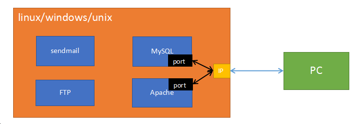
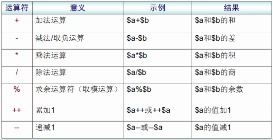
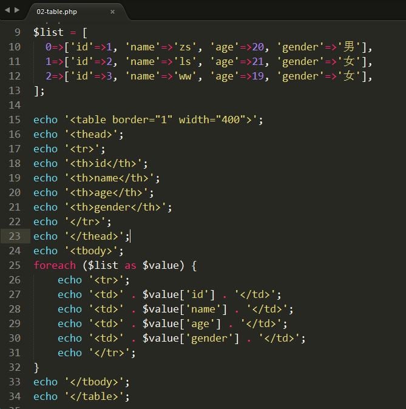

# 1. web服务器 #
   问题: 当我们写好一个html文件，放在桌面上时，别人能不能通过浏览器访问？
   答: 不行。 必须将我们的html文件放入==web服务器==，其他人通过网络才能访问。


##   1.1 什么是服务器？ ##
   服务器可以从硬件、软件(系统软件、应用软件)两个角度描述。

   按硬件描述： 服务器就是一台超级计算机。
   按系统划分： 在硬件上安装了什么操作系统，就可以称为该系统的服务器
                     例如:  linux服务器、windows服务器、unix服务器等。
   按软件划分： 在操作系统中安装了什么软件，就可以称作该软件的服务器
                     例如:  ==web服务器、数据库服务器==、邮件服务器等。


##   1.2 Web服务器 ##
  Web服务器就是安装了Web服务软件，能够提供网站服务的服务器。淘宝、京东、新浪等等

  常见的Web软件：
    ==Apache==、Nginx、IIS、Tomcat、Node等。
    Apache服务器、Nginx服务器、IIS服务器、Tomcat服务器、Node服务器

    Apache是世界使用排名第一的Web服务器软件。我们将编写好的html、css、js等文件存入apache，就能够通过网络来访问这些文件了。
    
    PS: web服务器又叫做http/httpd服务器


# 2. PHP概述 #
##    2.1 PHP简介 ##
​    PHP（外文名:PHP: Hypertext Preprocessor，中文名：“超文本预处理器”）是一种通用开源脚本语言。主要适用于==Web领域的开发==，能够完成==动态网页==的制作。


##    2.2 PHP特点 ##

- PHP是目前最流行的网站开发语言（B/S结构）之一。

- PHP是一种在服务器端执行的嵌入HTML文档的脚本语言。

- PHP 独特的语法混合了 C、Java、Perl 以及 PHP 自创新的语法。

- PHP是一种解释型弱类型语言(解释执行)

- 支持几乎所有流行的==数据库==以及操作系统。

- 源码开放、免费（free）


 在声明变量时，不需要指定数据类型的就是弱类型

​    var  a  = 123;

​    a = 'abc';


C、Java：   int  a = 123;   a = 'abc';

​      

 解释型、编译型   


##    2.3 B/S结构和C/S结构 ##
  C/S软件体系结构，即Client/Server (客户机/服务器)结构。
     核心特点：==要下载一个客户端==，例如：QQ、微信、LOL、王者荣耀、绝地求生等。   

  C/S结构的软件，服务器主要做==数据转发==工作。以QQ聊天为例：
     任何两个人聊天的内容都会发送到QQ服务器上，然后再由QQ服务器进行转发


   B/S软件体系结构，即Browser/Server （浏览器/服务器）结构。
       核心特点：==使用浏览器（Chrome、Firefox等）进行操作==，例如：淘宝、京东、新浪等。

   B/S结构软件，服务器承担了所有业务，浏览器只是用来显示最终内容的。

思考问题： B/S的优势和劣势， C/S的优势和劣势。

 B/S的优势: 部署方便，容易维护。用户使用方便（一个浏览器即可）。
 B/S的劣势: 客户端功能简单

 C/S的优势: 功能强大
 C/S的劣势: 必须下载客户端非常麻烦，升级维护麻烦


# 3. 安装环境 （phpstudy） #

        phpstudy是一个集成环境，集成了Apache（IIS和nginx）、PHP、MySQL。 安装该软件后，PHP开发的程序就能运行了。


# 4. 初识PHP
# 5. URL解析 #

##    5.1 URL地址说明 ##
   URL: uniform resource locator  统一资源定位器

       localhost  <==>  http://localhost:80/index.html （全URL）

- http: 超文本传输协议

- localhost: 域名。（一般域名：www.taobao.com，www.sina.com.cn） localhost是特殊域名，每一台电脑都有，并且指向当前使用的电脑

- 80: 端口号。 apache的默认端口号为80，所以可以省略不写  (tips:很多web服务器默认端口都是80 Nginx IIS)

- index.html: 访问的文件的路径 (localhost指向了 d:/phpstudy/WWW)，所以该url地址访问的是  d:/phpstudy/WWW/index.html文件

- 如果没有指定访问的文件，则默认会访问index.html文件；如果没有index.html文件，则会以列表形式显示当前目录下的所有文件夹和文件

  localhost:  D:\phpStudy\WWW


##    5.2 IP ##
   IP: Internet Protocol  互联网协议，是为计算机网络相互连接进行通信而设计的协议。

    处于网络（互联网、局域网）上的任何一台计算机都有一个独立的ip地址。
    ip地址由4段3位长度的数字组成， 3位数字的取值范围 0-255。如： 102.15.201.10

   特殊ip:
    127.0.0.1 : 回环地址，每一台电脑都有该ip，指向当前使用的电脑
    192.168.**.* *: 该网段是专门用于做==局域网==的ip段。


##  5.3 域名

   域名（Domain Name）： 每个网站都有一个自己的域名。人们可以在浏览器中输入域名来访问对应的网站。

   淘宝: www.taobao.com

   百度: www.baidu.com

   特殊域名：
          localhost: 本地主机。在浏览器中输入localhost就会访问当前操作的这台电脑的web服务器。


##    5.4 DNS ##
   DNS: Domain Name System  域名系统。在DNS服务器中保存了域名和IP的映射关系。主要工作是将域名转换为IP地址，因为我们通过浏览器访问网站时，实际上是去找对应的IP地址。

   域名: 网站的名称，就相当于人名。
   IP: 网站在网络上的实际地址，就相当于人的住址。

   一般访问网站时都是输入域名的(例如： www.tmall.com  www.163.com)，但是在实际访问时域名会被DNS转换为IP地址。

   DNS工作机制图:


 hosts文件可以手动设置域名和IP的映射关系

 dns缓存可以保存曾经访问过的域名和IP的映射关系


工作步骤:

1)  在浏览器中输入  www.taobao.com，按下回车

2)  浏览器首先在本机中的 hosts文件和dns缓存中查询，www.taobao.com的IP地址。如果有，则获取该IP地址，然后去访问淘宝服务器。 如果没有，则向dns服务器发送解析请求。

3) dns服务器获取到浏览器请求信息之后， 将域名转换为IP地址，再将IP地址返回给浏览器。

4) 浏览器获取到IP地址，然后通过IP地址访问淘宝服务器。 


 windows下查看dns缓存:
    ipconfig  /displaydns
    ipconfig  /displaydns > c:/dnscache.txt   将dns缓存导入到c:/dnscache.txt文件

 windows下清除dns缓存
    ipconfig  /flushdns


##    5.5 端口 ##
    端口是英文port的意译。端口可以理解为区分服务器上服务的标号

   已被占用的著名端口号：
    80:   Web端口号， Apache、Nginx、IIS
    21:   FTP端口号， FTP软件
    22:   SSH端口号
    25:   sendmail端口号
    ......

  因为Web服务的默认端口号是80，所以在地址栏可以不输入，但是如果将端口号改为其他的（如：8088），那就必须输入端口号，才能正常访问。





# 6. PHP运行原理 #

## 6.1 HTML运行原理 ##


1) 在浏览器的URL地址栏中输入 www.baidu.com/index.html 地址，点回车。请求就发送给百度服务器。
2) 百度服务器找到index.html文件，并将文件的内容返回给浏览器
3) 浏览器接收到index.html中的内容，渲染到页面上。

同理: localhost/a.html ,  则会返回 本机web服务器根目录下 a.html文件的内容。浏览器拿到内容后进行渲染。


## 6.2 PHP运行原理 ##
 ==apache不认识php==
 ==浏览器也不认识php==

 

 1) 在浏览器地址栏中输入 localhost/index.php ,点回车之后。将请求发送给apache服务器。
 2) 服务器找到 index.php文件之后，转发给php解释器
 3) php解释器将index.php文件中的php代码全部转为html，再返回给apache
 4) apache将处理好的html返回给浏览器，浏览器渲染后就可以看到页面


# 7. PHP的数据类型 #

 PHP数据类型一共有8种:

-  基本类型(标量):

     整型:     整数， 例如: 10, 234, -20, -35 
     浮点型:  小数,  例如: 3.1415, 2.13, 35.123
     布尔值:  true/false
     字符串:  使用单引号/双引号包含的内容, 例如: ‘abc’, “王者荣耀”

-  复合类型:

     数组
     对象

-  特殊类型:

     资源 、 null (空)


 整型、浮点型、布尔型、字符串、数组、资源、null


# 8. 变量 #
变量命名规则：

-  由字母、数字、下划线组成，必须以字母或者下划线起头
-  变量的长度可以是任意的，但不能超过255个字符
-  最前面需要加 $
-  变量名最好有意义，能够做到见名知意
-  当变量名由多单词组成时，最好使用下划线分割或者使用驼峰命名法
-  PHP变量区分大小写


# 9.双引号和单引号的区别

  双引号中的变量会被解释为值，单引号中的变量会被解释为字符串

  单引号的执行速度会快于双引号的速度


# 10. 常量 #
 保存不会发生改变的数据(如：3.1415， 路径等)时，最好使用常量。

 常量的使用方法：
   1) 声明:  define(var1,  var2,  var3);

        参数1: 常量名
    
        参数2: 常量值
    
        参数3: 常量名是否区分大小写 ， true（不区分）/false（区分/默认）;

   2) 调用:  echo  常量名;


# 11. 运算符 #
##    11.1 运算符种类 ##
- 算术运算符

- 字符串运算符
- 赋值运算符
- 比较运算符
- 逻辑运算符
- 其他运算符


 算术运算符：



+运算符只能做加法运算


特殊案例:

```
str = "abc";
int = 20;
echo str + int;

str = "5";
int = 20;
echo str + int;
```


 赋值运算符：


`a += b   a = a + b`


 比较运算符：


 逻辑运算符：


  异或: (了解)
     true   xor   true   =  false
     true   xor   false  =  true
     false  xor   true   =  true
     false  xor   false  =  false


  其他运算符：


   三元运算符:   判断表达式？值1：值2

​    

   php默认内置有4种错误： 
        notice： 通知错误
        Warning error： 警告错误
        Parse error： 解析错误
        Fatal error： 致命错误

 


@不能屏蔽掉所有的错误。 也不建议在实际开发中使用该符号。

```
<?php 
// 语法错误是不能被屏蔽掉的
@books = "JavaScript"
echo books;

// 大多数其他错误是可以被屏蔽掉的
@abc();
?>
```


##   11.2 字符串链接运算符 ##
   字符串拼接:   .  

  

```
a = 'abc';
b = 123;
echo a . b; //abc123

a = 123;
b = 234;
echo a . b; //123234

```


# 12. 流程控制 #
##   12.1 选择结构  (if...else) ##
```
if(判断表达式){
  程序块1;
} else {
  程序块2;
}

if(判断表达式){
  程序块;
} elseif(判断表达式) {
  程序块;
} ...{
} else {
  程序块;
}
```

 


##   12.2 循环结构  (while / for / do...while) ##
```
while(判断表达式){
  程序块;
}

for(赋值表达式; 判断表达式; 步进表达式){
  程序块;
}

do{
  程序块
} while(判断表达式)

下面循环执行几次?
for(i = 1; i == 1; i++){}   //1次
for(i = 1; i = 1; i++){}    //无数次  死循环
```


##   12.3 分支结构  (switch) ##

```
switch(变量){
  case 值1:
    程序块1；
    break;
  case 值2:
    程序块2；
    break;
  ...
  default:
    程序块
}
   
变量一般使用 : 整型  字符  字符串
```
## 13.2 数组读写

   不管是索引还是关联数组，都是通过下标来进行读写控制的。

```
arr3 = ['张无忌', '赵敏', '灭绝师太'];

echo arr2[6];
//下标是字符串，一定要加引号
// 如果不加引号就会变为常量
echo info['name'];

goods_info['goods_name'] = '小米 note 3';
```

     


## 13.3 数组遍历

    foreach 语句结构，用来遍历数组(关联数组和索引数组均可)。
    
    格式: 

```
foreach(arr as key=>value){程序体}

foreach(arr as value){程序体}
```

      arr : 要遍历的数组      
      key: 单元的下标，可以是任意变量名
      value: 单元的值，可以是任意变量名


)


# 13.数组

## 13.1 二维数组和多维数组

- 一维数组的单元中，保存了一个数组，那么该数组就是二维数组
- 二维数组可以想象成一个表格
- 二维数组同样也用下标来进行控制
- 二维数组常用来存储一组相似/相关的数据
- 二维数组的每个单元都保存一个一维数组，就是三维数组；三维数组的每个单元都保存一个数组就是四维数组； 依次类推，可以到n维。在一般开发中，最常用的是一维和二维数组，三维极少使用。


```
echo $arr[0]['name']; //钢铁侠
echo $arr[1]['gender']; //随意

$arr[0]; ===> ['name'=>'钢铁侠', 'gender'=>'男']

$arr['name'][0]; //这种写法是错误的，必须先行后列; 先第一维下标，后第二维下标
```


```
//同质数据
$list = [
  0=>['name'=>'zs', 'age'=>20, 'gender'=>'男'],
  1=>['name'=>'ls', 'age'=>21, 'gender'=>'女'],
  2=>['name'=>'ww', 'age'=>19, 'gender'=>'女'],
];

$list[0]['name']; //zs
$list[1]['gender']; //女
$list[2]['age']; //19

```


## 13.2 遍历二维数组

    核心思想： 使用foreach取出第一维的数据（数组），第二层通过下标输出


```
$list = [
  0=>['id'=>1, 'name'=>'zs', 'age'=>20, 'gender'=>'男'],
  1=>['id'=>2, 'name'=>'ls', 'age'=>21, 'gender'=>'女'],
  2=>['id'=>3, 'name'=>'ww', 'age'=>19, 'gender'=>'女'],
];


```


## 1.3 将数组输出成一个表格

方案一: 使用PHP输出所有的标签以及数据




方案二： 提前定义好表格结果，只循环tbody中的内容

```
<?php 
//同质数据
$list = [
  0=>['id'=>1, 'name'=>'zs', 'age'=>20, 'gender'=>'男'],
  1=>['id'=>2, 'name'=>'ls', 'age'=>21, 'gender'=>'女'],
  2=>['id'=>3, 'name'=>'ww', 'age'=>19, 'gender'=>'女'],
];
?>
<table border="1" width="600" class="a">
    <thead class="b" style="color:red">
        <tr>
            <th>编号</th>
            <th>姓名</th>
            <th>年龄</th>
            <th>性别</th>
        </tr>
    </thead>
    <tbody>
        <?php foreach ($list as $value) { ?>
        <tr>
            <td><?php echo $value['id']; ?></td>
            <td><?php echo $value['name']; ?></td>
            <td><?php echo $value['age']; ?></td>
            <td><?php echo $value['gender']; ?></td>
        </tr>
        <?php } ?>
    </tbody>
</table>
```


## 13.4 print_r函数

   该函数不但能够输出基本类型，还能够输出数组，在项目开发时经常使用该函数查看数组中的所有数据。


# 14. 超全局变量(预定义数组)

## 14.1 什么是超全局变量

    超全局变量是PHP内置的变量，在每一个php文件中都可以直接使用。
    
    特点: 
       1） 在每个PHP页面都能直接使用
       2） 内部都是关联数组结构

```
非常重要: $_GET、$_POST、$_SESSION、$_COOKIE、$_FILES
知道: $_SERVER、$_REQUEST、$GLOBALS
```

 

## 14.2 $_SERVER

$_SERVER记录了服务器和客户端的主要信息，和当前页面的信息

 

重点记住的内容:

  REQUEST_URI ： 访问的文件地址

  SCRIPT_NAME： 脚本名称（路径）

  PHP_SELF： 自身文件名

  访问的文件的绝对路径。 此处的绝对路径是和域名绝对

    ==/php2/code/server.php  -->  localhost/php2/code/server.php==


## 2.3 get/post方式接收表单数据

  表单处理通常需要两个页面：

      1)  form.html，表单页，用户可以在表单页上填写相关数据
      2)  form.php ,  数据接收处理页， 接收用户在表单填写的数据，然后做进一步处理


代码实现：


form.html


form.php


  表单提交关键点总结:

  表单页: form.html

​      1) 必须有form表单标签，form必须有action 和 method 两个属性

	     action: 指定表单数据提交的位置 ---  php/jsp/asp文件的路径
	     method: 表单提交的方式， post 、get(默认)

​      2) 每个表单域都要有name属性    input   select   textarea

​      3) 必须有submit类型的按钮 ---> submit按钮有页面跳转的功能

   

   数据接收处理页： form.php

​      1) method=post时，使用$_POST接收数据    

​      2) method=get时，使用$_GET接收数据

​      3) 不管是`$_POST`还是`$_GET`，都是一个关联数组，数组的下标就是表单域中 name 属性的值 


## 14.4 每种域和类型的提交方式

  表单标签： form 、 ==input 、 select 、 textarea==

  ==表单提交的实际上是每个域的value值==

  1) input  type= text/password/hidden/email  提交的就是value属性中的值

  2) input  type=radio  提交的是选中项的value值。==value必须设置，否则后端会接收 on==

  3) input  type=checkbox  ==在name的值后增加[] 转换成数组结构==，后端才能接收到所有的已勾选项

  4) select  name值需要定义在select标签中； value定义在option中，每条option都有自己的value
		  如果不定义option中的value，则会将option中间的内容发送到后端页面中

  5) textarea  name值定义在textarea标签中，value没有显式的表示出来，就是开始标签和结束标签之间的内容


## 14.5 post和get的区别 (非常重要)

==通过URL地址栏来区分post和get==

get将提交数据拼接成字符串显示在URL地址栏中

post不显示


 

1) 提交方式

- get会将数据显式的拼接到url地址栏中  (字符串)

  例如： form.php==?==id=10001==&==username=heiheihei==&==passwd=123456&key=value....

  ？前是 接收数据的文件地址，也就是action所指定的文件地址

  ？后是 提交的数据

  key=value方式传参，多个参数之间使用&符号隔开

         id、username、passwd等等（键/key）都是表单域的name值
         1、heiheihei、123456等等（值/value）都是表单域的value值

- post不会显示出来

2) 传递数据量大小

- post最小值是2M，默认8M，可以通过修改php配置文件来修改大小，理论上没有上限的。

- get会受到浏览器的地址栏的限制。有的是2k（IE6），有的是8K(chrome)


3) 应用范围不一样

- post在绝大多数情况下都使用在表单提交中。

- get的应用范围比较广，只要能进行页面跳转，就能传递数据。在a标签的href中，location.href中等都能使用get方式。


get方式传递数据:

 get.html


get.php 使用 $_GET就能接收到数据

## 14.6 $_REQUEST

   $_REQUEST 即可以接收get方式提交的数据，也能接收post方式提交的数据。但是因为速度比较慢，所以现在被弃用。


# 15. **文件上传**

  文件上传属于一种特殊的表单提交，也需要两个页面 ---  表单页  和   数据处理页。

文件上传核心点总结:

 ==核心点一：表单设计==

    1) 表单标签form中必须额外增加 enctype属性，必须使用post提交表单

    2) 文件域必须有name属性和值 


 ==核心点二  ---  $_FILES==

$_FILES是一个二维数组，保存了上传文件的相关信息：

 第一维下标是 文件域的name值

 第二维有5个固定单元

   name: 上传的文件名

   type: 上传的文件类型

   tmp_name: 上传文件在服务器临时存储的路径

   error:  错误码，错误码有0-4  5个值。 等于0时，代表文件正常上传

      0：代表正常上传，没有错误
      1：代表上传文件大小超过了 php.ini中 upload_max_filesize 定义的大小
      2：代表上传文件大小超过了 php.ini中 post_max_size 定义的表单最大值
      3：文件只有部分被上传 
      4：没有文件被上传 

   size: 上传文件的大小  bit    1024bit=1kb


 ==核心点三  ---  move_uploaded_file==

   将上传文件从临时保存路径移动到目标存放路径

move_uploaded_file (参数1， 参数2)；

   参数1: 临时路径  --->  `$_FILES['pic']['tmp_name']`

   参数2: 目标路径  --->  使用相对路径或者绝对路径都能移动文件，注意需要给文件名


# 16. 函数

## 16.1 什么是函数？

   函数（function）是一段完成指定任务的已命名代码块

   PHP函数包括内置函数（系统函数）和自定义函数两类

  

## 16.2 函数的格式

   PHP声明函数的方式和Javascript一致。 

```
function  函数名称（[参数1 [,参数2 [,…]]]）
{
	函数体;
	//如需函数有返回值时使用
	[return 返回值;]
} 

```

## 16.3 变量的作用域

  核心概念: 在函数体外定义的变量，在函数体内无效
 	  	   在函数体内定义的变量，在函数体外无效

  全局变量 和 局部变量:
	局部变量:  函数体内的变量，该变量只在函数范围内有效。
	全局变量:  函数体外的变量，在整个php文件中都有效（除了函数）。


## 16.4 文件包含

  文件包含一共有4个函数:   
	include、           require
	include_once、 require_once

  ==文件A中包含文件B，那么文件B就相当于文件A的一部分。==

  注意事项: 
    如果文件A和文件B定义了相同的变量，则会发生覆盖。
    如果文件A和文件B定义了相同的函数，则会发生致命错误。


四个语句的区别：

1) include： 载入文件时。如果未找到文件，则产生 E_WARNING 级别的警告错误，脚本继续运行。

2) include_once：与include 语句作用相同，区别只是如果该文件已经被包含过，则不会再次包含。

3) require： 载入文件时。如果未找到文件，则产生 E_COMPILE_ERROR级别的致命错误，脚本中止执行。

4) require_once： 与require 语句作用相同，区别只是如果该文件已经被包含过，则不会再次包含。


## 16.5 static静态变量

   当一个变量使用static进行修饰时，该变量在整个php函数运行过程中只有一份。


## 1.4 global 全局变量

   如果在一个函数体内想强行使用函数体外定义的变量，可以使用global关键词来声明。


# 17. 常用函数

## 17.1 日期函数

```
int time():  获取当前时间点的时间戳 -- 1970.1.1 00:00:00 到现在的秒数   unix纪元
string date(format $str, timestamp $int): 可以将时间戳转为年月日时分秒的形式
```


```
date函数说明：

参数1: 要显示的时间格式
参数2: 时间戳, 可选参数, 如果不指定则为当前时间戳
返回值: 指定的时间格式

时间格式参数:
Y: 4位年
m: 带前导0的2位月
d: 带前导0的2位日
H: 带前导0的2位时
i: 带前导0的2位分
s: 带前导0的2位秒

修改时区有两种方法:
1)  使用函数 ---- date_default_timezone_set();      临时修改
2)  修改php配置文件 php.ini                         永久修改
北京时间: PRC (中国人民共和国)  或者  asia/shanghai (亚洲/上海)
```

重启apache服务器，才能使最新的配置项生效。 （只要修改过Apache或者php的配置文件，就都需要重启Apache服务器才能生效。Apache配置文件 httpd.conf）


## 17.2 变量函数

```
bool empty($var): 判断变量是否为空。如果为空返回 true；反之，则返回false
bool isset($var): 判断一个变量是否被设置。 如果已设置返回true，反之，返回false
void unset($var): 删除变量，无返回值
```

    void 无返回值


## 17.3 数组函数

```
bool in_array(mixed, arr):  检查一个值是否存在于一个数组当中
array explode(delimiter, str): 使用一个字符串将另一个字符串分割为数组
string implode(str, arr):  使用一个字符串将一个数组链接为字符串
```


## 17.4 字符串函数

```
int strlen(str):  获取字符串长度
int strpos/strrpos($str, $char): 查询$char字符串在$str字符串中的第一次/最后一次出现的下标
string substr（str, start[, length]）:  字符串截取
string str_replace（search, replace, str）:  字符串替换
string trim（str）:  删除字符串左右两边的空格
void die/exit([str]): 结束当前脚本
```


```
<?php 
header('content-type:text/html;charset=utf-8');
$str = 'abcdefg';
echo strlen($str);
echo '<br>';

//结束当前脚本，die之后的代码都不再执行了
die('脚本到此结束');

//在gb2312和gbk字符集下,一个中文占两个字符
//在utf-8字符集下，一个中文占三个字符

$str = '德玛西亚之力';
echo strlen($str);
echo '<br>';

$str = 'abcdefag';
$char = 'a';
echo strpos($str, $char);
echo strrpos($str, $char);
echo '<br>';

$str = 'abcdefg';
//参数2: 起始的下标
//echo substr($str, 2);
echo substr($str, 2, 30);
echo '<br>';

//截取文件后缀 ---> abc.jpg   a.txt   b.doc   aaa.bbb.avi
//1. 找文件名的最后一个 . 的下标
//2. 再用substr函数从下标位置开始截取到最后
$pos = strrpos('aaa.bbb.avi', '.');
echo substr('aaa.bbb.avi', $pos);
echo '<br>';

$str = 'Hello World';
$char = 'a';
/**
 * 字符串替换
 * 参数1: 要被替换的字符串
 * 参数2: 使用该字符串来替换参数1指定的字符串
 * 参数3: 要在该字符串中执行替换
 */
//目标: 将 Hello World中的o替换为a
echo str_replace('o', 'a', $str); //Hella warld
?>
```


## 17.5 文件读写函数

```
string  file_get_contents(string $path);
参数: 文件路径，可以是本地文件的路径，也可以是网络地址
返回值: 文件内容

int file_put_contents(string $path, string $data[, constants flag]);
参数1: 文件路径
参数2: 要写入文件的字符串
参数3: 可选参数，默认不写，新内容覆盖原文件中的内容；FILE_APPEND是向文件中追加内容
返回值: 写入文件的字符串长度
```


