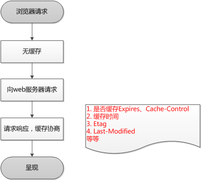

浏览器缓存就是把一个已经请求过的Web资源（如html页面，图片，js，数据等）拷贝一份副本储存在浏览器中。缓存会根据进来的请求保存输出内容的副本。当下一个请求来到的时候，如果是相同的URL，缓存会根据缓存机制决定是直接使用副本响应访问请求，还是向源服务器再次发送请求。比较常见的就是浏览器会缓存访问过网站的网页，当再次访问这个URL地址的时候，如果网页没有更新，就不会再次下载网页，而是直接使用本地缓存的网页。只有当网站明确标识资源已经更新，浏览器才会再次下载网页。

## 1 为什么使用缓存

（1）减少网络带宽消耗

　　无论对于网站运营者或者用户，带宽都代表着金钱，过多的带宽消耗，只会便宜了网络运营商。当Web缓存副本被使用时，只会产生极小的网络流量，可以有效的降低运营成本。

（2）降低服务器压力

　　给网络资源设定有效期之后，用户可以重复使用本地的缓存，减少对源服务器的请求，间接降低服务器的压力。同时，搜索引擎的爬虫机器人也能根据过期机制降低爬取的频率，也能有效降低服务器的压力。

（3）减少网络延迟，加快页面打开速度

　　带宽对于个人网站运营者来说是十分重要，而对于大型的互联网公司来说，可能有时因为钱多而真的不在乎。那Web缓存还有作用吗？答案是肯定的，对于最终用户，缓存的使用能够明显加快页面打开速度，达到更好的体验。

## 2 浏览器端的缓存规则

　　对于浏览器端的缓存来讲，这些规则是在HTTP协议头和HTML页面的Meta标签中定义的。他们分别从新鲜度和校验值两个维度来规定浏览器是否可以直接使用缓存中的副本，还是需要去源服务器获取更新的版本。

　　新鲜度（过期机制）：也就是缓存副本有效期。一个缓存副本必须满足以下条件，浏览器会认为它是有效的，足够新的：

　　　　1. 含有完整的过期时间控制头信息（HTTP协议报头），并且仍在有效期内；

　　　　2. 浏览器已经使用过这个缓存副本，并且在一个会话中已经检查过新鲜度；

　　满足以上两个情况的一种，浏览器会直接从缓存中获取副本并渲染。

　　校验值（验证机制）：服务器返回资源的时候有时在控制头信息带上这个资源的实体标签Etag（Entity Tag），它可以用来作为浏览器再次请求过程的校验标识。如过发现校验标识不匹配，说明资源已经被修改或过期，浏览器需求重新获取资源内容。

## 3 浏览器缓存的控制
（1）使用HTML Meta 标签

　　Web开发者可以在HTML页面的<head>节点中加入<meta>标签，代码如下

```html
<meta http-equiv="Pragma" content="no-cache">  
<!- Pragma是http1.0版本中给客户端设定缓存方式之一，具体作用会在后面详细介绍 -->
```

　　上述代码的作用是告诉浏览器当前页面不被缓存，每次访问都需要去服务器拉取。但是！这里有个坑...

　　事实上这种禁用缓存的形式用处很有限：

　　　　a. 仅有IE才能识别这段meta标签含义，其它主流浏览器仅识别“Cache-Control: no-store”的meta标签。

　　　　b. 在IE中识别到该meta标签含义，并不一定会在请求字段加上Pragma，但的确会让当前页面每次都发新请求（仅限页面，页面上的资源则不受影响）。

（2）使用缓存有关的HTTP消息报头

　　在这里就需要先跟大家介绍一下HTTP的相关知识。一个URI的完整HTTP协议交互过程是由HTTP请求和HTTP响应组成的。

## 4 浏览器HTTP请求流程
第一次请求



第二次请求


浏览器在第一次请求发生后，再次请求时：

    浏览器在请求某一资源时，会先获取该资源缓存的header信息，判断是否命中强缓存（cache-control和expires信息），
    若命中直接从缓存中获取资源信息，包括缓存header信息；
    本次请求根本就不会与服务器进行通信；
    在firebug下可以查看某个具有强缓存资源返回的信息，
    例如本地firebug查看的一个强缓存js文件

    如果没有命中强缓存，浏览器会发送请求到服务器，
    请求会携带第一次请求返回的有关缓存的header字段信息（Last-Modified/If-Modified-Since和Etag/If-None-Match），
    由服务器根据请求中的相关header信息来比对结果是否协商缓存命中；
    若命中，则服务器返回新的响应header信息更新缓存中的对应header信息，
    但是并不返回资源内容，它会告知浏览器可以直接从缓存获取；否则返回最新的资源内容
--------------------- 
## 5 用户行为与缓存
浏览器缓存行为还有用户的行为有关，具体情况如下：

用户操作|Expires/Cache-Control|Last-Modified/Etag
--|:--:|:--:
地址栏回车|有效|有效
页面链接跳转|有效|有效
新开窗口|有效|有效
前进、后退|有效|有效
F5刷新|无效(BR重置max-age=0)|有效
Ctrl+F5刷新|无效(重置Cache-Control=no-cache)|无效 请求头丢弃该选项

## 6 不能缓存的请求

　　当然并不是所有请求都能被缓存，无法被浏览器缓存的请求如下：

1. HTTP信息头中包含Cache-Control:no-cache，pragma:no-cache（HTTP1.0），或Cache-Control:max-age=0等告诉浏览器不用缓存的请求

2. 需要根据Cookie，认证信息等决定输入内容的动态请求是不能被缓存的

3. 经过HTTPS安全加密的请求（有人也经过测试发现，ie其实在头部加入Cache-Control：max-age信息，firefox在头部加入Cache-Control:Public之后，能够对HTTPS的资源进行缓存，参考《HTTPS的七个误解》）

4. POST请求无法被缓存

5. HTTP响应头中不包含Last-Modified/Etag，也不包含Cache-Control/Expires的请求无法被缓存

## 7 浏览器缓冲有哪些
浏览器缓存主要有两类：缓存协商：Last-modified ，Etag 和彻底缓存：cache-control，Expires。