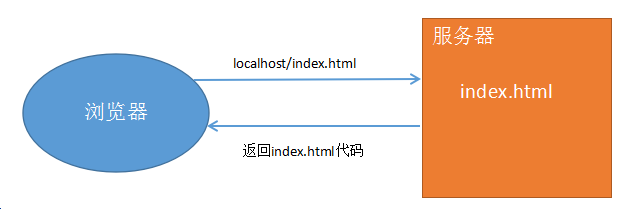

## 1 Http协议概述

  协议: 就是事先的一种约定、规则、规范、标准。（租房合同、工作合同）。

  HTTP协议：HyperText Transfer Protocol 超文本传输协议，客户端（浏览器端）与WEB服务器端之间的交互协议。当浏览器和服务器进行数据交换时，html文件、图片、CSS、JS等都是基于HTTP协议进行传输的。

  HTTP协议有两个版本: 1.0 和 1.1，目前使用的基本都是1.1

  特点: 
  通常是基于 B/S 结构软件的。
  无连接: 浏览器向服务器发送一次请求，服务器响应一次，链接即结束。
  无状态: 无记忆。 服务器不能记住哪个浏览器访问过。 

  

无连接 -- 没有持久化链接

当浏览器地址栏输入 www.baidu.com/index.html，按下回车时。浏览器向服务器发送请求，服务器找到index.html文件返回给浏览器之后，本次链接断开。

如果在点击该页面中任何一个链接，则重新建立一次链接。客户端发送请求，服务器响应。之后又断开链接。 

## 3.2 请求和响应

HTTP协议主要分为两大部分: 
  请求:  访问服务器的任何一个文件都是一次请求
  响应:  服务器处理请求，将结果返回给浏览器。

1) 请求/请求报文/请求协议 (==request== / http request)
  客户端(浏览器)向服务器索要数据时遵循的协议

   请求报文分为3个部分:  请求行   请求头   请求主体

  请求行:  请求方式、请求URL地址、协议版本号
  请求头:  主机域名，客户端(浏览器)的信息等
  请求主体:  发送给服务器的数据，get和post都会通过请求主体将数据发送给服务器

   可以使用Chrome tools 或者 firebug 来查看请求和响应的信息（F12）

       

    主要请求项:
      host： 主机名和端口号，80端口默认不显示
      accept：可接受的程序类型
      accept-encoding： 可接受的压缩类型
      accept-language： 可接受的语言类型
      cache-control： 缓存控制

2) 响应 / 响应报文  (==response== / http response)

  响应报文也分为3部分:  响应行   响应头   响应主体
  
  响应行: 协议版本号、响应结果状态码
  响应头: 主要是服务器端的信息
  响应主体: 就是从服务器返回给客户端的数据
  
  主要响应项：
   content-type： 响应内容类型， content-type:text/html，服务器告诉浏览器，返回的这部分数据是文本类型，使用html方式来解析即可。
   content-length： 响应内容的长度 ，content-length:336, 从服务器返回给浏览器的数据总长度为336字节

## 3.3 状态码

 常见的状态码如下: 

 200 ok   -----   请求成功

 302 redirect|Found  ----- 重定向

 304 not modified ----- 未修改

 403 forbidden   -----  禁止访问 （没有权限访问）

 404 Not Found  -----  未找到页面

 500 internal server error  ----- 服务器内部错误 (可能是服务器本身有问题，或者代码错的太离谱)

 

## 3.4 多次请求和响应

 

## 3.5 header 响应头设置

1) 设置响应类型

浏览器发起请求的方式是多样的，当发起请求后服务端会有对应的内容响应过来，浏览器会根据响应头==Content-Type==来对响应的内容进行解析

content-type主要的响应类型是  text/html   （默认）
其他常见类型 :  text/css   text/javascript   image/png  image/jpeg  image/gif

2) header('content-type:image/png');

此时，服务器告诉浏览器，以解释png图片的方式来解释，所以就能正常显示图片了。

3) 指定字符集

   核心: 页面指定的字符集和页面编码字符集一致

   中文字符集: utf-8  gb2312  gbk

     header(‘Content-Type:text/html;charset=utf-8’);
     header(‘Content-Type:text/html;charset=gb2312’);

windows的默认编码是gb2312，所以在windows下创建的文件也是 gb2312编码的。（ANSI）

 

   页面乱码问题处理方式：
     页面乱码是因为==文件编码==和==页面指定编码==不一致，所以解决该问题就是要统一文件编码和页面指定编码

    ① 在页面中设置 header ，编码指定为 utf-8
    ② 将文件的编码格式，指定为utf-8 (使用sublime，将保存格式设置为 utf-8 或者 使用editplus另存为文件时，设置utf-8)

如果 header设置为  utf-8，则文件编码格式也要设置为 utf-8

如果header设置为 gbk，则文件编码格式要设置为 ANSI 

在windows下直接创建文件，默认格式是ANSI，那么页面字符集就要用 gbk或者gb2312

在sublime下创建文件，是utf-8格式，那么页面字符集也指定为utf-8

4) 页面重定向 --->  页面跳转

     header('location:页面地址');       //立即跳转
     header('refresh:2;url=页面地址');  //延迟2秒后跳转

## 3.6 -- 状态代码：状态代码由三位数字组成，第一个数字定义了响应的类别，且有五种可能取值

 

1xx：信息性状态码，表示服务器已接收了客户端请求，客户端可继续发送请求。

    100 Continue

    101 Switching Protocols

 2xx：成功状态码，表示服务器已成功接收到请求并进行处理。

    200 OK 表示客户端请求成功

    204 No Content 成功，但不返回任何实体的主体部分

    206 Partial Content 成功执行了一个范围（Range）请求

3xx：重定向状态码，表示服务器要求客户端重定向。

    301 Moved Permanently 永久性重定向，响应报文的Location首部应该有该资源的新URL

    302 Found 临时性重定向，响应报文的Location首部给出的URL用来临时定位资源

    303 See Other 请求的资源存在着另一个URI，客户端应使用GET方法定向获取请求的资源

    304 Not Modified 服务器内容没有更新，可以直接读取浏览器缓存

     307 Temporary Redirect 临时重定向。与302 Found含义一样。302禁止POST变换为GET，但实际使用时并不一定，307则更多浏览器可能会遵循这一标准，但也依赖于浏览器具体实现

 4xx：客户端错误状态码，表示客户端的请求有非法内容。

       400 Bad Request 表示客户端请求有语法错误，不能被服务器所理解

       401 Unauthonzed 表示请求未经授权，该状态代码必须与 WWW-Authenticate 报头域一起使用

       403 Forbidden 表示服务器收到请求，但是拒绝提供服务，通常会在响应正文中给出不提供服务的原因

       404 Not Found 请求的资源不存在，例如，输入了错误的URL

5xx：服务器错误状态码，表示服务器未能正常处理客户端的请求而出现意外错误。

        500 Internel Server Error 表示服务器发生不可预期的错误，导致无法完成客户端的请求

        503 Service Unavailable 表示服务器当前不能够处理客户端的请求，在一段时间之后，服务器可能会恢复正常

 