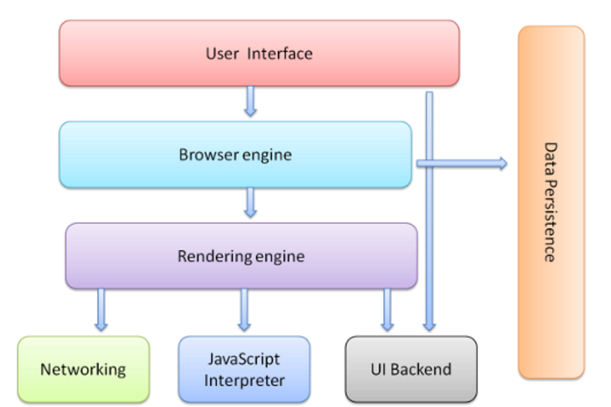

# JavaScript 高级
##  JavaScript

#### JavaScript 是什么

- 解析执行：轻量级解释型的 

  解释执行 JavaScript  PHP    每一行代码都要先解释再执行 -- 慢，灵活

  ​	var a = 10;

  ​	var b = 20;

  ​	console.log(a, b);  

  编译执行  C#  Java         一次性编译，然后再一行一行执行  -- 快

- 语言特点：动态，头等函数 (First-class Function)
  + 又称函数是 JavaScript 中的一等公民

- 执行环境：在宿主环境（host environment）下运行，浏览器是最常见的 JavaScript 宿主环境
  + 但是在很多非浏览器环境中也使用 JavaScript ，例如 node.js

#### JavaScript 的组成

- ECMAScript  - 语法规范
  - 变量、数据类型、类型转换、操作符
  - 流程控制语句：判断、循环语句
  - 数组、函数、作用域、预解析
  - 对象、属性、方法、简单类型和复杂类型的区别
  - 内置对象：Math、Date、Array，基本包装类型String、Number、Boolean
- Web APIs
  - BOM
    - onload页面加载事件，window顶级对象
    - 定时器
    - location、history
  - DOM
    - 获取页面元素，注册事件
    - 属性操作，样式操作
    - 节点属性，节点层级
    - 动态创建元素
    - 事件：注册事件的方式、事件的三个阶段、事件对象 

#### JavaScript 可以做什么

> 阿特伍德定律：  stackoverflow
>
> Any application that can be written in JavaScript, will eventually be written in JavaScript.  
>
> 任何可以用*JavaScript*来写的应用，最终都将用*JavaScript*来写。阿特伍德 stackoverflow的创始人之一
>
> 掘金    微信公众号：前端大全


### 浏览器是如何工作的



```
User Interface  用户界面，我们所看到的浏览器
Browser engine  浏览器引擎，用来查询和操作渲染引擎
*Rendering engine 用来显示请求的内容，负责解析HTML、CSS，并把解析的内容显示出来。
				负责把HTML文档解释成DOM树
Networking   网络，负责发送网络请求
*JavaScript Interpreter(解析者)   JavaScript解析器，负责执行JavaScript的代码
UI Backend   UI后端，用来绘制类似组合框和弹出窗口
Data Persistence(持久化)  数据持久化，数据存储  cookie、HTML5中的sessionStorage
```

---

## JavaScript 面向对象编程

### 面向对象介绍

#### 什么是对象

- **现实世界中的对象**

  对象是单个事 物的抽象。

  一本书、一辆汽车、一个人都可以是对象，一个数据库、一张网页、一个与远程服务器的连接也可以是对象。当实物被抽象成对象，实物之间的关系就变成了对象之间的关系，从而就可以模拟现实情况，针对对象进行编程。

- **程序世界中的对象**

  对象是一个容器，封装了属性（property）和方法（method）。

  - 属性是对象的状态，方法是对象的行为（完成某种任务）。
    - 比如：我们可以把动物抽象为animal对象，使用“属性”记录具体是那一种动物，使用“方法”表示动物的某种行为（奔跑、捕猎、休息等等）。
  - 对象是一个抽象的概念，可以将其简单理解为：**数据集或功能集**。
  - ECMAScript-262 把对象定义为：**无序属性的集合，其属性可以包含基本值、对象或者函数**。

  > 提示：每个对象都是基于一个引用类型创建的，这些类型可以是系统内置的原生类型，也可以是开发人员自定义的类型。
  >
  > Array  类型  构造函数
  >
  > var arr = new Array();

  Student  一类事物  类型

  var s = new Student();  通过类型，创建了一个具体的对象


#### 什么是面向对象

> 面向对象不是新的东西，它只是过程式代码的一种高度封装，目的在于**提高**代码的**开发效率**和**可维护性**。

- 面向对象编程

   Object Oriented Programming，简称 OOP ，是一种编程开发思想。它将真实世界各种复杂的关系，抽象为一个个对象，然后由对象之间的分工与合作，完成对真实世界的模拟。

- 在面向对象程序开发思想中，每一个对象都是功能中心，具有**明确分工**，可以完成接受信息、处理数据、发出信息等任务。对象要**职责分明**

>  因此，面向对象编程具有灵活、代码可复用、高度模块化等特点，容易维护和开发，比起由一系列函数或指令组成的传统的过程式编程（procedural programming），更适合多人合作的大型软件项目。

面向对象与面向过程： 

- 面向过程就是亲力亲为，事无巨细，面面俱到，步步紧跟，有条不紊
- 面向对象就是找一个对象，指挥得结果
- 面向对象将执行者转变成指挥者
- **面向对象不是面向过程的替代，而是面向过程的封装**

**面向对象的特性**：

- 封装性 
- 继承性
- [多态性]抽象

#### 程序中面向对象的基本体现

在 JavaScript 中，所有数据类型都可以视为对象，当然也可以自定义对象。
自定义的对象数据类型就是面向对象中的类（ Class ）的概念。

我们以一个例子来说明面向过程和面向对象在程序流程上的不同之处。

假设我们要处理学生的成绩表，为了表示一个学生的成绩，面向过程的程序可以用一个对象表示：

```javascript
var std1 = { name: 'Michael', score: 98 }
var std2 = { name: 'Bob', score: 81 }
```

而处理学生成绩可以通过函数实现，比如打印学生的成绩：

```javascript
function printScore (student) {
  console.log('姓名：' + student.name + '  ' + '成绩：' + student.score)
}
```

如果采用面向对象的程序设计思想，我们首选思考的不是程序的执行流程，
而是 `Student` 这种数据类型应该被视为一个对象，这个对象拥有 `name` 和 `score` 这两个属性（Property）。
如果要打印一个学生的成绩，首先必须创建出这个学生对应的对象，然后，给对象发一个 `printScore` 消息，让对象自己把自己的数据打印出来。

抽象数据行为模板（Class）：

```javascript
function Student(name, score) {
  this.name = name;
  this.score = score;
  this.printScore = function() {
    console.log('姓名：' + this.name + '  ' + '成绩：' + this.score);
  }
}
```

根据模板创建具体实例对象（Instance）：

```javascript
var std1 = new Student('Michael', 98)
var std2 = new Student('Bob', 81)
```

实例对象具有自己的具体行为（给对象发消息）：

```javascript
std1.printScore() // => 姓名：Michael  成绩：98
std2.printScore() // => 姓名：Bob  成绩 81
```

面向对象的设计思想是从自然界中来的，因为在自然界中，类（Class）和实例（Instance）的概念是很自然的。
Class 是一种抽象概念，比如我们定义的 Class——Student ，是指学生这个概念，
而实例（Instance）则是一个个具体的 Student ，比如， Michael 和 Bob 是两个具体的 Student 。

所以，面向对象的设计思想是：

- 抽象出 Class(构造函数)
- 根据 Class(构造函数) 创建 Instance
- 指挥 Instance 得结果

面向对象的抽象程度又比函数要高，因为一个 Class 既包含数据，又包含操作数据的方法。

### 创建对象

#### 简单方式

我们可以直接通过 `new Object()` 创建：

```javascript
var person = new Object()
person.name = 'Jack'
person.age = 18

person.sayName = function () {
  console.log(this.name)
}
```

每次创建通过 `new Object()` 比较麻烦，所以可以通过它的简写形式对象字面量来创建：

```javascript
var person = {
  name: 'Jack',
  age: 18,
  sayName: function () {
    console.log(this.name)
  }
}
```

对于上面的写法固然没有问题，但是假如我们要生成两个 `person` 实例对象呢？

```javascript
var person1 = {
  name: 'Jack',
  age: 18,
  sayName: function () {
    console.log(this.name)
  }
}

var person2 = {
  name: 'Mike',
  age: 16,
  sayName: function () {
    console.log(this.name)
  }
}
```

通过上面的代码我们不难看出，这样写的代码太过冗余，重复性太高。

### 构造函数

内容引导：

- 构造函数语法
- 分析构造函数
- 构造函数和实例对象的关系
  + 实例的 constructor 属性
  + instanceof 操作符
- 普通函数调用和构造函数调用的区别
- 构造函数的问题

#### 构造函数

构造函数：

```javascript
function Person (name, age) {
  this.name = name;
  this.age = age;
  this.sayName = function () {
    console.log(this.name);
  };
}

var p1 = new Person('Jack', 18);
p1.sayName(); // => Jack

var p2 = new Person('Mike', 23)
p2.sayName(); // => Mike
```

#### 解析构造函数代码的执行

而要创建 `Person` 实例，则必须使用 `new` 操作符。
以这种方式调用构造函数会经历以下 4 个步骤：

1. 创建一个新对象
2. 将构造函数的作用域赋给新对象（因此 this 就指向了这个新对象）
3. 执行构造函数中的代码
4. 返回新对象

下面是具体的伪代码：

```javascript
function Person (name, age) {
  // 当使用 new 操作符调用 Person() 的时候，实际上这里会先创建一个对象
  // var instance = {}
  // 然后让内部的 this 指向 instance 对象
  // this = instance
  // 接下来所有针对 this 的操作实际上操作的就是 instance
  this.name = name;
  this.age = age;
  this.sayName = function () {
    console.log(this.name);
  };
  // 在函数的结尾处会将 this 返回，也就是 instance
  // return this
}
```

#### 构造函数和对象(实例)的关系

在每一个实例对象中同时有一个 `constructor` 属性，该属性指向创建该实例的构造函数：

```javascript
console.log(p1.constructor === Person); // => true
console.log(p2.constructor === Person); // => true
console.log(p1.constructor === p2.constructor); // => true
```

对象的 `constructor` 属性最初是用来标识对象类型的，
但是，如果要检测对象的类型，还是使用 `instanceof` 操作符更可靠一些：

```javascript
console.log(p1 instanceof Person); // => true
console.log(p2 instanceof Person); // => true
```

总结：

- 构造函数是根据具体的事物抽象出来的抽象**模板**
- 实例对象是根据抽象的构造函数模板得到的具体实例对象
- 每一个实例对象都具有一个 `constructor` 属性，指向创建该实例的构造函数
  + 注意： `constructor` 是实例的属性的说法不严谨，具体后面的原型会讲到
- 可以通过实例的 `constructor` 属性判断实例和构造函数之间的关系
  + 注意：这种方式不严谨，推荐使用 `instanceof` 操作符，后面学原型会解释为什么

#### 实例成员和静态成员

- 实例成员

  属于对象的成员，每一个对象都具有的成员，但是每个对象具有的这个成员的值是不同的。

  例如：p.name。通过Person构造函数创建的对象的name属性的值是不同的

- 静态成员

  属于构造函数的成员，所有对象都共享

  Person.verson = '1.0';  

#### 构造函数的问题

使用构造函数带来的最大的好处就是创建对象更方便了，但是其本身也存在一个浪费内存的问题：

```javascript
function Person (name, age) {
  this.name = name;
  this.age = age;
  this.type = 'human';
  this.sayHello = function () {
    console.log('hello ' + this.name);
  }
}

var p1 = new Person('Tom', 18);
var p2 = new Person('Jack', 16);
```

在该示例中，从表面上好像没什么问题，但是实际上这样做，有一个很大的弊端。
那就是对于每一个实例对象，`type` 和 `sayHello` 都是一模一样的内容，
每一次生成一个实例，都必须为重复的内容，多占用一些内存，如果实例对象很多，会造成极大的内存浪费。

```javascript
console.log(p1.sayHello === p2.sayHello); // => false
```

对于这种问题我们可以把需要共享的函数定义到构造函数外部：

```javascript
function sayHello = function () {
  console.log('hello ' + this.name);
}

function Person (name, age) {
  this.name = name;
  this.age = age;
  this.type = 'human';
  this.sayHello = sayHello;
}

var p1 = new Person('Top', 18)
var p2 = new Person('Jack', 16)

console.log(p1.sayHello === p2.sayHello) // => true
```

这样确实可以了，但是如果有多个需要共享的函数的话就会造成全局命名空间冲突的问题。

### 原型

- **构造函数的原型**

更好的解决对象中方法占用内容的方式的方案： **prototype**

JavaScript 规定，每一个**(构造)函数**都有一个 **prototype** 属性，指向另一个对象。
**这个对象的所有属性和方法，都会被构造函数的对象所拥有**。

这也就意味着，我们可以把所有对象实例需要共享的属性和方法直接定义在 `prototype` 对象上。

```javascript
function Person (name, age) { 
}

console.log(Person.prototype)

Person.prototype.type = 'human'

Person.prototype.sayName = function () {
  console.log(this.name)
}

var p1 = new Person(...)
var p2 = new Person(...)

console.log(p1.sayName === p2.sayName) // => true
```

这时所有实例的 `type` 属性和 `sayName()` 方法，
其实都是同一个内存地址，指向 **prototype** 对象，因此就提高了运行效率。

- **对象的原型**

  每一个对象都有一个**\_\_proto\_\_**的属性，此属性指向构造函数的**prototype**

  > **注意**：`__proto__` 是非标准属性。

#### 构造函数、实例、原型三者之间的关系


任何函数都具有一个 **prototype** 属性，该属性是一个对象。

```javascript
function F () {}
console.log(F.prototype) // => object

F.prototype.sayHi = function () {
  console.log('hi!')
}
```

构造函数的 `prototype` 对象默认都有一个 **constructor** 属性，指向 **prototype** 对象所在函数。

```javascript
console.log(F.prototype.constructor === F) // => true
```

通过构造函数得到的实例对象内部会包含一个指向构造函数的 `prototype` 对象的指针 `__proto__`。

```javascript
var instance = new F()
console.log(instance.__proto__ === F.prototype) // => true
```

实例对象可以直接访问原型对象成员。

```javascript
instance.sayHi() // => hi!
```

总结：

- 任何函数都具有一个 `prototype` 属性，该属性是一个对象
- `prototype` 对象默认都有一个 `constructor` 属性，指向 `prototype` 对象所在函数
- 通过构造函数得到的实例对象内部会包含一个指向构造函数的 `prototype` 对象的指针 `__proto__`
- 所有实例都直接或间接继承了原型对象的成员

#### 属性成员的搜索原则：原型链

了解了 **构造函数-实例-原型对象** 三者之间的关系后，接下来我们来解释一下为什么实例对象可以访问原型对象中的成员。

每当代码读取某个对象的某个属性时，都会执行一次搜索，目标是具有给定名字的属性

- 搜索首先从对象实例本身开始
- 如果在实例中找到了具有给定名字的属性，则返回该属性的值
- 如果没有找到，则继续搜索指针指向的原型对象，在原型对象中查找具有给定名字的属性
- 如果在原型对象中找到了这个属性，则返回该属性的值

也就是说，在我们调用 `person1.sayName()` 的时候，会先后执行两次搜索：

- 首先，解析器会问：“实例 person1 有 sayName 属性吗？”答：“没有。
- ”然后，它继续搜索，再问：“ person1 的原型有 sayName 属性吗？”答：“有。
- ”于是，它就读取那个保存在原型对象中的函数。
- 当我们调用 person2.sayName() 时，将会重现相同的搜索过程，得到相同的结果。

而这正是多个对象实例共享原型所保存的属性和方法的基本原理。

总结：

- 先在自己身上找，找到即返回
- 自己身上找不到，则沿着原型链向上查找，找到即返回
- 如果一直到原型链的末端还没有找到
  - 如果是属性则返回 `undefined`
  - 如果是方法会报错

#### 实例对象读写原型对象成员

读取：

- 先在自己身上找，找到即返回
- 自己身上找不到，则沿着原型链向上查找，找到即返回
- 如果一直到原型链的末端还没有找到
  - 如果是属性则返回 `undefined`
  - 如果是方法会报错

写入：

- 当实例期望重写原型对象中的某个普通数据成员时实际上会把该成员添加到自己身上
- 也就是说该行为实际上会屏蔽掉对原型对象成员的访问

#### 更简单的原型语法

我们注意到，前面例子中每添加一个属性和方法就要敲一遍 `Person.prototype` 。
为减少不必要的输入，更常见的做法是用一个包含所有属性和方法的对象字面量来重写整个原型对象：

```javascript
function Person (name, age) {
  this.name = name
  this.age = age
}
Person.prototype = {
  type: 'human',
  sayHello: function () {
    console.log('我叫' + this.name + '，我今年' + this.age + '岁了')
  }
}
```

在该示例中，我们将 `Person.prototype` 重置到了一个新的对象。
这样做的好处就是为 `Person.prototype` 添加成员简单了，但是也会带来一个问题，那就是原型对象丢失了 `constructor` 成员。

所以，我们为了保持 `constructor` 的指向正确，建议的写法是：

```javascript
function Person (name, age) {
  this.name = name
  this.age = age
}

Person.prototype = {
  constructor: Person, // => 手动将 constructor 指向正确的构造函数
  type: 'human',
  sayHello: function () {
    console.log('我叫' + this.name + '，我今年' + this.age + '岁了')
  }
}
```

#### 原生对象的原型

  所有函数都有 prototype 属性对象。

- Object.prototype
- Function.prototype
- Array.prototype
- String.prototype
- Number.prototype
- Date.prototype
- ...


> **注意**：内置对象的**prototype**属性(只读属性)不能够直接复制

#### 原型对象使用建议

- 属性（一般就是非函数成员）放到构造函数中
- 方法（一般就是函数）放到原型对象中
- 如果重置了 `prototype` 记得修正 `constructor` 的指向

### 案例：随机方块游戏

- 分析对象：方块对象 Box

- 分析属性和方法

  - 属性 
    - left、top  方块的坐标
    - size         方块的大小（方块是正方形的）
    - color        方块的颜色
    - _div           方块对应的div
  - 方法
    - random    随机生成位置

- 构造函数

  构造函数中设置方块的属性，创建div

  ```js
  function Box(map) {
    this.left = 0;
    this.top = 0;
    this.size = 20;
    this.color = 'red';

    this.div = document.createElement('div');
    map.appendChild(this.div);
    this.div.className = 'box';
  }
  ```

- 随机方块的位置

  1. 随机生成方块的坐标，范围在map中
  2. 随机生成方块的颜色
  3. 设置div的样式属性
  4. 构造函数中调用random
  5. 新建app.js创建方块进行测试

  ```js
  Box.prototype.random = function () {
    // 1. 随机生成坐标
    var maxX = 800 / this.size - 1;
    var maxY = 600 / this.size - 1;
    this.left = getRandom(0, maxX) * 20;
    this.top = getRandom(0, maxY) * 20;
    // 2. 随机生成颜色
    var r = getRandom(0, 255);
    var g = getRandom(0, 255);
    var b = getRandom(0, 255);
    this.color = 'rgb('+ r +', '+ g +', '+ b +')';
    // 3. 设置div的样式属性
    this.div.style.left = this.left + 'px';
    this.div.style.top = this.top + 'px';
    this.div.style.width = this.size + 'px';
    this.div.style.height = this.size + 'px';  
    this.div.style.backgroundColor = this.color;
  }
  ```

- 随机生成[min, max]之间的整数

  ```js
  function getRandom(min, max) {
    return parseInt(Math.random() * (max - min + 1)) + min;
  }
  ```

- 游戏主逻辑

  1. 创建方块对象

  2. 开启定时器，定时随机方块的位置

  3. 点击map，判断鼠标的位置是否在方块上

     3.1 获取鼠标在map中的坐标

     3.2 判断鼠标的位置是否在方块上，如果赢了，停止定时器

---

### 自调用函数

- 自调用函数

  - 解决变量冲突的问题

  - 问题：演示不加分号的问题

  - 语法

    ```js
    (function() {
      	var msg = '你猜谁能访问我';
        console.log(msg);
    })();
    console.log(msg);
    ```

    > 注意：
    >
    > - 函数要使用()包含起来，把函数变成表达式
    > - 后面的小括号是函数调用

  - 问题

    - 问题1：如果存在多个自调用函数要用分号分割，否则语法错误

      ```js
      // 错误
      (function () {
      })()

      (function () {
      })()

      // 正确
      ;(function () {
      })()

      ;(function () {
      })()
      ```

    - 问题2：当自调用函数 前面有函数声明时，会出错。

      ```js
      // 所以建议自调用函数前，加上;
      var a = function () {
        alert('11');
      }
      (function () {
        alert('22');
      })();
      ```

- bind改变函数中的this

  - 定时器中的this指向谁？

    ```js
    setInterval(function() {
        console.log(this);
    }, 1000);
    ```

  - 如何把定时器中的this改变成其它对象？

    ```js
    var obj = {
        name: 'zs',
        age: 18
    };
    setInterval(function() {
        console.log(this);
        console.log(this.name);
    }.bind(obj), 1000);
    ```

  > bind() 可以改变函数内部的this的指向，并返回一个新的函数


### 什么是继承

- 现实生活中的继承
- 程序中的继承
  - 子类型继承父类型的成员，让代码重用

### 对象的"继承"

通过遍历把一个对象的所有成员拷贝给另一个对象

```js
// 对象的拷贝
// 复制对象的成员给另一个对象
function extend(parent, child) {
  for (var key in parent) {
    // 不复制同名的属性
    if (child[key]) {
      continue;
    }
    child[key] = parent[key];
  }
}
```

### 原型继承

- 继承：类型和类型之间的关系
- 学生类型  老师类型  -> Person类型
- 继承目的： 把子类型中共同的成员提取到父类型中，代码重用
- 可以方便的基础父类型的原型中的方法，但是属性的继承无意义

```js
// 父类型
function Person() {
  this.name = 'zs';
  this.age = 18;
  this.sex = '男';
}
Person.prototype.sayHi = function() {
  console.log('大家好，我是' + this.name);
}
// 子类型
function Student() {
  this.score = 100;
}
Student.prototype = new Person();
Student.prototype.constructor = Student;

var s1 = new Student();
console.log(s1.constructor);
```

> 注意：当设置了构造函数的prototype之后，别忘记设置constructor
>
> 问题：原型继承，无法设置构造函数的参数**Student.prototype = new Person();**只执行一次，无法给属性传值

### 借用构造函数

- 前置知识 call

  使用call可以改变函数中的this，并且可以立即调用函数

  和bind不同的是，bind会返回一个新函数，而call是直接调用

  ```js
  function fn(x, y) {
    console.log(this);
    console.log(x + y);
  }
  var o = {
    name: 'zs'
  };
  // call()  改变函数中的this，直接调用函数
  fn.call(o, 2, 3);
  ```

- 借用构造函数

  可以方便的继承父类型的属性，但是无法继承原型中的方法

  ```javascript
  // 父类型
  function Person(name, age, sex) {
    this.name = name;
    this.age = age;
    this.sex = sex;
  }
  Person.prototype.sayHi = function () {
    console.log(this.name);
  }
  // 子类型
  function Student(name, age, sex, score) {
    Person.call(this, name, age, sex);
    this.score = score;
  }
  var s1 = new Student('zs', 18, '男', 100);
  console.dir(s1);
  ```

  > 借用构造函数继承的问题：无法继承方法

### 组合继承：原型继承+借用构造函数继承

```javascript
// 父类型
function Person(name, age, sex) {
  this.name = name;
  this.age = age;
  this.sex = sex;
}

Person.prototype.sayHi = function () {
  console.log('大家好，我是' + this.name);
}
// 子类型
function Student(name, age, sex, score) {
  // 借用构造函数
  Person.call(this, name, age, sex);
  this.score = score;
}
Student.prototype = new Person();
Student.prototype.constructor = Student;
// 学生特有的方法
Student.prototype.exam = function () {
  console.log('考试');
}
```

> **小结**：
>
> 继承：子类型所有对象具有父类型的成员
>
> 关于继承要记住下面两句代码

```js
Student.prototype = new Person();
Student.prototype.constructor = Student;
```

---

## 函数进阶

### 函数的定义方式

- 函数声明
- 函数表达式
- `new Function`

#### 函数声明

```javascript
function foo () {
}
```

#### 函数表达式

```javascript
var foo = function () {
};
```

#### **new Function**

```js
var fn = new Function('a', 'b', 'return a + b;');
var sum = fn(5, 6);
console.log(sum);
```

#### 函数声明与函数表达式的区别

- 函数声明必须有名字
- **函数声明会函数提升**，在预解析阶段就已创建，声明前后都可以调用
- 函数表达式类似于变量赋值，提升的仅仅是变量声明
- 函数表达式可以没有名字，例如匿名函数
- 函数表达式没有变量提升，在执行阶段创建，必须在表达式执行之后才可以调用

下面是一个根据条件定义函数的例子(了解)：

```javascript
if (true) {
  function f () {
    console.log(1);
  }
} else {
  function f () {
    console.log(2);
  }
}
```

以上代码执行结果在不同浏览器中结果不一致。有些浏览器里不会进行函数提升(Chrome)，有些浏览器中会函数提升。

不过我们可以使用函数表达式解决上面的问题：

```javascript
var f;

if (true) {
  f = function () {
    console.log(1)
  };
} else {
  f = function () {
    console.log(2)
  };
}
```

### 函数的调用方式

- 普通函数
- 构造函数
- 对象方法

### 函数内 `this` 指向的不同场景

函数的调用方式决定了 `this` 指向的不同：

| 调用方式   | 非严格模式   | 备注                |
| ------ | ------- | ----------------- |
| 普通函数调用 | window  | 严格模式下是 undefined  |
| 构造函数调用 | 实例对象    | 原型方法中 this 也是实例对象 |
| 对象方法调用 | 该方法所属对象 | 紧挨着的对象            |
| 事件绑定方法 | 绑定事件对象  |                   |
| 定时器函数  | window  |                   |

这就是对函数内部 this 指向的基本整理，写代码写多了自然而然就熟悉了。

> **注意**：**函数内部的this，是由函数的调用方式决定的。**

### 函数也是对象

- 所有函数都是 `Function` 的实例

### 改变函数中的this

- 为什么要改变函数内部的this

  例如：我们经常在定时器外部备份 this 引用，然后在定时器函数内部使用外部 this 的引用。

- 函数有三个方法可以改变内部的this：call、apply、bind。

#### call

`call()` 方法调用一个函数, 其具有一个指定的 `this` 值和分别地提供的参数(参数的列表)。

语法：

```javascript
fun.call(thisArg[, arg1[, arg2[, ...]]])
```

参数：

- `thisArg`
  + 在 fun 函数运行时指定的 this 值
  + 如果指定了 null 或者 undefined 则内部 this 指向 window

- `arg1, arg2, ...`
  + 指定的参数列表

应用：

1. 借用构造函数

2. 借用其他对象的方法

   ```js
   // 伪数组
   var obj = {
     0: 100,
     1: 10,
     2: 11,
     3: 20,
     length: 4
   };
   Array.prototype.push.call(obj, 30);
   Array.prototype.splice.call(obj, 0, 3);

   // 借用Object的toString()
   var arr = [5, 9];
   console.log(arr.toString());
   console.log(Object.prototype.toString.call(arr));
   ```

#### apply

`apply()` 方法调用一个函数, 其具有一个指定的 `this` 值，以及作为一个数组（或类似数组的对象）提供的参数。

语法：

```javascript
fun.apply(thisArg, [argsArray])
```

参数：

- `thisArg`
- `argsArray`

`apply()` 与 `call()` 非常相似，不同之处在于提供参数的方式。
`apply()` 使用参数数组而不是一组参数列表。例如：

```javascript
fun.apply(this, ['eat', 'bananas'])
```

应用：把数组展开

```js
// Math.max(3, 5, 6);
var arr = [5, 10, 1, 3, 6];
// Math.max不能求数组中的最大值
console.log(Math.max.apply(null, arr));
console.log(Math.max.apply(Math, arr));
// console.log(1, 2, 3);
// console.log(arr);
console.log.apply(null, arr);
console.log.apply(console, arr);
```


#### bind

- bind不会调用函数，会返回一个新的函数
- 新函数内部的this是bind的第一个参数
- 原函数中的参数，通过第二个参数传递

语法：

```javascript
fun.bind(thisArg[, arg1[, arg2[, ...]]])
```

参数：

- thisArg
  + 当绑定函数被调用时，该参数会作为原函数运行时的 this 指向。当使用new 操作符调用绑定函数时，该参数无效。

- arg1, arg2, ...
  + 当绑定函数被调用时，这些参数将置于实参之前传递给被绑定的方法。

返回值：

返回由指定的this值和初始化参数改造的原函数拷贝。

示例1：

```javascript
var obj = {
  name: 'zs',
  fun: function() {
    setInterval(function() {
      console.log(this.name);
    }.bind(this), 1000);
  }
}
obj.fun();
```

示例2：

```javascript
btn.onclick = function () {
  // 事件处理函数中的this  是触发该事件的对象
  // 通过bind 改变事件处理函数中this的指向
}.bind(obj);
```

#### 小结

- call 和 apply 特性一样
  + 都是用来调用函数，而且是立即调用
  + 但是可以在调用函数的同时，通过第一个参数指定函数内部 `this` 的指向
  + call 调用的时候，参数必须以参数列表的形式进行传递，也就是以逗号分隔的方式依次传递即可
  + apply 调用的时候，参数必须是一个数组，然后在执行的时候，会将数组内部的元素一个一个拿出来，与形参一一对应进行传递
  + 如果第一个参数指定了 `null` 或者 `undefined` 则内部 this 指向 window

- bind
  + 可以用来指定内部 this 的指向，然后生成一个改变了 this 指向的新的函数
  + 它和 call、apply 最大的区别是：bind 不会调用
  + bind 支持传递参数，它的传参方式比较特殊，一共有两个位置可以传递
    * 1. 在 bind 的同时，以参数列表的形式进行传递
    * 2. 在调用的时候，以参数列表的形式进行传递
    * 那到底以谁 bind 的时候传递的参数为准呢还是以调用的时候传递的参数为准
    * 两者合并：bind 的时候传递的参数和调用的时候传递的参数会合并到一起，传递到函数内部

### 函数的其它成员

- arguments
  + 实参集合
- caller
  + 函数的调用者
- length
  + 形参的个数
- name
  + 函数的名称

```javascript
function fn(x, y, z) {
  console.log(fn.length) // => 形参的个数
  console.log(arguments) // 伪数组实参参数集合
  console.log(arguments.callee === fn) // 函数本身
  console.log(fn.caller) // 函数的调用者
  console.log(fn.name) // => 函数的名字
}

function f() {
  fn(10, 20, 30)
}

f()
```

### 高阶函数

- 函数可以作为参数
- 函数可以作为返回值

#### 作为参数

```javascript
function eat (callback) {
  setTimeout(function () {
    console.log('吃完了')
    callback();
  }, 1000);
}

eat(function () {
  console.log('去唱歌');
});
```

#### 作为返回值

```javascript
function genFun (type) {
  return function (obj) {
    return Object.prototype.toString.call(obj) === type;
  }
}

var isArray = genFun('[object Array]');
var isObject = genFun('[object Object]');

console.log(isArray([])); // => true
console.log(isArray({})); // => true
```

### 作用域、作用域链、预解析

- 全局作用域
- 函数作用域
- **没有块级作用域**

```javascript
{
  var foo = 'bar';
}

console.log(foo);

if (true) {
  var a = 123;
}
console.log(a);
```

作用域链示例代码：

```javascript
var a = 10;

function fn () {
  var b = 20;

  function fn1 () {
    var c = 30;
    console.log(a + b + c);
  }

  function fn2 () {
    var d = 40;
    console.log(c + d);
  }

  fn1();
  fn2();
}
```

- 内层作用域可以访问外层作用域，反之不行

### 什么是闭包

**闭包**：闭包是函数和声明该函数的词法环境的组合。

- 闭包就是能够读取其他函数内部变量的函数，
- 闭包就是将函数内部和函数外部连接起来的一座桥梁。

闭包的用途：

- 可以在函数外部读取函数内部成员
- 让函数内成员始终存活在内存中

#### 一些关于闭包的例子

闭包演示：

```javascript
function fn() {
  var n = 10;
  return function () {
    return n;
  }
}
var f = fn();
console.log(f());
```

案例1：第一次调用生成一个随机数，以后每次调用都返回这个随机数

```js
function getRandom() {
  var random = parseInt(Math.random() * 10) + 1;
  return function () {
    return random; 
  }
}
var fn = getRandom();
console.log(fn());
console.log(fn());
```

案例2：写一个函数返回一个返回，返回的函数可以实现1+m,  100+m, 1000+m

```js
function getFun(n) {
  return function (m) {
    return n + m;
  }
}
// 求 100 + m
var fn100 = getFun(100);
// 求 1000 + m
var fn1000 = getFun(1000);
console.log(fn100(1));
console.log(fn1000(1));
```

案例3：闭包的经典案例

```js
var heroes = document.getElementById('heroes');
var list = heroes.children;
for (var i = 0; i < list.length; i++) {
  var li = list[i];
 
  (function (i) {
    li.onclick = function () {
      // 点击li的时候输出当前li对应的索引
      console.log(i);
    }
  })(i);
}
```

案例4：点击按钮设置文档字体大小

```js
// 创建一个函数，设置body的字体大小
function makeFun(size) {
  return function () {
    document.body.style.fontSize = size + 'px';
  }
}

btn1.onclick = makeFun(12);
btn2.onclick = makeFun(14);
btn3.onclick = makeFun(16);
```

案例5：定时器输出循环变量i

```js
console.log('start');
for (var i = 0; i < 3; i++) {
  (function (i) {
    setTimeout(function () {
      console.log(i);
    }, 0);
  })(i);
}
console.log('end');
```

- setTimeout的执行原理

  所有的js代码都在执行栈上执行，定时器和注册事件的函数会放到一个任务队列上。

  当执行栈上的代码执行完毕后，才会执行任务队列上的任务。

#### 闭包的思考题

思考题 1：

```javascript
var name = "The Window";
var object = {
  name: "My Object",
  getNameFunc: function () {
    return function () {
      return this.name;
    };
  }
};

console.log(object.getNameFunc()())
```

思考题 2：

```javascript
var name = "The Window";　　
var object = {　　　　
  name: "My Object",
  getNameFunc: function () {
    var that = this;
    return function () {
      return that.name;
    };
  }
};
console.log(object.getNameFunc()())
```

### 递归

- 什么是递归
  - 函数自己调用自己
  - 递归需要有结束的条件

#### 递归执行模型

```javascript
function fn1 () {
  console.log(111)
  fn2()
  console.log('fn1')
}

function fn2 () {
  console.log(222)
  fn3()
  console.log('fn2')
}

function fn3 () {
  console.log(333)
  fn4()
  console.log('fn3')
}

function fn4 () {
  console.log(444)
  console.log('fn4')
}

fn1()
```

#### 举个栗子：计算阶乘的递归函数

```javascript
function factorial (num) {
  if (num <= 1) {
    return 1
  } else {
    return num * factorial(num - 1)
  }
}
```

#### 递归应用场景

- 深拷贝

  ```js
  // 深拷贝
  function deepCopy(o1, o2) {
    for (var key in o1) {
      if (o1[key] instanceof Array) {
        // 如果key是数组类型 Array？   []
        o2[key] = [];
        deepCopy(o1[key], o2[key]);
      } else if (o1[key] instanceof Object) {
        // 如果key是复杂类型 Object？  {}
        o2[key] = {};
        deepCopy(o1[key], o2[key]);
      } else {
        // 如果key这个属性 是基本类型
        o2[key] = o1[key];
      }
    }
  }
  ```

  ​

- 遍历 DOM 树

---


---

