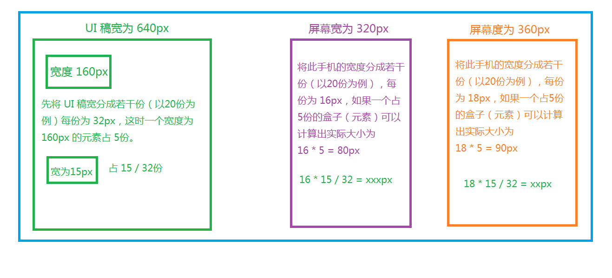

### 1 px rem 和 em 的区别
* px  
  px像素，相对长度单位，是相对于显示器屏幕分辨率而言  
  特点：IE无法调整使用Px作为单位的字体大小

* em  
  1.em的值是不固定的  
  2.em会继承父元素字体的大小  
  浏览器默认字体高是16px,在使用中将body设置为62.5%,em的值变为10px

* rem  
  是c3新增加的单位，相对的是html的跟元素,默认16px,通过rem可以做到只修改根元素就可按照比例调整所有字体的大小

* em 和 rem 的区别  
  em是根据父元素继承相应的大小，不是固定的  
  rem继承html跟元素的大小，只有改变html的值才可以改变rem的值

### 2 移动端让页面适配网页大小的meta标签
  < meta name="eqMobileViewport" content="width=320,initial-scale=1.0,minimum-scale=1.0,maximum-scale=1.0,user-scalable=no"/ >

### 3 h5移动开发的app框架
html5最主要的优势：   
  1、一套HTML5 APP 即可同时适用安卓及IOS平台，甚至WP平台，适配性和统一体验较好。  
  2、版本服务器端更新，用户永远看到的都是最新的APP端信息。  
  3、手机客户端及存储数据较少，节约用户手机空间  
  4、技术难度较低，开发工作量小，开发成本低。

 **局限性**
 用户体验大幅落后于原生APP，操作的流畅度，程序的执行效率，与原生APP都有较大差距；HTML5 APP 受网速的影响较大，在网络情况较差的情况下，HTML5 APP 往往连打开都困难，而原生程序，基本都能顺利打开运行（只是速度较慢）。

1. 框架：Hbuilder（国产） 
官网：http://dcloud.io/   
简介： HBuilder是DCloud推出一款支持HTML5的Web开发IDE。“快，是HBuilder的最大优势，通过完整的语法提示和代码输入法、代码块及很多配套，HBuilder能大幅提升HTML、js、css的开发效率。   
优点：   
      1、HTML5语法、HTML5+语法、三大浏览器扩展语法，尽收HBuilder中。     
      2、每个浏览器发布新版后，一周内，其新增语法就收录入HBuilder。   
      3、强大到令你震惊的Jquery语法提示！   
      4、每个语法在哪个浏览器、哪个版本上是否可运行，这里都有。   
      5、没有比这里更全的语法库，也没有比这里更全的浏览器兼容性数据库。  
缺点：  
      1.云端编译，无法保证安全性。   
      2.不能完全跨平台。不同平台代码需要微调。

2. JQuery Mobile   
1.官方网站：http://jquerymobile.com/   
2.性质：UI框架   
3.说明：这个大名鼎鼎的JQuery的移动版本。跟JQuery一样是一个轻量级的JS库，一样使用HTML5+CSS+JS的技术。应为轻量级，所以在web加载时比Sencha有一点优势。缺点显而易见，UI控件太少了。因为JQuery Mobile 太普及了，也有很多第三方的扩展控件库例如JQuery Mobile Touch。比较有意思的是Sencha Touch 也融合了JQuery Mobile Touch。   
4.授权：完全开源，放心使用

 ### 4 移动端常见的兼容性问题
 1、安卓浏览器看背景图片，有些设备会模糊。用同等比例的图片在PC机上很清楚，但是手机上很模糊
 
 是devicePixelRatio作怪，因为手机分辨率太小，如果按照分辨率来显示网页，这样字会非常小，所以苹果当初就把iPhone 4的960* 640分辨率，在网页里只显示了480* 320，这样devicePixelRatio＝2。
 
 现在android比较乱，有1.5的，有2的也有3的。想让图片在手机里显示更为清晰，必须使用2x的背景图来代替img标签（一般情况都是用2倍）。例如一个div的宽高是100* 100，背景图必须得200*200，然后background-size:contain;，这样显示出来的图片就比较清晰了。
 
 代码可以如下：
 ```css
 background:url(../images/icon/all.png) no-repeat center center;  
 -webkit-background-size:50px 50px;
 background-size: 50px 50px;
 display:inline-block; 
 width:100%; 
 height:50px;
 或者background-size:contain;
 ```

2、假如手机网站不用兼容IE浏览器，一般我们会使用zeptojs
zeptojs内置Touch events方法，Touch events看了一下zeptio新版的API，已经支持IE10以上浏览器，对zeptojs可以选择使用！

3、防止手机中网页放大和缩小
```css
<meta name="viewport" content="width=device-width, initial-scale=1.0, user-scalable=0" />
```

4、长时间按住页面出现闪退
```css
element {

-webkit-touch-callout:none;

}
```
5、iphone及ipad下输入框默认内阴影
```css
Element{

-webkit-appearance:none;

}
```
6、ios和android下触摸元素时出现半透明灰色遮罩
```css
Element {

-webkit-tap-highlight-color:rgba(255,255,255,0)

}
```
设置alpha值为0就可以去除半透明灰色遮罩，备注：transparent的属性值在android下无效。

7、旋转屏幕时，字体大小调整的问题
```css
html, body, form, fieldset, p, div, h1, h2, h3, h4, h5, h6{

-webkit-text-size-adjust:100%;

}
```

8、圆角bug

某些Android手机圆角失效
```css
background-clip: padding-box;

background-clip 属性规定背景的绘制区域。
border-box 	背景被裁剪到边框盒。 	
padding-box 	背景被裁剪到内边距框。 	
content-box 	背景被裁剪到内容框。
```

9、设置缓存

手机页面通常在第一次加载后会进行缓存，然后每次刷新会使用缓存而不是去重新向服务器发送请求。如果不希望使用缓存可以设置no-cache。

10、 IOS中input键盘事件keyup、keydown、keypress支持不是很好
问题是这样的，用input search做模糊搜索的时候，在键盘里面输入关键词，会通过ajax后台查询，然后返回数据，然后再对返回的数据进行关键词标红。

用input监听键盘keyup事件，在安卓手机浏览器中是可以的，但是在ios手机浏览器中变红很慢，用输入法输入之后，并未立刻相应keyup事件，只有在通过删除之后才能相应！

解决办法：可以用html5的oninput事件去代替
```js
keyupdocument.getElementById('testInput').addEventListener('input',function(e){varvalue = e.target.value;});
```
然后就达到类似keyup的效果！

11、ios 设置input 按钮样式会被默认样式覆盖

解决方式如下：
```css
input,

textarea {

border: 0;

-webkit-appearance: none;

}
```
设置默认样式为none

12、移动端点透问题
div是绝对定位的蒙层,并且z-index高于a。而a标签是页面中的一个链接

我们给div绑定tap事件：
```js
$('#haorooms').on('tap',function(){$('#haorooms').hide();});
```
我们点击蒙层时 div正常消失，但是当我们在a标签上点击蒙层时，发现a链接被触发，这就是所谓的点透事件。

原因：touchstart 早于 touchend 早于click。 即click的触发是有延迟的，这个时间大概在300ms左右，也就是说我们tap触发之后蒙层隐藏， 此时 click还没有触发，300ms之后由于蒙层隐藏，我们的click触发到了下面的a链接上。

解决：

（1）尽量都使用touch事件来替换click事件。例如用touchend事件(推荐)。  
（2）用fastclick
（3）用preventDefault阻止a标签的click  
（4）延迟一定的时间(300ms+)来处理事件 （不推荐）  
（5）以上一般都能解决，实在不行就换成click事件。

下面介绍一下touchend事件，如下： 

$("#haorooms").on("touchend",function(event) {event.preventDefault();});

### 5 rem布局原理



其实rem布局的本质是等比缩放，一般是基于宽度

假设我们将屏幕宽度平均分成100份，每一份的宽度用x表示，x = 屏幕宽度 / 100，如果将x作为单位，x前面的数值就代表屏幕宽度的百分比
```css
p {width: 50x} /* 屏幕宽度的50% */ 

```

* 如果子元素设置rem单位的属性，通过更改html元素的字体大小，就可以让子元素实际大小发生变化
  
```css
html {font-size: 16px}
p {width: 2rem} /* 32px*/
 
html {font-size: 32px}
p {width: 2rem} /*64px*/
```
* 如果让html元素字体的大小，恒等于屏幕宽度的1/100，那1rem和1x就等价了

```css
html {fons-size: width / 100}
p {width: 50rem} /* 50rem = 50x = 屏幕宽度的50% */ 
```
* 如何让html字体大小一直等于屏幕宽度的百分之一呢？ 可以通过js来设置，一般需要在页面dom ready、resize和屏幕旋转中设置
  
```js
document.documentElement.style.fontSize = document.documentElement.clientWidth / 100 + 'px'; 
```
* 那么如何把UE图中的获取的像素单位的值，转换为已rem为单位的值
* 公式是元素宽度 / UE图宽度 * 100，假设UE图尺寸是640px，UE图中的一个元素宽度是100px，根据公式100/640*100 = 15.625
  
```css
p {width: 15.625rem}
```

下面来验证下上面的计算是否正确，下面的表格是UE图等比缩放下，元素的宽度

| UE图宽度 | UE图中元素宽度 |

| ----- | -------- |

| 640px | 100px |

| 480px | 75px |

| 320px | 50px |

下面的表格是通过我们的元素在不同屏幕宽度下的计算值

| 页面宽度 | html字体大小 | p元素宽度 |

| ----- | --------------- | ---------------- |

| 640px | 640/100 = 6.4px | 15.625*6.4=100px |

| 480px | 480/100=4.8px | 15.625*4.8=75px |

| 320px | 320/100=3.2px | 15.625*3.2=50px |

比Rem更好的方案

想让页面元素随着页面宽度变化，需要一个新的单位x，x等于屏幕宽度的百分之一，css3带来了rem的同时，也带来了vw和vh

    vw —— 视口宽度的 1/100；vh —— 视口高度的 1/100 —— MDN

根据定义可以发现1vw=1x，有了vw我们完全可以绕过rem这个中介了，下面两种方案是等价的
```css
/* rem方案 */
html {fons-size: width / 100}
p {width: 15.625rem}
 
/* vw方案 */
p {width: 15.625vw}
```
vw还可以和rem方案结合，这样计算html字体大小就不需要用js了
```css
html {fons-size: 1vw} /* 1vw = width / 100 */
p {width: 15.625rem}
```
缺点：在使用弹性布局时，一般会限制最大宽度，比如在pc端查看我们的页面，此时vw就无法力不从心了，因为除了width有max-width，其他单位都没有，而rem可以通过控制html根元素的font-size最大值，而轻松解决这个问题。 有兼容性问题