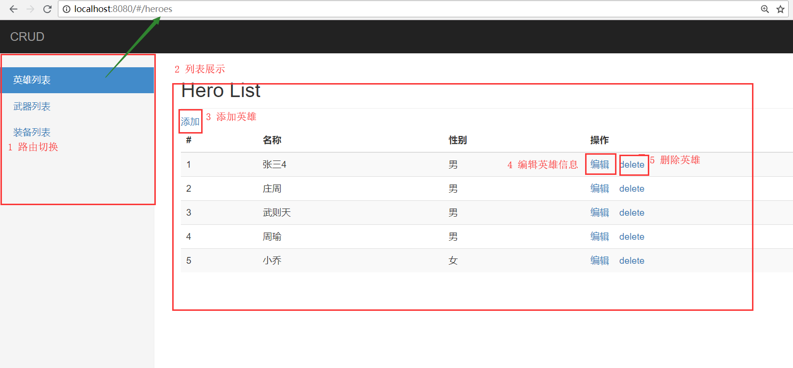
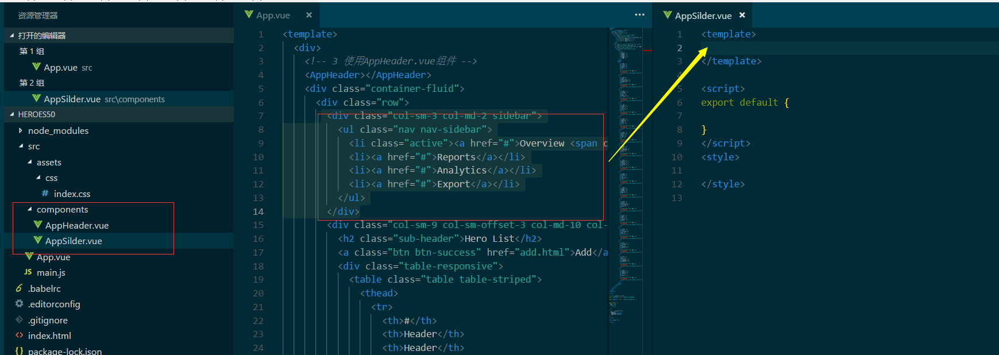

## 单文件组件

> 说明: 
> 1. *.vue 文件，是一个自定义的文件类型，用类似HTML的语法描述一个Vue组件
> 2. 每个.vue文件包含三种类型的顶级语言块
> 3. 这三个部分分别代表了 html,js,css。 

### **template 部分**

- 代表它的 html 结构 
- 必须在里面放置一个 html 标签来包裹所有的代码 
- 我们在其他地方写好了一个组件，然后就可以在当前template中引入

### **script 部分**

```js
export default {
    // 这里写你的代码,如
    el:,
    data:,
    props:
    // 省略
};
```

### **style 部分**

 就是针对我们的 template 里内容出现的 html 元素写一些样式 

> 注意: vue-cli的作用就是让我们把精力放在业务编码上,一切准备的工作交给vue-cli去做
>
> 之后我们可以直接使用vue-cli去做案例或者项目


# Vue案例

> 讲完了Vue基础知识和vue-cli工具
>
> 我们利用所讲知识完成一个简单的案例--英雄列表
>
> 目的:
>
> 1. 熟悉vue-router的使用
> 2. 熟悉单文件组件的使用
> 3. 熟悉vue-cli的使用

## 案例演示



## 功能拆分

1. vue-cli创建项目hero
2. 路由配置
3. 英雄列表
   - 列表展示
   - 添加英雄
   - 编辑英雄
   - 删除英雄

## 项目起步

> 利用脚手架vue-cli生成项目结构

```cmd
# 安装 Vue CLI 脚手架
# 如果已经安装过则不需要!
npm i -g @vue/cli

# 使用脚手架工具初始化你的项目
vue init webpack-simple 项目名称

# 进入你初始化好的项目
cd 项目路径

#安装项目所需依赖
npm i

# 启动开发模式
# 或者 npm start
npm run dev
```

## 调整模板

> 将vue-cli生成的文件中无用的代码进行删除

## 首页展示

### 步骤分析:

1. 导入素材: 将课程包中index.html的标签结构放在App.vue的template中
2. 安装bootstrap@3.3.7: index.html使用了bootstrap和index.css,在vue项目中安装和导入
3. 在main.js中引入bootstrap和index.css
4. 修改webpack配置: 程序报错、无法识别字体文件, 需要在webpack.config.js中进行配置



### 代码演示

#### 1. 导入素材

#### 2. 安装bootstrap,导入index.css

1. npm i bootstrap@3.3.7
2. 将课程包中的css文件夹放在assets中

#### 3. 引入bootstrap和index.css

`main.js` 

```js
import Vue from 'vue'
import App from './App.vue'

import "../node_modules/bootstrap/dist/css/bootstrap.css";
import "./assets/css/index.css";

new Vue({
    el: '#app',
    render: h => h(App)
})
```

#### 4. 修改webpack.config.js配置

```js
{
    test: /.(ttf|woff2|woff|eot)$/,
        loader: 'file-loader',
            options: {
                name: '[name].[ext]?[hash]'
            }
}
```

接下来我们用**单文件组件**的方式将页面文件提取为不同的组件

## 提取公共头部组件

### 步骤分析:

#### 1. 新建AppHeader.vue

#### 2. 修改App.vue的template

#### 3.  使用AppHeader.vue

### 代码演示:

1. 在src下新建components/AppHeader.vue
2. 找到头部的标签结构,将其放置于AppHeader.vue的template中
3. 在App.vue中引入并使用AppHeader.vue组件
   1. 引入AppHeader.vue组件
   2. 注册AppHeader.vue组件
   3. 使用AppHeader.vue组件

`AppHeader.vue` 

```js
<template>
    <nav class="navbar navbar-inverse navbar-fixed-top">
        <div class="container-fluid">
            <div class="navbar-header">
                <button type="button" class="navbar-toggle collapsed" data-toggle="collapse" data-target="#navbar" aria-expanded="false" aria-controls="navbar">
                    <span class="sr-only">Toggle navigation</span>
<span class="icon-bar"></span>
<span class="icon-bar"></span>
<span class="icon-bar"></span>
</button>
<a class="navbar-brand" href="#">CRUD</a>
</div>
</div>
</nav>
</template>

<script>
    export default {

}
</script>
<style>

</style>
```

`App.vue` 

```js
<template>
    <div>
    <!-- 3 使用AppHeader.vue组件 -->
<AppHeader></AppHeader>
<!--后面的标签结构 省略..-->
</div>
</template>

<script>

    // 1. 导入AppHeader.vue组件
    import AppHeader from './components/AppHeader';


export default {
    name: 'app',
    data () {
        return {

        }
    },
    // 2. 注册AppHeader组件
    components:{
        // 注意命名
        AppHeader:AppHeader
    }
}
</script>

<style lang="scss">

    </style>
```

## 提取侧边栏组件

### 步骤分析

#### 1. 新建AppSilder.vue

#### 2. 修改App.vue的template

#### 3.  使用AppSilder.vue


## 提取英雄列表组件

> 新建AppList.vue,并将App.vue中的英雄列表的页面标签提取到AppList.vue中

### 步骤分析

#### 1. 新建AppList.vue

#### 2. 修改App.vue的template

#### 3.  使用AppList.vue


## Vue-Router使用

> 使用 Vue-Router 实现页面导航管理

### 步骤分析及代码演示

1. 安装路由模块

```cmd
npm i vue-router
```

1. 在 `main.js` 中加载

```js
...
import VueRouter from 'vue-router' // 加载路由模块

// 注册到 Vue 中才可以使用
Vue.use(VueRouter)

// ...
```

1. 在 `main.js` 中 `new` 出 `VueRouter` 实例，并挂载到根实例的 `router` 选项中

```js
// ...

// 配置路由表
const appRouter = new VueRouter({
    routes: [
    ]
})

// ...

new Vue({
    el: '#app',
    render: h => h(App),
    // 配置实例选项 router 为你在上面 new 出来的 VueRouter 实例对象
    router: appRouter
});
```

1. 配置路由表

```js
// ...
// 配置路由表
const appRouter = new VueRouter({
    // routes 选项用来配置路由表
    // 当请求 /xxx 的时候，渲染 xxx 组件
    // routes 是一个数组，数组中存储一些固定格式的对象
    // 对象 path 表示请求的路径
    // 对象的 component 用来指定当你请求 path 路径的时候，渲染该组件
    // 现在的问题是？匹配到 path 的时候，组件往哪里渲染？
    // 在你的根组件预留一个路由的出口，用来告诉路由到匹配到某个 path 的时候，把该组件渲染到哪里
    routes: [
        {
            path: '/foo',
            component: {
                template: `<div>foo 组件啊</div>`
            }
        },
        {
            path: '/bar',
            component: {
                template: `<div>bar 组件啊</div>`
            }
        }
    ]
});
// ...
```

1. 在 `src/App.vue` 组件中设置路由出口（告诉路由往哪里渲染 path 匹配到的组件）

```html
<template>
    <div id="app">
        <AppHeader></AppHeader>
        <div class="container-fluid">
            <div class="row">
                <AppSidebar></AppSidebar>
                <div class="col-sm-9 col-sm-offset-3 col-md-10 col-md-offset-2 main">
                    <!-- <AppList></AppList> -->
                    <!--
<router-view></router-view> 组件标签是给路由看的，默认啥都没有
它不是固定的，它标识路由出口标记
当路由匹配到 path xxx 的时候，会将 router-view 替换到我们在路由表中配置好的组件
-->
                    <router-view></router-view>
                </div>
            </div>
        </div>
    </div>
</template>
...
```

1. 在侧边栏 `src/components/AppSidebar.vue` 组件中 增加两个导航链接用来导航 `foo` 和 `bar`

```html
<template>
    <div class="col-sm-3 col-md-2 sidebar">
        <ul class="nav nav-sidebar">
            <li class="active"><a href="#">英雄管理 <span class="sr-only">(current)</span></a></li>
            <li><a href="#">用户管理</a></li>
            <li><a href="#">商品管理</a></li>
            <li><a href="#">订单管理</a></li>
            <!--
导航链接要以 # 开头，后面跟你在路由表中配好的 path 路径
-->
            <li><a href="#/foo">Go Foo</a></li>
            <li><a href="#/bar">Go Bar</a></li>
        </ul>
    </div>
</template>

<script></script>

<style></style>
```

## 将路由导航到 .vue 组件

 `src/components/Foo.vue`:

```html
<template>
    <div>
        Foo 组件
    </div>
</template>

<script></script>
<style></style>
```

`src/components/Bar.vue`:

```html
<template>
    <div>
        Bar 组件
    </div>
</template>

<script></script>
<style></style>
```

`src/main.js`:

```js
// ...
// ...
import Foo from './components/Foo'
import Bar from './components/Bar'
import HeroList from './components/HeroList'

// ...
// ...

// 配置路由表
const appRouter = new VueRouter({
    routes: [
        {
            path: '/foo',
            component: Foo
            // component: {
            //   template: `<div>foo 组件啊</div>`
            // }
        },
        {
            path: '/bar',
            component: Bar
        },
        {
            path: '/heroes',
            component: HeroList
        }
    ]
});

// ...
```

## 提取路由模块router.js

> 将main.js中路由相关的代码提取到router.js中

`新建router.js` 

```js
import Vue from 'vue';

// 1. 导入路由
import VueRouter from 'vue-router';

// 导入组件
import AppList from './components/AppList.vue';
import Bar from './components/Bar.vue';
import Foo from './components/Foo.vue';


// 注册插件
// https://cn.vuejs.org/v2/guide/plugins.html
Vue.use(VueRouter);

// 2. 创建路由对象，配置路由规则
const router = new VueRouter({
    routes: [
        // { name: 'home', path: '/', redirect: '/heroes' },
        { name: 'home', path: '/', redirect: { name: 'heroes' } },
        // 路由规则
        { name: 'heroes', path: '/heroes', component: AppList },
        { name: 'bar', path: '/bar', component: Bar },
        { name: 'foo', path: '/foo', component: Foo }
    ]
});

// 3 导出模块
export default router;
```

`main.js` 

```js
import Vue from 'vue'
import App from './App.vue'

// import Foo from './components/Foo'
// import Bar from './components/Bar'
// import AppList from './components/AppList'

// import VueRouter from 'vue-router' // 加载路由模块
// // 注册到 Vue 中才可以使用
// Vue.use(VueRouter);

// 1 导入路由对象
import router from './router';

import "../node_modules/bootstrap/dist/css/bootstrap.css";
import "./assets/css/index.css";


new Vue({
    el: '#app',
    render: h => h(App),
    // 配置实例选项 router 为你在上面 new 出来的 VueRouter 实例对象
    // router: appRouter
    router
});
```

## 配置导航菜单

> 将AppSilder.vue中的a标签改成router-link

`AppSilder.vue` 

```js
<template>
    <div class="col-sm-3 col-md-2 sidebar">
        <ul class="nav nav-sidebar">
            <!-- <li class="active"><a href="#">Overview <span class="sr-only">(current)</span></a></li>
<li><a href="#/heroes">Reports</a></li>
    <li><a href="#">Analytics</a></li>
        <li><a href="#">Export</a></li>
            <li><a href="#/foo">Go Foo</a></li>
                <li><a href="#/bar">Go Bar</a></li> -->
                    <router-link tag="li" to="/heroes">
                        <a>英雄列表</a>
</router-link>
<router-link tag="li" to="/bar">
    <a>武器列表</a>
</router-link>
<router-link tag="li" to="/foo">
    <a>装备列表</a>
</router-link>
</ul>
</div>
</template>

<script>
    export default {

}
</script>
<style>

</style>
```

## API-Server

> 接下来要实现具体的功能, 首先是英雄列表展示,其中的数据要来源于服务器
>
> 我们使用json-server快速启动api服务器 监听课程包中的db.json
>
> 可以使用postman测试接口

## 英雄列表数据渲染

> 利用axios发送请求获取英雄列表的数据渲染到AppList.vue的template中

### 步骤分析:

1. 启动json-server
2. 在安装并在AppList.vue中导入axios
3. 在data选项中添加属性list:[]
4. 将发送请求的方法写在methods中 loadData
5. 在created钩子函数中调用loadData方法
6. 将list中的数据渲染到template中的相应位置

### 代码演示:

`AppList.vue` 

```html
<template>
    <div>
        <h2 class="sub-header">Hero List</h2>
        <a class="btn btn-success" href="add.html">Add</a>
        <div class="table-responsive">
            <table class="table table-striped">
                <!-- <thead>
<tr>
<th>#</th>
<th>Header</th>
<th>Header</th>
<th>Header</th>
<th>Header</th>
<th>操作</th>
</tr>
</thead>
<tbody>
<tr>
<td>1,001</td>
<td>Lorem</td>
<td>ipsum</td>
<td>dolor</td>
<td>sit</td>
<td>
<a href="edit.html">edit</a>
&nbsp;&nbsp;
<a href="javascript:window.confirm('Are you sure?')">delete</a>
</td>
</tr>
</tbody> -->
                <thead>
                    <tr>
                        <th>#</th>
                        <th>名称</th>
                        <th>性别</th>
                        <th>操作</th>
                    </tr>
                </thead>
                <tbody>
                    <tr :key="item.id" v-for="(item, index) in list">
                        <td>{{ index + 1 }}</td>
                        <td>{{ item.name }}</td>
                        <td>{{ item.gender }}</td>
                        <td>

                            <a href="edit.html">edit</a>
                            &nbsp;&nbsp;
                            <a href="javascript:window.confirm('Are you sure?')">delete</a>            </td>
                    </tr>
                </tbody>
            </table>
        </div>
    </div>
</template>

<script>
    import axios from 'axios';

    export default {
        data(){
            return {
                list:[]
            }
        },
        created(){
            this.loadData();
        },
        methods:{
            loadData(){
                axios.get('http://localhost:3000/users')
                    .then((res)=>{
                    console.log(res);
                    const {status,data} = res;
                    if (status == 200) {
                        this.list = data;
                    }

                })
            }
        }
    }
</script>
<style>

</style>

```

### 实现效果:


## 删除功能

> 点击英雄列表中每个英雄信息后面的删除按钮,可以删除当前英雄数据

### 步骤分析

1. 找到删除按钮, 绑定click事件
2. 将要删除的英雄的id传给删除方法
3. 在methods中实现删除方法
   1. 获取当前英雄的id
   2. 提示用户是否删除
   3. 如果是, 则调用axios.delete方法删除数据
      1. 删除成功, 重新渲染列表

### 代码演示

`AppList.vue`

```html
<template>
    <div>
        <h2 class="sub-header">Hero List</h2>
        <a class="btn btn-success" href="add.html">Add</a>
        <div class="table-responsive">
            <table class="table table-striped">

                <thead>
                    <tr>
                        <th>#</th>
                        <th>名称</th>
                        <th>性别</th>
                        <th>操作</th>
                    </tr>
                </thead>
                <tbody>
                    <tr :key="item.id" v-for="(item, index) in list">
                        <td>{{ index + 1 }}</td>
                        <td>{{ item.name }}</td>
                        <td>{{ item.gender }}</td>
                        <td>
                            <a href="edit.html">edit</a>
                            &nbsp;&nbsp;
                            <!-- <a href="javascript:window.confirm('Are you sure?')">delete</a>             -->
                            <a href="#" @click.prevent="handleDelete(item.id)">delete</a>

                        </td>
                    </tr>
                </tbody>
            </table>
        </div>
    </div>
</template>

<script>
    import axios from 'axios';

    export default {
        data(){
            return {
                list:[]
            }
        },
        created(){
            this.loadData();
        },
        methods:{
            loadData(){
                axios.get('http://localhost:3000/users')
                    .then((res)=>{
                    console.log(res);
                    const {status,data} = res;
                    if (status == 200) {
                        this.list = data;
                    }

                })
            },

            handleDelete(id) {
                // 删除提示
                if (!confirm('是否确认删除？')) {
                    return;
                }
                axios
                    .delete(`http://localhost:3000/users/${id}`)
                    .then((res) => {
                    if (res.status === 200) {
                        // 删除成功，重新渲染列表
                        this.loadData();
                    } else {
                        alert('删除失败');
                    }
                })
                    .catch((err) => {
                    console.log(err);
                });
            }
        }
    }
</script>
<style>

</style>

```

## 添加功能-页面

> 点击添加按钮 进入到添加的组件,输入新英雄信息,点击确定, 回到列表页渲染新数据

> 我们先让添加的页面显示出来

### 步骤分析

1. 新建add.vue组件
2. 将课程包中的add.html中添加的页面标签放置在add.vue中
3. 修改路由router.js
   1. 导入add.vue
   2. 注册add.vue
   3. 使用add.vue
4. 根据效果调整add.vue中的标签

### 代码演示


`add.vue`

```html
<template>
    <div>
        <h2 class="sub-header">Add Hero</h2>
        <form>
            <div class="form-group">
                <label for="exampleInputEmail1">Email address</label>
                <input type="email" class="form-control" id="exampleInputEmail1" placeholder="Email">
            </div>
            <div class="form-group">
                <label for="exampleInputPassword1">Password</label>
                <input type="password" class="form-control" id="exampleInputPassword1" placeholder="Password">
            </div>
            <div class="form-group">
                <label for="exampleInputFile">File input</label>
                <input type="file" id="exampleInputFile">
                <p class="help-block">Example block-level help text here.</p>
            </div>
            <div class="checkbox">
                <label>
                    <input type="checkbox"> Check me out
                </label>
            </div>
            <button type="submit" class="btn btn-success">Submit</button>
        </form>
    </div>
</template>

<script>
    export default {

    }
</script>

<style>

</style>

```

`router.js`

```js
import Vue from 'vue';

// 1. 导入路由
import VueRouter from 'vue-router';

// 导入组件
import AppList from './components/AppList.vue';
import Bar from './components/Bar.vue';
import Foo from './components/Foo.vue';
import Add from './components/add.vue';


// 注册插件
// https://cn.vuejs.org/v2/guide/plugins.html
Vue.use(VueRouter);

// 2. 创建路由对象，配置路由规则
const router = new VueRouter({
    routes: [
        // { name: 'home', path: '/', redirect: '/heroes' },
        { name: 'home', path: '/', redirect: { name: 'heroes' } },
        // 路由规则
        { name: 'heroes', path: '/heroes', component: AppList },
        { name: 'bar', path: '/bar', component: Bar },
        { name: 'foo', path: '/foo', component: Foo },
        { name: 'add', path: '/add', component: Add }

    ]
});

// 3 导出模块
export default router;
```

`AppList`

```html
<template>
    <div>
        <h2 class="sub-header">Hero List</h2>
        <!-- <a class="btn btn-success" href="add.html">Add</a> -->
        <!-- 注意动态绑定属性 : -->
        <router-link :to="{name:'add'}">添加</router-link>
        <div class="table-responsive">
            <!--省略-->
        </div>
    </div>
</template>

// 省略

```

`add.vue`

```html
<template>
    <div>
        <div>
            <h2 class="sub-header">Add Hero</h2>
            <form>
                <div class="form-group">
                    <label for="name">英雄名称</label>
                    <input type="text" class="form-control" id="name" placeholder="Name">
                </div>
                <div class="form-group">
                    <label for="sex">英雄性别</label>
                    <input type="text" class="form-control" id="sex" placeholder="Sex">
                </div>
                <button type="submit" class="btn btn-success">Submit</button>
            </form>
        </div>
    </div>
</template>
<!-- 省略-->
```

## 添加功能-功能实现

> 有了页面,接下来我们实现添加的功能

### 步骤分析:

1. 绑定文本框
2. 添加按钮注册事件
3. 发送请求

### 代码演示:

`add.vue` 

```html
<template>
    <div>  
        <h2 class="sub-header">Add Hero</h2>
        <form>
            <div class="form-group">
                <label for="name">英雄名称</label>
                <input v-model="formData.name" type="text" class="form-control" id="name" placeholder="Name">
            </div>
            <div class="form-group">
                <label for="sex">英雄性别</label>
                <input v-model="formData.gender" type="text" class="form-control" id="sex" placeholder="Sex">
            </div>
            <button @click.prevent="handleAdd" type="submit" class="btn btn-success">Submit</button>
        </form>
    </div>
</template>

<script>

    import axios from 'axios'
    export default {
        data() {
            return {
                // 绑定到表单元素
                formData: {
                    name: '',
                    gender: ''
                }
            }
        },
        methods:{
            handleAdd() {
                axios
                    .post('http://localhost:3000/users', this.formData)
                    .then((res) => {
                    const { status, data } = res;
                    if (status === 201) {
                        // 判断添加是否成功
                        // 添加成功，跳转到英雄列表
                        this.$router.push({ name: 'heroes' });
                    } else {
                        alert('添加失败');
                    }
                })
            }
        }
    }
</script>

<style>

</style>

```

## 编辑功能-页面

> 编辑的页面和添加的页面很像

### 步骤分析

1. 新建edit.vue组件
2. 将add.vue中的代码copy到edit.vue中进行修改
3. 修改路由router.js
   1. 导入edit.vue
   2. 注册edit.vue
   3. 使用edit.vue
4. 在AppList中设置router-link 动态参数

### 代码演示

`edit.vue`

```html
<template>
    <div>

        <h2 class="sub-header">Edit Hero</h2>
        <form>
            <div class="form-group">
                <label for="name">英雄名称</label>
                <input v-model="formData.name" type="text" class="form-control" id="name" placeholder="Name">
            </div>
            <div class="form-group">
                <label for="sex">英雄性别</label>
                <input v-model="formData.gender" type="text" class="form-control" id="sex" placeholder="Sex">
            </div>
            <button  type="submit" class="btn btn-success">Submit</button>
        </form>
    </div>
</template>

<script>

    import axios from 'axios'
    export default {
        data() {
            return {
                // 绑定到表单元素
                formData: {
                    name: '',
                    gender: ''
                }
            }
        },
        methods:{

        }
    }
</script>

<style>

</style>

```

`router.js` 

```js
import Vue from 'vue';

// 1. 导入路由
import VueRouter from 'vue-router';

// 导入组件
import AppList from './components/AppList.vue';
import Bar from './components/Bar.vue';
import Foo from './components/Foo.vue';
import Add from './components/add.vue';
import Edit from './components/edit.vue';

// 注册插件
// https://cn.vuejs.org/v2/guide/plugins.html
Vue.use(VueRouter);

// 2. 创建路由对象，配置路由规则
const router = new VueRouter({
    routes: [
        // { name: 'home', path: '/', redirect: '/heroes' },
        { name: 'home', path: '/', redirect: { name: 'heroes' } },
        // 路由规则
        { name: 'heroes', path: '/heroes', component: AppList },
        { name: 'bar', path: '/bar', component: Bar },
        { name: 'foo', path: '/foo', component: Foo },
        { name: 'add', path: '/add', component: Add },
        { name: 'edit', path: '/edit/:id', component: Edit }
    ]
});

// 3 导出模块
export default router;
```

`AppList`

```html
<!-- <a href="edit.html">edit</a> -->
<router-link :to="{name:'edit',params:{id:item.id}}">编辑</router-link>
```

## 编辑功能-功能实现

### 步骤分析:

1. 进入编辑页面，显示当前要编辑的英雄
   1. 获取url上的id，created()
   2. 发送请求获取数据
   3. 绑定文本框
2. 点击Submit按钮，实现更新功能

### 代码演示

`edit.vue` 

```html
<template>
    <div>
        <h2 class="sub-header">Edit Hero</h2>
        <form>
            <div class="form-group">
                <label for="name">英雄名称</label>
                <input v-model="formData.name" type="text" class="form-control" id="name" placeholder="Name">
            </div>
            <div class="form-group">
                <label for="sex">英雄性别</label>
                <input v-model="formData.gender" type="text" class="form-control" id="sex" placeholder="Sex">
            </div>
            <button @click.prevent="handleEdit" type="submit" class="btn btn-success">Submit</button>
        </form>
    </div>
</template>

<script>

    import axios from 'axios';

    // 1. 进入编辑页面，显示当前要编辑的英雄
    // 1.1 获取url上的id，created()
    // 1.2 发送请求获取数据
    // 1.3 绑定文本框

    // 2. 点击Submit按钮，实现更新功能

    export default {
        data() {
            return {
                formData: {
                    name: '',
                    gender: ''
                },
                // 获取url上的id，默认-1
                heroId: -1
            }
        },
        // 组件创建完毕
        created() {
            // 获取路由参数
            this.heroId = this.$route.params.id;
            console.log(this.heroId);

            // 调用 获取英雄对象的方法
            this.loadData();
        },
        methods: {
            // 根据id，获取英雄对象
            loadData() {
                axios
                    .get(`http://localhost:3000/users/${this.heroId}`)
                    .then((res) => {
                    if (res.status === 200) {
                        this.formData = res.data;
                    }
                });
            },
            handleEdit() {
                axios
                    .put(`http://localhost:3000/users/${this.heroId}`, this.formData)
                    .then((res) => {
                    if (res.status === 200) {
                        this.$router.push({ name: 'heroes' });
                    } else {
                        alert('修改失败');
                    }
                });
            }
        }
    };
</script>

<style>

</style>

```

## 当前选中导航的样式

> 选中某个导航时,其样式和其他的不同, 为active的样式
>
> [参考文档](https://router.vuejs.org/zh/api/#tag) 

`router.js` 

添加    linkActiveClass: 'active',全局配置

```js
// 省略
const router = new VueRouter({
    linkActiveClass: 'active',
    routes: [
        // { name: 'home', path: '/', redirect: '/heroes' },
        { name: 'home', path: '/', redirect: { name: 'heroes' } },
        // 路由规则
        { name: 'heroes', path: '/heroes', component: AppList },
        { name: 'bar', path: '/bar', component: Bar },
        { name: 'foo', path: '/foo', component: Foo },
        { name: 'add', path: '/add', component: Add },
        { name: 'edit', path: '/edit/:id', component: Edit }
    ]
});
// 省略
```

## 全局配置axios

> axios请求在多个组件中都要使用, 
>
> 所以, 可以考虑给Vue实例添加axios选项,
>
> 这样 所有的组件都可以使用

`main.js` 

```js
// 省略--

// 导入axios
import axios from 'axios';
// 配置所有Vue的实例都具有$http这个成员
Vue.prototype.$http = axios;

new Vue({
    el: '#app',
    render: h => h(App),
    // 配置实例选项 router 为你在上面 new 出来的 VueRouter 实例对象
    // router: appRouter
    router
});
```

> 将之前在组件中使用axios的位置改成

1. 去掉import axios from 'axios'
2. 将axios. 改成this.$http.

`add.vue` 

```js
<script>

    // import axios from 'axios'
    export default {
data() {
return {
// 绑定到表单元素
formData: {
    name: '',
        gender: ''
}
}
},
    methods:{
        handleAdd() {
            this.$http
                .post('http://localhost:3000/users', this.formData)
                .then((res) => {
                const { status, data } = res;
                if (status === 201) {
                    // 判断添加是否成功
                    // 添加成功，跳转到英雄列表
                    this.$router.push({ name: 'heroes' });
                } else {
                    alert('添加失败');
                }
            })
        }
    }
}
    </script>
```

## 配置baseUrl

> 请求的url中有一部分是一样的, 每次写很麻烦,
>
> 所以, 可以使用axios的API 配置baseURl

`main.js`

```js
// 省略--

// 导入axios
import axios from 'axios';
// 设置baseURL
axios.defaults.baseURL = 'http://localhost:3000/';

// 省略--
```

> 在发起this.$http请求的位置, 简化原来的url

`add.vue`

```js
<script>

    // import axios from 'axios'
    export default {
data() {
return {
// 绑定到表单元素
formData: {
    name: '',
        gender: ''
}
}
},
    methods:{
        handleAdd() {
            this.$http
                .post('users', this.formData)
                .then((res) => {
                const { status, data } = res;
                if (status === 201) {
                    // 判断添加是否成功
                    // 添加成功，跳转到英雄列表
                    this.$router.push({ name: 'heroes' });
                } else {
                    alert('添加失败');
                }
            })
        }
    }
}
    </script>
```

