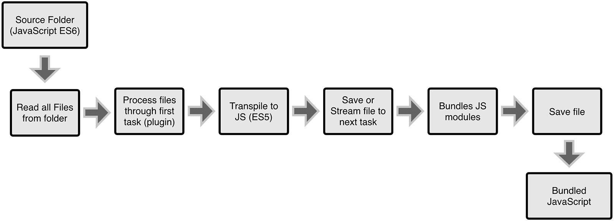
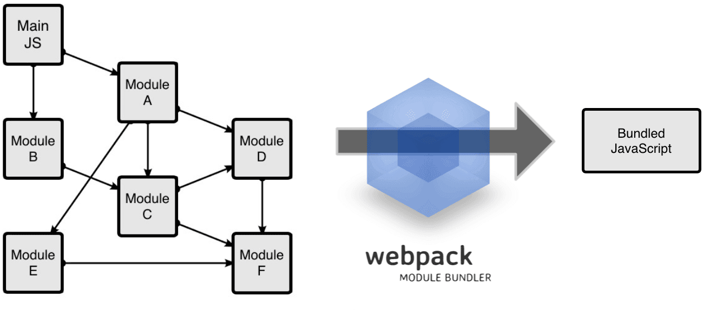

### 1-基础-webpack-介绍

> 静态页->表单提交->闭包+自调 ->AMD/CMD/->require.js/sea.js/common.js->
>
> js代码变得模块化->module.exports和require("./xxx.js")->ES6->import和export default
>
> ->终级js模块化解决方案 -> webpack
>
> webpack:模块化(.js/.css/.vue等)
>
> 

### 2-基础-webpack-本地安装

> 建议本地安装 -> 每个项目有自己的webpack配置

1. cd 项目目录

2. npm init -y

3.  npm install --save-dev webpack

4.  npm install --save-dev webpack-cli

5. webpack --help

   > 可以在目录下使用webpack指令去实现功能->比如 打包 


### 3-基础-webpack-目录设置

> webpack指令 打包 ->error->配置打包参数,比如入口 出口->vuecli里面webpack已经配置完毕
>
> webpack和vue没有直接关系 -> vuecli->内置webpack工具->配置全写完

1. index.html 页面文件 引入入口文件main.js
2. src/main.js+cal.js
3. webpack.config.js -> 配置webpack的

### 4-基础-webpack-配置文件

> webpack打包->提供配置文件->webpack.config.js->入口+出口
>
> webpack指令 -> dist/bundle.js

### 5-基础-webpack-css-loader

> webpack默认只能处理.js文件
>
> 非.js文件 ->让webpack处理->安装指定css-loader/style-loader -> 配置loader->重新打包

1. npm 指定的加载器 
2. 在webpack.config.js中配置加载器
3. 重新打包

### 6-基础-webpack-图片资源

> webpack默认不能处理图片资源
>
> 1. npm install --save-dev file-loader
> 2. 配置

> 测试->index.html src="dist/bundle.js"->在dist复制index.html 修改src="./bundle.js"


### 7-基础-webpack-字体文件

1. 找loader
2. 配置

> 补充

1. .ttf文件
2. css3 @font-face{src,font-family} 
3. 支持英文


### 8-基础-webpack-服务器

1. ```
   npm install --save-dev webpack-dev-server
   ```

2. 配置

3. package.json- > "start" :"webpack-dev-server --open"

4. 重新打包  + npm start

### 9 一个常见的`webpack`配置文件
```js
const webpack = require('webpack');
const HtmlWebpackPlugin = require('html-webpack-plugin');
const ExtractTextPlugin = require('extract-text-webpack-plugin');

module.exports = {
        entry: __dirname + "/app/main.js", //已多次提及的唯一入口文件
        output: {
            path: __dirname + "/build",
            filename: "bundle-[hash].js"
        },
        devtool: 'none',
        devServer: {
            contentBase: "./public", //本地服务器所加载的页面所在的目录
            historyApiFallback: true, //不跳转
            inline: true,
            hot: true
        },
        module: {
            rules: [{
                    test: /(\.jsx|\.js)$/,
                    use: {
                        loader: "babel-loader"
                    },
                    exclude: /node_modules/
                }, {
                    test: /\.css$/,
                    use: ExtractTextPlugin.extract({
                        fallback: "style-loader",
                        use: [{
                            loader: "css-loader",
                            options: {
                                modules: true,
                                localIdentName: '[name]__[local]--[hash:base64:5]'
                            }
                        }, {
                            loader: "postcss-loader"
                        }],
                    })
                }
            }
        ]
    },
    plugins: [
        new webpack.BannerPlugin('版权所有，翻版必究'),
        new HtmlWebpackPlugin({
            template: __dirname + "/app/index.tmpl.html" //new 一个这个插件的实例，并传入相关的参数
        }),
        new webpack.optimize.OccurrenceOrderPlugin(),
        new webpack.optimize.UglifyJsPlugin(),
        new ExtractTextPlugin("style.css")
    ]
};
```
**WebPack和Grunt以及Gulp相比有什么特性**  
其实Webpack和另外两个并没有太多的可比性，Gulp/Grunt是一种能够优化前端的开发流程的工具，而WebPack是一种模块化的解决方案，不过Webpack的优点使得Webpack在很多场景下可以替代Gulp/Grunt类的工具。

Grunt和Gulp的工作方式是：在一个配置文件中，指明对某些文件进行类似编译，组合，压缩等任务的具体步骤，工具之后可以自动替你完成这些任务。  

Grunt和Gulp的工作流程



Webpack的工作方式是：把你的项目当做一个整体，通过一个给定的主文件（如：index.js），Webpack将从这个文件开始找到你的项目的所有依赖文件，使用loaders处理它们，最后打包为一个（或多个）浏览器可识别的JavaScript文件。

webpack工作流程



**通过配置文件来使用Webpack**

Webpack拥有很多其它的比较高级的功能（比如说本文后面会介绍的loaders和plugins），这些功能其实都可以通过命令行模式实现，但是正如前面提到的，这样不太方便且容易出错的，更好的办法是定义一个配置文件，这个配置文件其实也是一个简单的JavaScript模块，我们可以把所有的与打包相关的信息放在里面。

在当前文件夹的根目录下新建一个名为webpack.config.js的文件，写入如下所示的简单配置代码，目前的配置主要涉及到的内容是入口文件路径和打包后文件的存放路径。
```js
module.exports = {
  entry:  __dirname + "/app/main.js",//已多次提及的唯一入口文件
  output: {
    path: __dirname + "/public",//打包后的文件存放的地方
    filename: "bundle.js"//打包后输出文件的文件名
  }
}
```
